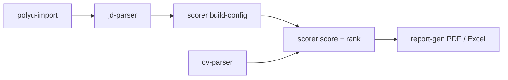

# Pipeline Skill (Agent Screening Orchestrator)

Run the whole screening pipeline in one command by chaining the other skill CLIs
(`polyu-import` -> `jd-parser` -> `scorer build-config` -> `cv-parser` -> `scorer score` -> `report-gen`).
It shells out to the exact same entry points documented in each skill, so behavior is identical
to running the steps manually. No backend code is duplicated or modified, and the REST demo
(frontend + `POST /api/v1/...` endpoints) is unaffected.

## Prerequisites

- Backend dependencies installed: `pip install -r backend/requirements.txt`.
- `.env` at repo root with `ZAI_API_KEY` and `LLM_BASE_URL` (the cv-parser step calls the Zhipu LLM).
- Run every command from the repository root.
- Network access to `https://jobs.polyu.edu.hk` only when using `--polyu-ref` / `--polyu-detail-url`.

## Run

```bash
python .codex/skills/pipeline/scripts/run_pipeline.py \
  --jd-file jd.txt \
  --cv cv1.pdf --cv cv2.pdf \
  --position "Backend Engineer" \
  --output-dir data/pipeline_out
```

| flag                              | meaning                                                                                                                                 |
| --------------------------------- | --------------------------------------------------------------------------------------------------------------------------------------- |
| **JD source (choose one)**        |                                                                                                                                         |
| `--jd-file <txt>`                 | JD text file; parsed with the jd-parser skill                                                                                           |
| `--jd-json <json>`                | Already-parsed JD (jd-parser output, polyu-parsed output, or pure `structured_data`); skips parsing                                     |
| `--polyu-ref <REF>`               | PolyU external ref; fetched + parsed with the polyu-import skill (network)                                                              |
| `--polyu-detail-url <URL>`        | PolyU detail URL fallback used together with `--polyu-ref`                                                                              |
| **Candidates**                    |                                                                                                                                         |
| `--cv <pdf>` (repeatable)         | CV PDF to parse and score via the cv-parser skill                                                                                       |
| `--extracted <json>` (repeatable) | Already-extracted candidate JSON; skips cv-parser                                                                                       |
| **Reports**                       |                                                                                                                                         |
| `--position <title>`              | Job title shown on reports (required unless `--skip-reports`)                                                                           |
| `--engine <legacy\|matching>`     | Scoring engine: `legacy` (default, ScorerService) or `matching` (six-dimension engine that renders the modal-style radar/interview PDF) |
| `--reference-date <YYYY-MM-DD>`   | Reference date for the matching engine (default: today)                                                                                 |
| `--skip-reports`                  | Score + rank only; skip PDF/Excel generation                                                                                            |
| `--output-dir <dir>`              | Output directory for intermediate JSONs and reports (default `data/pipeline_out`)                                                       |
| **L1 reliability**                |                                                                                                                                         |
| `--max-retries <N>`               | Extra attempts per candidate step after the first (default `2`)                                                                         |
| `--resume`                        | Skip JD parse / CV parse / score when usable artifacts already exist in `--output-dir`                                                  |
| `--fail-fast`                     | Abort the batch on the first per-candidate failure (legacy all-or-nothing behavior)                                                     |

## What it runs

1. **JD source**: `polyu fetch-and-parse` (if `--polyu-ref`/`--polyu-detail-url`), or `jd-parser` on `--jd-file`, or reuses `--jd-json` as-is.
2. **Config**: `scorer build-config --jd-structured <jd json> --output config.json`.
3. **Extraction**: `cv-parser --file <cv> [--jd-file jd-context.txt] --output extracted-<slug>.json` per `--cv` (`slug` is the source filename stem). One CV failing does not stop the others unless `--fail-fast`.
4. **Scoring**: `scorer score --extracted extracted-<slug>.json --config config.json --output score-<slug>.json` per successful parse (matching engine writes `detail-<slug>.json`).
5. **Ranking**: successful candidates sorted by `total_score` descending, `rank` 1..N.
6. **Reports**: PDF one-pager per successful candidate + Excel across those rows only.

## Engine modes

- **`legacy` (default)**: `scorer build-config` + `scorer score` -> `dimension_scores` + `interview_suggestions`. PDF radar is drawn from `dimension_scores`.
- **`matching`**: `scorer match` per candidate -> the same radar/interview-question detail payload the frontend candidate-match modal shows (`match_score`, `fit_band`, `eligibility`, `evidence_confidence`, `radar_dimensions` with per-dimension reasoning/gaps, `interview_questions`). PDFs render the modal content: radar chart, dimension details, and suggested interview questions. The Excel rows map `core_skill_match` / `relevant_experience` / `education_certification` / `evidence_impact` to the standard comparison columns.

## Output manifest

stdout prints a JSON manifest:

```json
{
  "status": "success",
  "engine": "legacy",
  "output_dir": ".../data/pipeline_out",
  "jd_source": ".../data/pipeline_out/jd-parse.json",
  "config_json": ".../data/pipeline_out/config.json",
  "candidates": [
    {
      "rank": 1,
      "name": "Alice",
      "source": "cv1.pdf",
      "total_score": 85.2,
      "tier": "Tier 1",
      "extracted_json": "...",
      "score_json": "...",
      "report_pdf": "..."
    }
  ],
  "failures": [],
  "ask": null,
  "reports": { "comparison_xlsx": "..." }
}
```

- `status` is `success` (everyone succeeded), `partial_success` (at least one candidate succeeded and at least one failed), `error` (JD/config hard-fail or zero candidates succeeded), or `need_input` (missing JD, CVs, or `--position`).
- Intermediate files (`jd-parse.json`, `config.json`, `extracted-<slug>.json`, `score-<slug>.json`, `manifest.json`, `rows.json`) are kept in `--output-dir` for inspection and `--resume`.
- Exit codes: `0` for `success` / `partial_success`; `2` for `need_input` (stdout JSON with `missing` + `questions`); `1` for `error` (stderr JSON).

## Behavior notes

- Reuses the other skill CLIs as subprocesses (`sys.executable`), so it inherits the venv/python that launched it.
- `--jd-file` text is written to `jd-context.txt` and passed to the cv-parser as JD context.
- `--jd-json` from `polyu fetch-and-parse` supplies its `jd_text` as CV context; from `jd-parser` there is no original text, so no JD context is passed to cv-parser.
- `--polyu-detail-url` is only accepted together with `--polyu-ref` (catalog fallback); it cannot be combined with `--jd-file` or `--jd-json`.
- Per-candidate steps (CV parse, score/match, PDF) retry `--max-retries` extra times; JD fetch/parse and `build-config` remain batch-hard failures.
- `--resume` skips a step when the target JSON in `--output-dir` already loads as an object.
- No DB writes, no REST API calls — this is the offline equivalent of the web demo flow.

## Offline example (no LLM, no network)

```bash
python .codex/skills/pipeline/scripts/run_pipeline.py \
  --jd-json .codex/skills/scorer/examples/sample-jd-structured.json \
  --extracted .codex/skills/report-gen/examples/sample-extracted.json \
  --position "Backend Engineer" \
  --engine matching \
  --output-dir /tmp/pipeline_demo
```

## Pipeline diagram



## Future migration

TODO(agent-migration): When the legacy REST API is deprecated, merge the shared logic currently in `backend/app/skills/` (and the services it wraps) into this folder so this skill becomes fully self-contained and can be composed into a single integrated agent pipeline.
