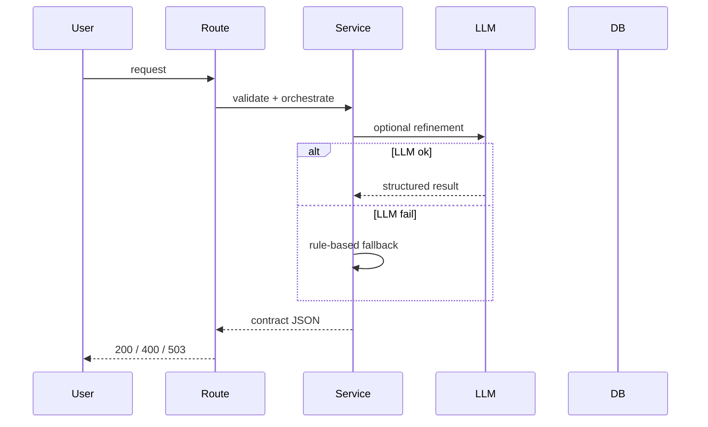
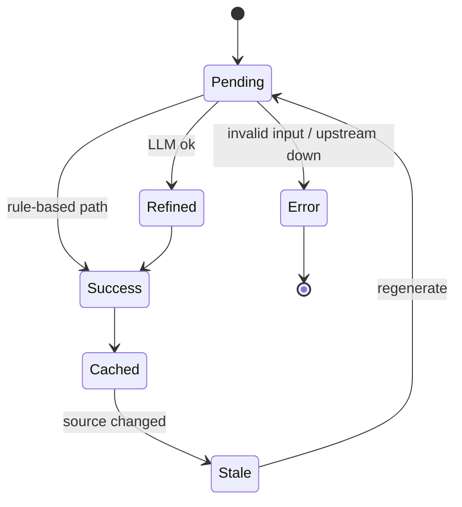
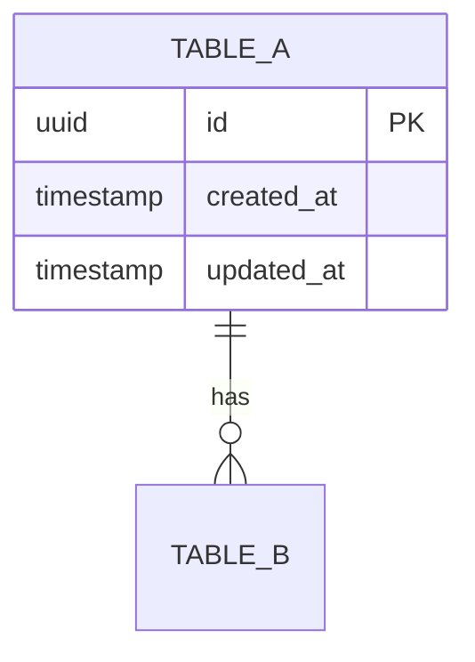

# Product Requirements Document (PRD)

**Feature Name:** <Feature Name>
**Version:** 1.0.0 (MVP)
**Status:** Draft
**Product Manager:** <Name>
**Target Users:** <Primary user groups>

> Keep the header above in sync with the YAML frontmatter (machine-readable source of truth).

---

## Change Log

| Version | Date       | Author | Change Summary |
| ------- | ---------- | ------ | -------------- |
| 1.0.0   | YYYY-MM-DD | <Name> | Initial draft  |

---

## 1. Executive Summary

[1-2 paragraphs: user problem, product value, expected output, trust/quality statement]

### 1.1 Product Vision

[One paragraph: long-term product vision and strategic value]

### 1.2 Success Definition (MVP)

[One paragraph: what "MVP success" means operationally]

### 1.3 User Personas

1. **[Persona Name / Role]**

   - [Context]
   - [Pain points]
   - [Success criteria]

2. **[Persona Name / Role]**
   - [Context]
   - [Pain points]
   - [Success criteria]

### 1.4 Open Questions (Resolve Before Build)

- [Question that could change scope or contract]
- [Question that could change scope or contract]

> Open questions must be resolved before build lock; cross-check with Section 12.7 review decisions.

---

## 2. MVP Scope (P0 + P1)

### 2.1 P0 - Core Requirements (Launch Blockers)

| ID   | Feature   | Description            | Status      |
| ---- | --------- | ---------------------- | ----------- |
| F0.1 | [Feature] | [Testable requirement] | Not Started |

> Status column: Not Started | In Progress | Done | Blocked. Update as the PRD becomes a living tracker.

### 2.2 P1 - Important Enhancements

| ID   | Feature   | Description                              | Status      |
| ---- | --------- | ---------------------------------------- | ----------- |
| F1.1 | [Feature] | [Can be delayed without blocking launch] | Not Started |

### 2.3 Module Priority Summary

| Module   | Name          | Priority | Rationale           |
| -------- | ------------- | -------- | ------------------- |
| Module 0 | [Module Name] | P0/P1    | [Why this priority] |

### 2.4 Acceptance Criteria by Module

Write each AC as an assertable statement; use Gherkin (Given/When/Then) for critical paths:

> Given <precondition>, When <action/input>, Then <expected result and error codes>.

#### Module 0: [Name]

- **AC0.1** [Testable criterion]
- **AC0.2** Given <x>, When <y>, Then <z>

#### Module 1: [Name]

- **AC1.1** [Testable criterion]

### 2.5 Related Code / Entry Points

| Req ID | Area      | Existing File(s) / Entry Point | Notes            |
| ------ | --------- | ------------------------------ | ---------------- |
| F0.1   | API route | `backend/.../routes/x.py`      | Add handler here |
| F0.2   | Service   | `backend/.../service.py`       | Reuse service    |

### 2.6 Requirements Traceability Matrix (RTM)

Map every requirement to its acceptance criteria, tests, KPI/validation, and owning module so the PRD is verifiable end-to-end.

| Req ID | Acceptance Criteria | Test Case ID | KPI / Validation        | Module / File           |
| ------ | ------------------- | ------------ | ----------------------- | ----------------------- |
| F0.1   | AC0.1               | T-F0.1-001   | Contract conformance    | `routes/x.py`           |
| F0.2   | AC0.2               | T-F0.2-001   | Evidence coverage >=95% | `services/x/service.py` |

---

## 3. Out of Scope

- [Explicitly excluded item]
- [Explicitly excluded item]

---

## 4. Technical Workflow

### 4.1 End-to-End User Flow (Text-Based)

1. [User flow step 1]
2. [User flow step 2]

### 4.2 Backend/System Workflow

1. [System step 1]
2. [System step 2]



### 4.3 Failure and Fallback Workflow

1. [Failure mode 1 and fallback]
2. [Failure mode 2 and fallback]



### 4.4 Config / Environment / External Dependencies

| Config / Env Var    | Required | Default | Description / Source      |
| ------------------- | -------- | ------- | ------------------------- |
| `LLM_BASE_URL`      | Yes      | -       | LLM provider endpoint     |
| `API_KEY`           | Yes      | -       | Secret from `.env`        |
| `ENABLE_LLM_REFINE` | No       | `false` | Feature flag for LLM path |

| External Service | Purpose   | SLA / Budget | Fallback if Down |
| ---------------- | --------- | ------------ | ---------------- |
| [Service]        | [Purpose] | [SLA]        | [Fallback]       |

---

## 5. Output Contract / Fixed JSON Schema

### 5.1 API Contract Summary

| Endpoint        | Method | Auth   | Success | Error Codes | Idempotent | Rate Limit |
| --------------- | ------ | ------ | ------- | ----------- | ---------- | ---------- |
| `/api/...`      | POST   | Bearer | 200     | 400/503     | No         | 10 rpm     |
| `/api/.../{id}` | GET    | Bearer | 200     | 404/503     | Yes        | -          |

Rules:

- Headers: `Content-Type: application/json`; echo `X-Request-ID` on response.
- Pagination: cursor-based (`?cursor=<opaque>&limit=`) for list endpoints.
- All failures use the error envelope (see Section 12.9).

### 5.2 Primary Response Schema (versioned)

```json
{
  "schema_version": "1.0.0",
  "id": "string_or_uuid",
  "status": "success|fallback|error",
  "structured_data": {},
  "metadata": {
    "parse_path": "primary|fallback",
    "cache_hit": false,
    "error_message": null
  }
}
```

Versioning & backward compatibility policy (non-negotiable):

- Bump `schema_version` on any breaking change.
- Within the same major version: additive-only changes (new optional fields).
- Breaking changes require a migration plan and must not silently alter shared contracts (e.g. `jd_parsed_json`).

### 5.3 Secondary Contract (if applicable)

```json
{
  "id": "uuid",
  "status": "success|fallback|error",
  "result": {},
  "metadata": {
    "version": "string",
    "error_message": null
  }
}
```

### 5.4 Database Schema Recommendations (MVP)

#### Table A: `[table_name]`

| Column | Type | Constraints | Notes         |
| ------ | ---- | ----------- | ------------- |
| id     | UUID | PK          | [Description] |



Data lifecycle rules:

- Soft delete: filter on `deleted_at IS NULL` everywhere.
- Retention: [e.g., keep last N versions / 90 days].
- Audit columns: `created_at`, `updated_at`, `created_by` on every table.

---

## 6. Non-Functional Requirements

| Category     | Requirement   |
| ------------ | ------------- |
| Determinism  | [Requirement] |
| Resilience   | [Requirement] |
| Performance  | [Requirement] |
| Traceability | [Requirement] |

---

## 7. Risks and Mitigations

| Risk   | Impact            | Mitigation   |
| ------ | ----------------- | ------------ |
| [Risk] | [High/Medium/Low] | [Mitigation] |

### 7.1 Failure-Mode Requirements (Non-negotiable)

- [Fallback requirement 1]
- [Fallback requirement 2]

---

## 8. Boundary / Separation Requirements

- [Ownership boundary 1]
- [Ownership boundary 2]
- [Backward compatibility or non-overwrite rule]

---

## 9. Success Metrics (KPIs)

| Metric   | Target           | Measured By                           |
| -------- | ---------------- | ------------------------------------- |
| [Metric] | [Numeric target] | [Dashboard / DB query / CI assertion] |

> Each P0 capability must map to at least one metric or validation mechanism (see RTM in 2.6).

---

## 10. Future Considerations (Post-MVP)

- [Future item]
- [Future item]

---

## 11. PRD Owner Sign-off

### 11.1 Definition of Done (DoD)

- [ ] All P0 items implemented and tested (per RTM).
- [ ] DB migrations applied and reversible.
- [ ] `.env.example` updated for new config.
- [ ] API/docs updated; no breaking change to existing contracts.
- [ ] CI green; test coverage added for each P0 item.

**PRD Owner Sign-off:** ****\_\_\_\_**** **Date:** **\_\_\_\_**
**Engineering Lead Sign-off:** **\_\_\_\_** **Date:** **\_\_\_\_**
**Data/AI Lead Sign-off:** **\_\_\_\_** **Date:** **\_\_\_\_**

---

## 12. Engineering Review Edition (Optional; add when requested)

This section is an implementation review layer. Keep Sections 1-11 as the canonical PRD.

### 12.1 Delivery Phases and Milestones

| Phase   | Scope   | Exit Criteria   |
| ------- | ------- | --------------- |
| Phase 1 | [Scope] | [Exit criteria] |
| Phase 2 | [Scope] | [Exit criteria] |

### 12.2 API Surface (MVP Proposed)

| Endpoint   | Method         | Purpose   | Notes   |
| ---------- | -------------- | --------- | ------- |
| `/api/...` | GET/POST/PATCH | [Purpose] | [Notes] |

### 12.3 Data and Consistency Rules (Review-Critical)

1. [Consistency rule 1]
2. [Consistency rule 2]

### 12.4 Test Plan and Quality Gates

| Test Layer        | Coverage Focus | Mandatory Cases |
| ----------------- | -------------- | --------------- |
| Unit Tests        | [Focus]        | [Cases]         |
| Integration Tests | [Focus]        | [Cases]         |
| E2E Tests         | [Focus]        | [Cases]         |

### 12.5 Release Readiness Checklist

- [ ] [Readiness item 1]
- [ ] [Readiness item 2]

### 12.6 Observability and Ops Runbook (MVP Minimum)

| Signal   | Threshold   | On-Call Action |
| -------- | ----------- | -------------- |
| [Signal] | [Threshold] | [Action]       |

### 12.7 Open Review Decisions (To Resolve Before Build Lock)

1. [Decision 1]
2. [Decision 2]

### 12.8 Engineering Sign-off Criteria

MVP build is review-approved only when:

1. [Criterion 1]
2. [Criterion 2]

### 12.9 API Error Code Catalog (Optional; add when needed)

| Error Code      | HTTP Status | Module   | Retryable | User Message (UI) | Client Action |
| --------------- | ----------- | -------- | --------- | ----------------- | ------------- |
| `EXAMPLE_ERROR` | 400         | module_x | No        | [Message]         | [Action]      |

```json
{
  "error_code": "string_enum",
  "message": "human_readable_message",
  "module": "module_0|module_1|module_2|module_3|cross",
  "retryable": true,
  "request_id": "uuid",
  "details": {},
  "timestamp": "ISO-8601"
}
```

---

## Glossary

| Term   | Definition   |
| ------ | ------------ |
| [Term] | [Definition] |
