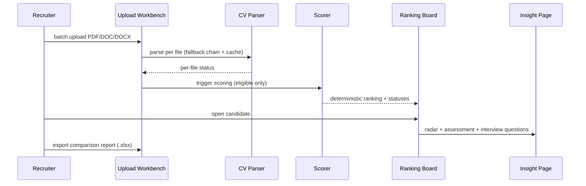

# Agent-CV-Screening Product Requirements Document (PRD)

**Feature Name:** Agent-CV-Screening Platform
**Version:** 2.0.0
**Status:** Active Draft
**Product Manager:** <Name>
**Target Users:** Recruiters/Reviewers, System Operators

> Keep the header above in sync with the YAML frontmatter (machine-readable source of truth).

---

## Change Log

| Version | Date       | Author        | Change Summary                                                         |
| ------- | ---------- | ------------- | ---------------------------------------------------------------------- |
| 2.0.0   | 2026-08-18 | HR Product Team | Restructured to canonical PRD template; split engineering content into `docs/ENGINEERING_SPEC.md`; aligned cross-references (FRS, implementation plan, feature PRDs). |
| 1.2.0   | 2026-08-03 | Project Team  | Baseline product PRD (previously mixed with engineering spec).         |

---

## 1. Executive Summary

University departments need a faster, more consistent way to screen large numbers of CVs. Manual review is slow, subjective, and hard to scale under deadline pressure. This product is a deterministic AI-assisted CV screening system that ingests CVs in bulk, extracts structured candidate profiles, ranks candidates with transparent scoring logic, and supports reviewer decisions with clear insights and interview guidance.

CRITICAL trust principle: **deterministic, explainable, and traceable by default**. Scoring and ranking must be reproducible for the same input and configuration, and every insight must be understandable to reviewers.

### 1.1 Product Vision

This is the first vertical use case of a broader direction: a future general-purpose evaluation and ranking platform. Modules must therefore be designed for future reuse and service extraction (parsing, scoring, insight, reporting as separable modules).

### 1.2 Success Definition (MVP / Demo)

Deliver an end-to-end usable demo workflow within 4 weeks with one full-time engineer: mixed-format batch upload, deterministic parsing and ranking, candidate insight visualization, and export — completed without manual data patching.

### 1.3 User Personas

1. **Recruiter / Reviewer (Primary)**
   - Context: creates or selects job config, uploads CVs, triggers scoring, reviews ranking and candidate details, logs review actions.
   - Pain points: slow manual triage, inconsistent screening criteria, opaque AI decisions.
   - Success criteria: completes shortlist review faster with clear per-candidate rationale and confidence.

2. **System Operator (Secondary)**
   - Context: monitors batch progress, retries failed files, validates demo environment readiness.
   - Pain points: invisible failures, full-batch restarts.
   - Success criteria: per-file status visibility and retry without restarting the batch.

---

## 2. MVP Scope (P0 + P1)

### 2.1 P0 - Core Requirements (Launch Blockers)

| ID   | Feature                         | Description                                                                                    | Status      |
| ---- | ------------------------------- | ---------------------------------------------------------------------------------------------- | ----------- |
| F0.1 | Job and Rubric Configuration    | Create and update job configurations with configurable scoring dimensions and weights.         | Not Started |
| F0.2 | Batch CV Upload                 | Support PDF/DOC/DOCX bulk upload with per-file processing status (`queued/processing/success/failed`). | Not Started |
| F0.3 | Deterministic Profile Extraction| Extract normalized candidate profile (identity, skills, education, experience, publications) with fallback chain and hash cache. | Not Started |
| F0.4 | Deterministic Scoring & Ranking | Rank candidates by total score descending with a deterministic tie-breaker; no LLM in the scoring path. | Not Started |
| F0.5 | Candidate Status Labels         | Assign recommendation statuses (`shortlisted/recommended/not_recommended/invalid_profile/manual_review`); missing `name` => `invalid_profile`. | Not Started |
| F0.6 | Candidate Insight Page          | 8-dimension radar chart, overall assessment (strengths/risks/rationale), recommended interview questions. | Not Started |
| F0.7 | Comparison Report Export        | Export comparison report (`.xlsx` minimum) for ranked candidates.                              | Not Started |
| F0.8 | JD Management & Matching        | Job Post management, JD parsing (agent chat interaction), candidate linking, and matching/ranking per `docs/jd-parser/PRD-JD_Management_v1.0.md`. | Not Started |

### 2.2 P1 - Important Enhancements

| ID   | Feature                | Description                                                                   | Status      |
| ---- | ---------------------- | ----------------------------------------------------------------------------- | ----------- |
| F1.1 | Candidate PDF Report   | Generate a one-page candidate PDF report (optional in demo).                  | Not Started |
| F1.2 | Feedback Analytics     | Aggregate reviewer feedback actions for quality analysis.                     | Not Started |
| F1.3 | Recalculation Monitor  | Background job status panel for long-running parse/score/report jobs.         | Not Started |
| F1.4 | Advanced Dashboards    | BI-style dashboards beyond channel analytics.                                 | Not Started |

> Status column: Not Started | In Progress | Done | Blocked.

### 2.3 Module Priority Summary

| Module   | Name                        | Priority | Rationale                                        |
| -------- | --------------------------- | -------- | ------------------------------------------------ |
| Module 0 | CV Ingestion & Parsing      | P0       | Foundation for all downstream scoring.           |
| Module 1 | Scoring & Ranking           | P0       | Core product value.                              |
| Module 2 | Candidate Insight           | P0       | Reviewer decision support.                       |
| Module 3 | Job & JD Management         | P0       | JD-to-shortlist loop (see JD PRD).               |
| Module 4 | Reporting & Feedback        | P1       | Export and analytics.                            |

### 2.4 Acceptance Criteria by Module

Write each AC as an assertable statement; use Gherkin for critical paths.

#### Module 0: CV Ingestion & Parsing

- **AC0.1** Given a batch of PDF/DOC/DOCX files, When uploaded, Then each file receives a processing status and failures include `error_code`/`error_message`.
- **AC0.2** Given a parsed candidate without `name`, When ranked, Then the candidate is labeled `invalid_profile` and excluded from the default ranking list.
- **AC0.3** Given the same file and configuration, When parsed twice, Then the structured output is identical (deterministic).

#### Module 1: Scoring & Ranking

- **AC1.1** Given the same input dataset and config, When ranked twice, Then the ranking order is identical.
- **AC1.2** Scoring path must not call the LLM (deterministic rule-based engine).

#### Module 2: Candidate Insight

- **AC2.1** Given a ranked candidate, When opening detail, Then the page shows the 8-axis radar chart, overall assessment, and recommended interview questions.
- **AC2.2** Interview questions map to weak or critical dimensions with `difficulty` in `easy|medium|hard`.

#### Module 3: Job & JD Management

- **AC3.1** Refer to `docs/jd-parser/PRD-JD_Management_v1.0.md` for JD parsing, chat interaction, and matching acceptance criteria.

#### Module 4: Reporting

- **AC4.1** Given ranked candidates, When exporting a comparison report, Then an `.xlsx` file is generated and downloadable.

### 2.5 Related Code / Entry Points

| Req ID | Area            | Existing File(s) / Entry Point       | Notes                            |
| ------ | --------------- | ------------------------------------ | -------------------------------- |
| F0.1   | Job config      | `backend/app/api/routes/jobs.py`     | CRUD + status + duplicate        |
| F0.2   | Upload          | `backend/app/api/routes/candidates.py` | `POST /candidates/upload`      |
| F0.3   | CV parsing      | `backend/app/services/cv_parser/service.py` | Fallback chain + hash cache  |
| F0.4   | Scoring         | `backend/app/services/scorer.py`, `backend/app/api/routes/scoring.py` | Deterministic engine |
| F0.6   | Insight         | `backend/app/api/routes/scoring.py` (results) | Radar + assessment + questions |
| F0.7   | Reporting       | `backend/app/api/routes/reports.py`, `backend/app/services/reporter.py` | xlsx comparison |

### 2.6 Requirements Traceability Matrix (RTM)

| Req ID | Acceptance Criteria | Test Case ID | KPI / Validation                     | Module / File                  |
| ------ | ------------------- | ------------ | ------------------------------------ | ------------------------------ |
| F0.1   | AC3.1               | T-F0.1-001   | Job CRUD round-trip tests            | `routes/jobs.py`               |
| F0.2   | AC0.1               | T-F0.2-001   | Upload success rate >= 90%           | `routes/candidates.py`         |
| F0.3   | AC0.3               | T-F0.3-001   | Determinism test (fixed corpus)      | `services/cv_parser/`          |
| F0.4   | AC1.1, AC1.2        | T-F0.4-001   | Ranking stability CI test            | `services/scorer.py`           |
| F0.5   | AC0.2               | T-F0.5-001   | invalid_profile assignment test      | scorer / schemas               |
| F0.6   | AC2.1, AC2.2        | T-F0.6-001   | Insight payload conformance          | `routes/scoring.py`            |
| F0.7   | AC4.1               | T-F0.7-001   | Export E2E test                      | `services/reporter.py`         |
| F0.8   | AC3.1               | T-F0.8-001   | See JD PRD RTM                       | `routes/jobs.py`, jd services  |
---

## 3. Out of Scope

- Full enterprise authentication and SSO integration.
- Complex multi-tenant permission matrix.
- Advanced BI dashboards.
- Multi-region deployment.
- Advanced async orchestration across multiple workers (queue refactor is post-demo).
- Token-level model attention explainability.

---

## 4. Technical Workflow

### 4.1 End-to-End User Journey (Text-Based)

1. Recruiter creates/selects a job and scoring rubric.
2. Recruiter uploads CVs in bulk (mixed formats supported).
3. System parses files and updates file-level processing statuses.
4. System validates minimum identity fields (`name` required); missing `name` => `invalid_profile`.
5. Eligible candidates are scored and ranked deterministically.
6. Recruiter views ranking list and status labels.
7. Recruiter opens candidate details: radar chart, overall assessment, recommended interview questions.
8. Recruiter exports comparison report and logs actions.
9. For JD-driven hiring: HR manages Job Posts, parses JD via the JD agent chat, imports candidates, and reviews the updated ranking (see JD PRD).

### 4.2 System Flow (Mermaid)



---

## 5. Output Contract / Fixed JSON Schema

This section is the canonical single source of truth for enums and field names shared across frontend and backend. All APIs, DB mappings, and UI states must align with this dictionary. Concrete DB schema and full API specs live in `docs/ENGINEERING_SPEC.md`.

### 5.1 Candidate Processing Status

Used for file-level ingestion/parsing pipeline visibility.

- `queued`, `processing`, `success`, `failed`

### 5.2 Candidate Recommendation Status

- `shortlisted`, `recommended`, `not_recommended`, `invalid_profile`, `manual_review`

Rules:

- `invalid_profile` is automatically assigned when required identity fields are missing (at minimum `name`).
- `manual_review` can be operator-assigned and takes precedence in UI status display.

### 5.3 Required Candidate Identity Fields

- `name` (required)
- Optional but recommended: `email`, `phone`

### 5.4 Canonical Field Names (JSON Shapes)

#### Upload Item

```json
{
  "batch_id": "string",
  "file_id": "string",
  "file_name": "string",
  "file_type": "pdf|doc|docx",
  "processing_status": "queued|processing|success|failed",
  "error_code": "string|null",
  "error_message": "string|null",
  "candidate_id": "uuid|null",
  "created_at": "datetime"
}
```

#### Candidate Profile (Normalized)

```json
{
  "candidate_id": "uuid",
  "name": "string|null",
  "email": "string|null",
  "phone": "string|null",
  "education": [],
  "experience": [],
  "skills": [],
  "publications": []
}
```

#### Ranking Row

```json
{
  "rank": "number",
  "candidate_id": "uuid",
  "candidate_name": "string",
  "total_score": "number",
  "recommendation_status": "shortlisted|recommended|not_recommended|invalid_profile|manual_review",
  "tier": "string",
  "dimension_scores": {
    "skill_match": "number",
    "experience_match": "number",
    "education_match": "number",
    "research_quality": "number",
    "communication_signal": "number",
    "leadership_signal": "number",
    "domain_relevance": "number",
    "project_impact": "number"
  }
}
```

#### Candidate Insight Response

```json
{
  "candidate_id": "uuid",
  "recommendation_status": "shortlisted|recommended|not_recommended|invalid_profile|manual_review",
  "overall_assessment": {
    "summary": "string",
    "strengths": ["string"],
    "risks": ["string"],
    "rationale": "string"
  },
  "radar_dimensions": {
    "skill_match": "number",
    "experience_match": "number",
    "education_match": "number",
    "research_quality": "number",
    "communication_signal": "number",
    "leadership_signal": "number",
    "domain_relevance": "number",
    "project_impact": "number"
  },
  "recommended_interview_questions": [
    {
      "question": "string",
      "target_dimension": "string",
      "difficulty": "easy|medium|hard",
      "intent": "string"
    }
  ]
}
```

### 5.5 Endpoint Naming Alignment

- Batch upload status: `GET /jobs/{job_id}/uploads/{batch_id}/status`
- Candidate recommendation status update: `PUT /jobs/{job_id}/candidates/{candidate_id}/status`
- Candidate insight: `GET /jobs/{job_id}/results/{candidate_id}/insight`
- JD parse: `POST /jobs/{job_id}/parse-jd` (see JD PRD)
- Scoring: `POST /jobs/{job_id}/score`, `GET /jobs/{job_id}/results`
- Reports: `POST /reports/comparison/{job_id}`, `GET /reports/download/{report_id}`

### 5.6 Versioning Rule
### 5.7 API Contract Summary and Config / Environment (Pointer)

N/A at product level - the detailed API contract summary (methods, auth, status codes, idempotency, rate limits) and environment/configuration variables are maintained in `docs/ENGINEERING_SPEC.md`. This PRD defines only the canonical field names and enums above.


If any enum value or field name in this section changes:

1. Update this section first.
2. Bump the PRD document version.
3. Update backend schemas and frontend types in the same change set.

Versioning policy: additive-only changes within the same major version; breaking changes require a migration plan and must not silently alter shared contracts.
---

## 6. Non-Functional Requirements

| Category     | Requirement                                                                                     |
| ------------ | ----------------------------------------------------------------------------------------------- |
| Determinism  | Same input + same configuration yields the same ranking outcome; scoring path never calls LLM.  |
| Performance  | Handle up to 200 uploads per batch in staging; ranking list usable for 500+ rows.               |
| Reliability  | Failures visible at file level; failed files retryable without full batch restart.              |
| Traceability | Parse path, error context, and version metadata returned/stored for debugging and audit.        |
| Usability    | Clear status-driven UX for upload and ranking pages; fast drill-down to candidate insight.      |
| Security     | Role-based access; uploaded files and PII encrypted at rest and in transit.                     |
| Compatibility| Frontend TS types and backend schemas match the canonical dictionary without naming drift.      |

---

## 7. Risks and Mitigations

| Risk                                | Impact | Mitigation                                                                 |
| ----------------------------------- | ------ | -------------------------------------------------------------------------- |
| Parsing variability across formats  | High   | Parser adapters + explicit invalid-profile handling + fallback chain.      |
| Scope creep during demo window      | High   | Protect core demo path; strict feature freeze.                             |
| Contract drift FE/BE                | High   | Shared canonical dictionary + consistency checks in CI.                    |
| LLM output drift despite fixed params | Medium | Response schema validation + hash cache + regression golden set.           |
| DOC/DOCX quality inconsistency      | Medium | Parser adapter abstraction + fallback extraction + explicit failure flags. |

---

## 8. Boundary / Separation Requirements

- **CV parser ownership (CRITICAL):** extraction logic and output schema stay in `backend/app/services/cv_parser`; not redefined by other PRDs.
- **JD parser ownership (CRITICAL):** JD parsing stays in `backend/app/services/jd_parser`; CV parser must not be overloaded with JD logic.
- **Modularity:** parsing, scoring, insight, and reporting are separable modules with stable interfaces for future reuse as a general evaluation platform.
- **Scoring engine generic:** scorer input is normalized JSON (not CV-specific); rubric/config externalized and versionable.

---

## 9. Success Metrics (KPIs)

| Metric                                          | Target                                       | Measured By                                        |
| ----------------------------------------------- | -------------------------------------------- | -------------------------------------------------- |
| Batch upload success rate                       | >= 90% under normal file quality             | CI + staging run logs (per-file status)            |
| Deterministic ranking stability                 | 100% identical repeated runs (same input/config) | CI determinism test over fixed dataset        |
| Upload scale                                    | 200 CV files in one batch                    | Staging load test                                  |
| Demo end-to-end completion                      | No manual data patching required             | Demo walkthrough checklist (UAT)                   |
| Contract consistency (FE/BE enums and fields)   | 0 naming drift                               | CI contract-consistency check                     |

---

## 10. Future Considerations (Post-MVP)

- General-purpose evaluation and ranking platform (non-CV domains).
- Full enterprise auth / SSO and multi-tenant permission matrix.
- Advanced BI dashboards and analytics.
- Background task queue for long-running parse/score/report jobs.
- Multi-region deployment.
- Feedback-driven model quality improvements.

---

## 11. PRD Owner Sign-off

### 11.1 Definition of Done (DoD)

- [ ] All P0 capabilities implemented and tested (per RTM).
- [ ] Canonical dictionary changes (if any) applied to backend schemas + frontend types in one change set.
- [ ] FRS and feature PRDs updated and cross-references valid.
- [ ] Demo walkthrough passes end-to-end without manual patching.
- [ ] CI green (typecheck, unit/integration tests, build).

**PRD Owner Sign-off:** ____________ **Date:** ________
**Engineering Lead Sign-off:** ________ **Date:** ________
**Data/AI Lead Sign-off:** ________ **Date:** ________

---

## 12. Engineering Review Edition (Reference)

Detailed engineering review content (DB schema, API specification, testing requirements, environment variables, Docker, and Cursor implementation instructions) is maintained in:

- `docs/ENGINEERING_SPEC.md` — implementation spec (directory structure, database models, API, services, env vars, Docker, testing, dev workflow).
- `docs/IMPLEMENTATION_PLAN.md` — 4-week rapid demo schedule and milestones.
- `docs/FRS.md` — detailed functional requirements (FR-001 ~ FR-026) with traceability.

---

## Glossary

| Term                | Definition                                                              |
| ------------------- | ----------------------------------------------------------------------- |
| `invalid_profile`   | Candidate missing required identity fields (at minimum `name`).         |
| `manual_review`     | Operator-assigned status that takes precedence in UI display.           |
| Canonical dictionary| Single source of truth for enums/field names shared FE/BE (Section 5).  |
| Deterministic path  | Rule-based scoring path with no LLM dependency.                         |
| Fallback chain      | Vision -> text LLM -> rule-based extraction for CV parsing.             |