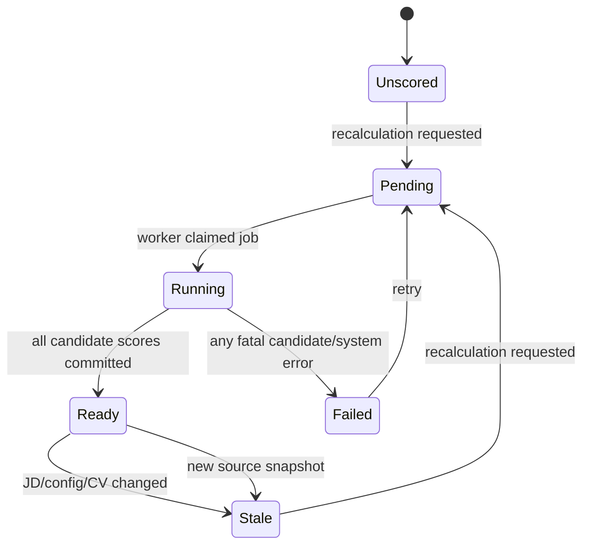
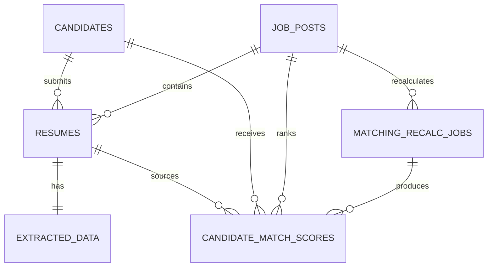

# Product Requirements Document (PRD)

**Feature Name:** Explainable Candidate Matching and Ranking P0  
**Version:** 1.0.4 (MVP)  
**Status:** Draft  
**Product Manager:** HR Product Team  
**Target Users:** Recruiters, HR Specialists, Hiring Managers, Recruiting Operations Leads

> Keep this visible header synchronized with the YAML frontmatter.

---

## Change Log

| Version | Date       | Author           | Change Summary                                                                                                                                                     |
| ------- | ---------- | ---------------- | ------------------------------------------------------------------------------------------------------------------------------------------------------------------ |
| 1.0.4   | 2026-08-20 | Engineering Team | Moved upload-triggered matching to the backend CV upload route with debounced coalescing; frontend batch upload no longer calls recalculate. |
| 1.0.3   | 2026-08-20 | Engineering Team | Triggered one matching recalculation after each successful frontend CV batch and condensed duplicate examples/review text without changing the contract. |
| 1.0.2   | 2026-08-20 | Engineering Team | Added atomic worker claims, heartbeat watchdog recovery, pending-work rescheduling, serialized idempotency checks, and one shared dense-ranking implementation. |
| 1.0.1   | 2026-08-20 | Engineering Team | Updated implementation status after completing the candidate matching database, deterministic backend engine, recalculation workflow, ranking APIs, and migration. |
| 1.0.0   | 2026-08-20 | HR Product Team  | Initial engineering-ready specification for radar scoring, explainable ranking, fixed-template interview questions, database migration, and JobPost integration.   |

---

## 1. Executive Summary

The product must evaluate every candidate against one specific Job Post, produce a comparable 0-100 match score, rank all candidates for that Job Post, and explain every score with traceable CV and JD evidence. Recruiters will use the ranked table to decide whom to review first, then open a candidate detail view containing a radar chart, dimension-level reasoning, eligibility flags, evidence confidence, and prepared interview questions.

This capability is decision support, not an automatic hiring or rejection system. The score measures documented JD-CV fit only. Protected characteristics, identity information, location, and work authorization must not be used as capability dimensions. Eligibility and operational constraints are displayed separately from the match score.

CRITICAL trust principle: every numeric score must be deterministic, versioned, reproducible, and backed by structured evidence. Missing data must be shown explicitly and must never be silently converted into an arbitrary neutral score.

### 1.1 Product Vision

Enable an HR user to move from a parsed JD and a set of parsed CVs to a transparent shortlist in minutes, while preserving enough evidence and version history for a hiring manager or auditor to reconstruct why each candidate was ranked.

### 1.2 Success Definition (MVP)

MVP succeeds when an HR user can:

1. Open a Job Post and see all successfully parsed candidates ranked from most to least recommended.
2. See normalized scoring weights and a consistent fit score for every candidate under that Job Post.
3. Open any row and inspect a radar chart with dimension scores, JD requirements, CV evidence, gaps, and deterministic reasoning.
4. See 3-6 fixed-template interview questions generated from score gaps or evidence that requires verification.
5. Change the Job Post matching configuration, trigger recalculation, and see a new atomic score version without mixing old and new results.

### 1.3 User Personas

| Persona | Need | Success |
| --- | --- | --- |
| Recruiter / HR Specialist | Review many candidates quickly using reliable ranks, visible gaps, and prepared questions. | Identifies the first review group without spreadsheet comparison. |
| Hiring Manager | Inspect technical/role evidence and understand rank differences. | Traces every score to CV evidence and a JD requirement. |
| Recruiting Operations Lead | Ensure consistent, auditable versions, reruns, failures, and quality. | Reproduces rankings from stored snapshots. |

### 1.4 Open Questions (Resolve Before Build)

No blocking product decision remains for P0. Section 12.7 records the default implementation decisions. Any change to those defaults requires a PRD version update before implementation.

---

## 2. MVP Scope (P0 + P1)

### 2.1 P0 - Core Requirements (Launch Blockers)

| ID    | Feature                   | Description                                                                                                                     | Status      |
| ----- | ------------------------- | ------------------------------------------------------------------------------------------------------------------------------- | ----------- |
| F0.1  | Job-scoped matching       | Score only CVs linked through `resumes.job_post_id` to the requested `JobPost`.                                                 | Done        |
| F0.2  | Six-dimension scoring     | Produce the fixed dimension contract defined in Section 5; inactive dimensions return `score: null` and zero normalized weight. | Done        |
| F0.3  | Normalized weights        | Normalize active dimension weights to exactly `1.000000` before calculating the total score.                                    | Done        |
| F0.4  | Explainable radar data    | Return radar-ready dimensions with score, weight, requirement, CV evidence, gaps, reasoning, status, and confidence.            | Done        |
| F0.5  | Eligibility separation    | Return `passed`, `failed`, or `needs_review` separately from capability match score.                                            | Done        |
| F0.6  | Confidence score          | Return evidence confidence separately; confidence must not be presented as candidate quality.                                   | Done        |
| F0.7  | Ranked candidate table    | List all candidates using one successful score version, ordered by recommendation group and total score.                        | In Progress |
| F0.8  | Fit bands                 | Assign `high`, `medium`, or `low` using fixed P0 thresholds.                                                                    | Done        |
| F0.9  | Candidate score detail    | A row click retrieves the full radar, reasoning, evidence, eligibility, and interview-question payload.                         | In Progress |
| F0.10 | Fixed interview templates | Generate 3-6 questions only from approved templates and stored trigger evidence.                                                | Done        |
| F0.11 | Versioned recalculation   | Recalculation writes a complete new `score_version`; readers switch versions only after the whole job succeeds.                 | Done        |
| F0.12 | Matching job status       | Persist recalculation status and expose pending/running/succeeded/failed progress.                                              | Done        |
| F0.13 | Immutable snapshots       | Store JD, matching config, CV identity/hash, normalized weights, and algorithm version with each score.                         | Done        |
| F0.14 | Database migration        | Introduce additive JobPost matching tables and Alembic migrations without deleting legacy scoring data.                         | Done        |
| F0.15 | Deterministic output      | Identical input snapshots and algorithm version produce identical scores, reasons, questions, fit bands, and rank.              | Done        |
| F0.16 | Error and stale states    | UI/API distinguish unscored, stale, running, failed, and ready; unscored candidates must not display `0` as if evaluated.       | In Progress |
| F0.17 | Upload-triggered matching | After each successful CV parse in `POST /candidates/upload`, the backend debounces and enqueues one `cv_uploaded` recalculation for the Job Post. | Done        |

> Status column: Not Started | In Progress | Done | Blocked.

### 2.2 P1 - Important Enhancements

| ID   | Feature                    | Description                                                                           | Status      |
| ---- | -------------------------- | ------------------------------------------------------------------------------------- | ----------- |
| F1.1 | Candidate comparison       | Overlay selected candidates or show side-by-side radar charts.                        | Not Started |
| F1.2 | Recruiter question editing | Allow HR to edit, reorder, save, and export prepared questions.                       | Not Started |
| F1.3 | Role-family templates      | Provide engineering, research, management, sales, and regulated-role scoring presets. | Not Started |
| F1.4 | Feedback calibration       | Use recruiter outcomes to evaluate thresholds; do not automatically retrain weights.  | Not Started |
| F1.5 | Export                     | Export ranked table and candidate detail to CSV/XLSX/PDF.                             | Not Started |
| F1.6 | Fairness monitoring        | Add aggregate disparity monitoring where legally permitted and privacy-reviewed.      | Not Started |
| F1.7 | Cross-job talent search    | Match one candidate against multiple active Job Posts.                                | Not Started |

### 2.3 Module Priority Summary

All five modules are P0: M0 configuration/contracts establishes one source of truth; M1 deterministic engine produces explainable scores; M2 persistence/recalculation guarantees atomic reproducibility; M3 ranking/read APIs supply table/detail data; M4 radar/questions delivers recruiter-facing value.

### 2.4 Acceptance Criteria by Module

#### Module 0: Configuration and Contracts

- **AC0.1** Given a valid matching config, When validated, Then all configured weights are finite and non-negative, and active normalized weights sum to `1.000000 ± 0.000001`.
- **AC0.2** Given a JD with no education requirement, When config is built, Then `education_certification.active=false`, its score is `null`, and its normalized weight is `0`.
- **AC0.3** The six dimension IDs are stable and exactly match Section 5.2.
- **AC0.4** Wire JSON uses `snake_case`; frontend conversion owns `camelCase`.

#### Module 1: Matching Engine

- **AC1.1** Given the same JD snapshot, CV snapshot, config, taxonomy, reference date, and algorithm version, When scored twice, Then canonical JSON outputs are byte-equivalent except generated record IDs/timestamps.
- **AC1.2** A dimension score is always `null` or in `[0,100]`.
- **AC1.3** Total score is in `[0,100]` and is calculated only from active dimensions.
- **AC1.4** Every active dimension returns at least one requirement entry and one reasoning object.
- **AC1.5** Missing explicit CV evidence is reported as a gap; the engine does not invent evidence.
- **AC1.6** Location and work authorization never contribute to the six capability dimensions.

#### Module 2: Persistence and Recalculation

- **AC2.1** Given Job A and Job B candidates, When recalculating Job A, Then no Job B resume is read or scored.
- **AC2.2** Given a job with ten eligible parsed resumes, When recalculation succeeds, Then exactly ten result rows exist for the new score version.
- **AC2.3** Given one candidate score fails, When the recalculation job completes, Then the new version is not published as current and the previous successful version remains readable with `stale=true`.
- **AC2.4** Repeating the same idempotency key returns the original recalculation job and does not create another score version.
- **AC2.5** Legacy `department_configs` and `scoring_results` rows remain readable and are not destructively migrated in P0.
- **AC2.6** Recalculation creation serializes on the Job Post row before checking idempotency, active work, rate limits, and reserving the next score version.
- **AC2.7** A worker atomically claims only a `pending` job, refreshes `heartbeat_at` while processing, and startup/watchdog recovery re-enqueues non-expired pending jobs.
- **AC2.8** Pending or running jobs with activity older than `matching_recalc_timeout_seconds` become terminal `failed` jobs with `MATCHING_RECALC_TIMEOUT`.
- **AC2.9** Given N successful CV parses within the debounce window for one Job Post, When the window closes, Then exactly one `cv_uploaded` recalculation is enqueued; failed parses enqueue nothing.

#### Module 3: Ranking and APIs

- **AC3.1** Given a published score version, When listing candidates, Then all rows come from that single version.
- **AC3.2** Default ordering is eligibility recommendation group, total score descending, core skill score descending, relevant experience score descending, confidence descending, then candidate ID ascending only as a deterministic non-business fallback.
- **AC3.3** Candidates with identical business sort values receive the same displayed rank.
- **AC3.4** A candidate with no published score returns `scoring_status=unscored` and `match_score=null`.
- **AC3.5** Pagination does not change rank values.

#### Module 4: Radar and Interview Questions

- **AC4.1** Clicking a ranked row loads the matching detail for the same `score_version` shown in the table.
- **AC4.2** Radar axes render only active dimensions; inactive dimensions are listed as `Not applicable` outside the polygon.
- **AC4.3** Each radar dimension exposes score, normalized weight, status, requirement, evidence, gap, reasoning, and confidence.
- **AC4.4** Each interview question has an approved `template_id`, trigger reason, dimension ID, and priority.
- **AC4.5** The system produces no more than six and no fewer than three questions when at least three actionable triggers exist.
- **AC4.6** Questions never reference age, gender, ethnicity, marital/family status, disability, religion, nationality, or other protected attributes.

### 2.5 Related Code / Entry Points

| Req ID      | Area               | Existing File(s) / Entry Point                                            | Required Direction                                                                        |
| ----------- | ------------------ | ------------------------------------------------------------------------- | ----------------------------------------------------------------------------------------- |
| F0.1        | Job/CV association | `backend/app/models/database.py`, `backend/app/api/routes/candidates.py`  | Reuse `Resume.job_post_id`; do not create a second candidate-job link table.              |
| F0.2-F0.6   | Scoring            | `backend/app/services/scorer.py`, `backend/app/services/skill_matcher.py` | Move/refactor behind `candidate_matching/` while preserving compatibility imports.        |
| F0.7-F0.9   | Read API           | `backend/app/api/routes/jobs.py`, `backend/app/api/routes/scoring.py`     | Read new JobPost matching tables, not `DepartmentConfig`.                                 |
| F0.10       | Questions          | `backend/app/services/scorer.py::_build_interview_suggestions`            | Replace free generic suggestions with fixed template records.                             |
| F0.11-F0.14 | DB/versioning      | `backend/app/models/database.py`, `backend/app/main.py`                   | Add new tables/columns through Alembic; stop adding matching migrations to startup hooks. |
| F0.16       | Frontend state     | `frontend/src/components/JobBoard/`, `frontend/src/types/index.ts`        | Add nullable score and explicit scoring status.                                           |
| F0.17       | Upload trigger     | `backend/app/api/routes/candidates.py`, `backend/app/services/matching_service.py` | Debounce rapid uploads into one backend `cv_uploaded` recalculation. |

### 2.6 Requirements Traceability Matrix (RTM)

| Req ID | Acceptance Criteria | Test Case ID         | KPI / Validation                   | Module / File                |
| ------ | ------------------- | -------------------- | ---------------------------------- | ---------------------------- |
| F0.1   | AC2.1               | T-MATCH-INT-001      | Cross-job leakage = 0              | routes + repository          |
| F0.2   | AC0.3, AC1.2        | T-MATCH-UNIT-001     | Schema conformance                 | candidate_matching contracts |
| F0.3   | AC0.1, AC1.3        | T-MATCH-UNIT-002     | Weight sum assertion               | config builder               |
| F0.4   | AC1.4, AC4.3        | T-MATCH-CONTRACT-001 | Explainability completeness >= 95% | service + schema             |
| F0.5   | AC1.6               | T-MATCH-UNIT-003     | Eligibility separation             | eligibility evaluator        |
| F0.6   | AC1.5               | T-MATCH-UNIT-004     | Unsupported evidence claims = 0    | evidence evaluator           |
| F0.7   | AC3.1-AC3.5         | T-MATCH-INT-002      | Stable ranking                     | ranking repository           |
| F0.8   | AC1.3               | T-MATCH-UNIT-005     | Threshold boundary tests           | ranker                       |
| F0.9   | AC4.1-AC4.3         | T-MATCH-E2E-001      | Detail load success >= 99%         | API + frontend               |
| F0.10  | AC4.4-AC4.6         | T-MATCH-UNIT-006     | Template compliance = 100%         | question builder             |
| F0.11  | AC2.2-AC2.4         | T-MATCH-INT-003      | Atomic publish                     | recalculation service        |
| F0.12  | AC2.3               | T-MATCH-INT-004      | Failure state correctness          | jobs table/API               |
| F0.13  | AC1.1               | T-MATCH-REPRO-001    | Reproducibility = 100%             | snapshots                    |
| F0.14  | AC2.5               | T-MATCH-MIG-001      | Migration rollback rehearsal       | Alembic                      |
| F0.15  | AC1.1               | T-MATCH-REPRO-002    | Determinism CI gate                | matching service             |
| F0.16  | AC3.4               | T-MATCH-E2E-002      | No false zero scores               | frontend                     |
| F0.17  | AC2.9               | T-MATCH-E2E-003      | One recalculation per debounce window | candidates upload + matching_service |

---

## 3. Out of Scope

- Automatic hiring or rejection decisions.
- Using protected attributes or inferred protected attributes in scoring.
- LLM-generated free-form scoring, reasoning, or interview questions.
- Semantic embedding/vector similarity in the P0 score.
- Cross-job candidate recommendations.
- Recruiter-authored arbitrary formulas or executable scoring expressions.
- Automatic weight optimization from feedback.
- Side-by-side candidate comparison.
- Replacing the CV Parser or JD Parser extraction contracts.
- Destructive migration or deletion of legacy `DepartmentConfig` scoring data.
- Report export, interview scheduling, or ATS write-back.

---

## 4. Technical Workflow

### 4.1 End-to-End User Flow

1. HR creates or opens a Job Post and confirms parsed JD requirements.
2. The system creates or validates `matching_config_json`.
3. HR uploads one or more CVs; each is parsed and linked through `Resume`.
4. Each successful parse marks matching `stale` (or `unscored` before the first version) and schedules a debounced backend `cv_uploaded` recalculation.
5. The frontend refreshes the candidate list after upload; manual/config-triggered recalculation remains available.
6. The candidate table shows `running` while retaining the last successful version if one exists.
7. When the whole recalculation succeeds, the system atomically publishes the new version.
8. HR sees candidates ordered from most to least recommended.
9. HR clicks a candidate row and sees radar dimensions, reasons, evidence, gaps, eligibility, confidence, and fixed-template questions.

### 4.2 Backend/System Workflow

1. Load `JobPost` where `deleted_at IS NULL`.
2. Load the persisted JD structured data and matching config.
3. Validate and canonicalize configuration; calculate `config_hash`.
4. Create one `matching_recalc_jobs` row with `target_score_version=current_score_version+1`.
5. Query only `Resume` rows for the requested `job_post_id`, joined to successful `ExtractedData`.
6. For each resume:

- Build immutable input snapshot metadata.
- Evaluate eligibility.
- Evaluate six dimensions using deterministic rules.
- Normalize active weights.
- Calculate total score, fit band, confidence, dimension reasoning, and questions.
- Refresh the persisted recalculation heartbeat and progress counter.

7. Rank all calculated rows through the shared deterministic ranker.
8. If every expected candidate succeeded, insert the complete published score batch and atomically update `JobPost.current_score_version`.
9. If any candidate failed, mark the recalculation failed, discard the incomplete in-memory batch, and keep the previous current version.

```mermaid
sequenceDiagram
    participant HR as HR User
    participant API as Matching API
    participant JOB as Recalculation Service
    participant ENG as CandidateMatchingService
    participant DB as PostgreSQL

    HR->>API: POST /jobs/{id}/matching/recalculate
    API->>DB: lock JobPost; idempotency check; reserve version
    API-->>HR: 202 recalc_job_id
    JOB->>DB: atomically claim pending job
    JOB->>DB: load JobPost + job-scoped CVs
    loop each successfully parsed CV
        JOB->>ENG: match(cv, jd, config, reference_date)
        ENG-->>JOB: score + radar + evidence + questions
        JOB->>DB: update progress + heartbeat
    end
    JOB->>JOB: rank all rows with shared ranker
    alt all candidates succeeded
        JOB->>DB: publish version atomically
        DB-->>HR: ranking status ready
    else one or more failed
        JOB->>DB: mark recalc failed; keep previous version
        DB-->>HR: previous version + stale warning
    end
```

### 4.3 Failure and Fallback Workflow

1. Missing/invalid JD: reject recalculation with `MATCHING_JD_NOT_READY`.
2. No successful CV parses: complete job with zero scored candidates; table remains empty, not failed.
3. Candidate parse pending/failed: exclude from scoring and return its row with parse/scoring status.
4. Candidate scoring exception: fail the target version atomically; never publish a partially ranked version.
5. Worker restart or watchdog scan: non-expired pending jobs are re-enqueued; pending/running jobs whose latest heartbeat exceeds the timeout become `failed` and are safe to retry using a new idempotency key.
6. Unknown eligibility evidence: return `needs_review`, not `failed`.
7. Unsupported role-specific requirement: mark that requirement `unknown` and lower confidence; never invent a score reason.



### 4.4 Config / Environment / External Dependencies

| Config / Env Var                  | Required | Default                 | Description                                        |
| --------------------------------- | -------- | ----------------------- | -------------------------------------------------- |
| `MATCHING_ENABLED`                | No       | `true`                  | Enables matching routes, recovery, and watchdog.   |
| `MATCHING_SCHEMA_VERSION`         | No       | `1.0.0`                 | Public matching contract version.                  |
| `MATCHING_ALGORITHM_VERSION`      | No       | `candidate-matching-v1` | Included in every score snapshot and hash.         |
| `MATCHING_TAXONOMY_VERSION`       | No       | `skill-taxonomy-v1`     | Identifies the relationship resolver data.         |
| `MATCHING_RECALC_TIMEOUT_SECONDS` | No       | `900`                   | Lease for abandoned pending/running jobs.          |
| `MATCHING_RECALC_DEBOUNCE_SECONDS`| No       | `5`                     | Coalesce rapid CV uploads into one recalculation.  |

Interview question limits remain per-job config (`3..6` when triggers exist); the recalculation creation date is the persisted/injectable reference date. Backend upload is the P0 coalescing boundary: each successful parse schedules debounced work, and the service merges bursts into one enqueue. If a recalculation is already active, new upload requests are deferred until it completes.

| External Service       | Purpose                                       | P0 Requirement    | Fallback if Down                                                    |
| ---------------------- | --------------------------------------------- | ----------------- | ------------------------------------------------------------------- |
| PostgreSQL 15          | Job, snapshot, score, and ranking persistence | Required          | API returns 503; no in-memory publish.                              |
| Existing CV Parser     | Produces candidate structured data            | Required upstream | Candidate remains unscored.                                         |
| Existing JD Parser     | Produces structured job requirements          | Required upstream | Recalculation blocked until valid JD exists.                        |
| Skill taxonomy YAML/DB | Canonical skill matching                      | Required          | Fail job with explicit taxonomy error; do not fuzzy-match silently. |

No LLM is called by the P0 matching engine.

---

## 5. Output Contract / Fixed JSON Schema

### 5.1 API Contract Summary

| Endpoint                                                        | Method | Auth              | Success | Error Codes     | Idempotent             | Rate Limit          |
| --------------------------------------------------------------- | ------ | ----------------- | ------- | --------------- | ---------------------- | ------------------- |
| `/api/v1/jobs/{job_id}/matching/config`                         | GET    | Existing app auth | 200     | 404             | Yes                    | Existing API policy |
| `/api/v1/jobs/{job_id}/matching/config`                         | PUT    | Existing app auth | 200     | 400/404/409     | With `If-Match`        | Existing API policy |
| `/api/v1/jobs/{job_id}/matching/recalculate`                    | POST   | Existing app auth | 202     | 400/404/409/422 | With `Idempotency-Key` | 10/min/job          |
| `/api/v1/jobs/{job_id}/matching/recalculations/{recalc_job_id}` | GET    | Existing app auth | 200     | 404             | Yes                    | Existing API policy |
| `/api/v1/jobs/{job_id}/candidates`                              | GET    | Existing app auth | 200     | 404             | Yes                    | Existing API policy |
| `/api/v1/jobs/{job_id}/matching/candidates/{candidate_id}`      | GET    | Existing app auth | 200     | 404/409         | Yes                    | Existing API policy |

Compatibility aliases for the existing frontend may be implemented:

- `PUT /api/v1/jobs/{job_id}/weight` delegates to matching config update.
- `POST /api/v1/jobs/{job_id}/recalculate` delegates to matching recalculation.
- Existing legacy `/jobs/{id}/score` and `/results` continue to use legacy behavior until callers migrate; do not silently reinterpret a `DepartmentConfig.id` as a `JobPost.id`.

Common rules:

- Wire JSON is `snake_case`.
- All responses include application `version`; matching payloads additionally include `schema_version`.
- List pagination remains page/limit for compatibility.
- Write requests support `X-Request-ID`; recalculation additionally requires `Idempotency-Key`.
- Within schema major version 1, changes are additive-only.

### 5.2 Dimension IDs and Default Weights

| Dimension ID              | Default Weight | Activation                                                                                                    | Purpose                                                     |
| ------------------------- | -------------- | ------------------------------------------------------------------------------------------------------------- | ----------------------------------------------------------- |
| `core_skill_match`        | 0.30           | Active when JD has must skills                                                                                | Weighted must-skill coverage.                               |
| `relevant_experience`     | 0.25           | Active when JD has skills, role, or experience requirement                                                    | Relevant duration and recency.                              |
| `role_seniority_fit`      | 0.15           | Active when JD seniority/role can be resolved                                                                 | Role level and responsibility fit.                          |
| `evidence_impact`         | 0.15           | Active when CV has experience/projects and JD has evaluable requirements                                      | Strength of evidence, ownership, and measurable impact.     |
| `education_certification` | 0.05           | Active only when JD explicitly requests degree, field, license, or certification                              | Education/professional requirement fit.                     |
| `job_specific_match`      | 0.10           | Active when JD has preferred skills, language, research, management, domain, or other configured requirements | Role-specific fit that must not distort core skill scoring. |

All candidates under one Job Post use the same active dimensions and normalized weights for a score version.

Normalization:

```text
normalized_weight[d] = configured_weight[d] / sum(configured_weight[active dimensions])
total_score = round_half_up(sum(score[d] * normalized_weight[d]), 2)
```

Invalid negative, NaN, or infinite weights fail validation. If no dimension is active, recalculation fails with `MATCHING_NO_ACTIVE_DIMENSIONS`.

### 5.3 Deterministic Dimension Rules

#### 5.3.1 Core Skill Match

For each JD must skill:

- Exact canonical skill evidence: strength `1.0`.
- Taxonomy-approved related skill: strength `0.7`.
- No evidence: strength `0.0`.
- A skill-list-only hit is valid evidence but has lower evidence confidence than a hit tied to experience/project/certification.

```text
core_skill_match = 100 * sum(skill_weight[i] * match_strength[i]) / sum(skill_weight[i])
```

Duplicate canonical requirements are merged before scoring. Skill weights are normalized inside this dimension.

#### 5.3.2 Relevant Experience

Relevant experience includes only date intervals associated with a JD must skill, preferred skill, role keyword, or configured domain requirement. Overlapping intervals are unioned and never double-counted.

If `minimum_years` exists:

```text
duration_score = min(relevant_years / minimum_years, 1) * 100
recency_score = 100 if latest relevant experience <= 24 months old
                70 if <= 48 months old
                40 otherwise
relevant_experience = 0.80 * duration_score + 0.20 * recency_score
```

If no minimum years exists:

```text
relevance_ratio = relevant_experience_items / all_dated_experience_items
relevant_experience = 0.70 * relevance_ratio * 100 + 0.30 * recency_score
```

No dated experience evidence produces score `0`, status `not_met`, and low confidence; it does not fabricate years.

#### 5.3.3 Role and Seniority Fit

P0 seniority vocabulary:

```text
intern < junior < mid < senior < lead < manager < director < executive
```

The target level comes from explicit JD title/requirement rules. The candidate level comes from the highest relevant CV role, not an unrelated role.

- Same or higher relevant level: `100`.
- One level below: `70`.
- Two levels below: `40`.
- More than two levels below: `10`.
- Target not resolvable: dimension inactive for the whole Job Post.
- Candidate level not resolvable: `0`, status `unknown`, confidence `0`.

Higher level is not automatically better when a Job Post explicitly marks overqualification handling; that policy is P1. P0 treats higher as meeting the requirement.

#### 5.3.4 Evidence and Impact

This dimension measures evidence quality, not skill coverage:

```text
evidence_coverage = must-skill hits tied to experience/project/certification
                    / all must-skill hits
ownership_rate = relevant evidence items containing approved ownership signals
                 / relevant evidence items
impact_rate = relevant evidence items containing a quantified result
              / relevant evidence items
evidence_impact = 0.50 * evidence_coverage * 100
                + 0.25 * ownership_rate * 100
                + 0.25 * impact_rate * 100
```

Approved ownership signals and metric regexes must be versioned configuration, support the launch languages, and be tested. Publication venue names must not be used here.

#### 5.3.5 Education and Certification

This dimension activates only for explicit JD requirements. Its internal subweights are renormalized across present requirements:

- Degree level: base subweight `0.70`.
- Field of study: base subweight `0.20`.
- Required license/certification: base subweight `0.10`.

Degree scoring:

- Meets or exceeds required normalized level: `100`.
- One level below: `50` only when the JD requirement is not mandatory.
- Otherwise: `0`.

Field and certification matching use canonical taxonomy/alias configuration. Mandatory failures are also represented in eligibility.

#### 5.3.6 Job-Specific Match

The config builder creates weighted requirements with one of these P0 evaluator types:

- `preferred_skill`
- `language`
- `research`
- `management`
- `domain`
- `license`

Each evaluator returns `met`, `partial`, `not_met`, or `unknown`, a 0-100 score where evidence permits, and supporting evidence. The dimension is the weighted average of evaluable requirements. Unknown unsupported requirements are excluded from the internal denominator and reduce confidence. If all requirements are unknown, the dimension score is `0`, status is `unknown`, and confidence is `0`.

Research evaluation is activated only by an explicit research requirement. It must use configured requirement evidence such as publication count/type or research project evidence; it must not infer quality solely from a hard-coded venue-name list.

### 5.4 Eligibility Contract

Eligibility is separate from total match score.

P0 evaluators:

- Explicit mandatory work authorization.
- Explicit mandatory language level.
- Explicit mandatory degree/license/certification.
- Configured minimum relevant experience.
- Configured minimum must-skill count or weighted coverage.

Rules:

1. `failed`: at least one mandatory requirement is known and not met.
2. `needs_review`: none is known failed and at least one mandatory requirement lacks reliable evidence.
3. `passed`: all configured mandatory requirements are known met.
4. No configured mandatory requirements: `passed`.
5. Failed candidates still receive capability scores for transparency.

Recommendation-group ordering:

```text
passed (0) < needs_review (1) < failed (2)
```

The UI must visibly explain that ordering is operational recommendation ordering, while `match_score` remains JD-CV capability fit.

### 5.5 Fit Bands and Ranking

P0 fit bands:

- `high`: total score `>= 80.00`
- `medium`: `60.00-79.99`
- `low`: `< 60.00`

Default ranking sort:

1. Eligibility group: passed, needs_review, failed.
2. Total score descending.
3. Core skill score descending.
4. Relevant experience score descending.
5. Confidence descending.
6. Candidate ID ascending as a deterministic fallback only.

Displayed rank uses SQL-style dense rank on business values through confidence. Candidates tied on all business values share rank; candidate ID only stabilizes row order and does not break the displayed tie.

### 5.6 Confidence Contract

Confidence is a 0-100 evidence quality/completeness indicator and does not alter the match score in P0.

Each dimension emits confidence based on:

- JD requirement provenance available.
- CV evidence tied to a structured section.
- Date/title/skill fields required by that evaluator available.
- Match type exact vs taxonomy-related.
- Parser status `success` vs fallback metadata when available.

```text
overall_confidence = sum(dimension_confidence[d] * normalized_weight[d])
```

UI label: `Evidence confidence`, never `Candidate confidence`.

### 5.7 Matching Configuration Schema

Persist in new `job_posts.matching_config_json`. Do not overload the existing skill-only `weight_config_json`; the config builder may read it as an input during initial migration.

```json
{
  "schema_version": "1.0.0",
  "algorithm_version": "candidate-matching-v1",
  "dimensions": {
    "core_skill_match": { "enabled": true, "weight": 0.3 },
    "relevant_experience": { "enabled": true, "weight": 0.25 },
    "role_seniority_fit": { "enabled": true, "weight": 0.15 },
    "evidence_impact": { "enabled": true, "weight": 0.15 },
    "education_certification": { "enabled": true, "weight": 0.05 },
    "job_specific_match": { "enabled": true, "weight": 0.1 }
  },
  "must_skills": [{ "skill_id": "python_1", "canonical_skill": "python", "weight": 1.0, "minimum_match_strength": 0.7 }],
  "eligibility_rules": [{ "rule_id": "minimum_relevant_experience", "mandatory": true, "parameters": { "minimum_years": 3 } }],
  "job_specific_requirements": [{ "requirement_id": "preferred_docker", "evaluator_type": "preferred_skill", "weight": 1.0, "mandatory": false, "parameters": { "canonical_skill": "docker" } }],
  "fit_bands": { "high_min": 80.0, "medium_min": 60.0 },
  "interview_question_policy": { "min_questions": 3, "max_questions": 6 }
}
```

Builder precedence:

1. Explicit persisted `matching_config_json`.
2. JD parser structured requirements.
3. Existing `weight_config_json.skills[]`.
4. PRD default dimensions/weights.

The effective config is validated, normalized, canonicalized with sorted keys, and SHA-256 hashed.

### 5.8 Candidate Match Detail Response

```json
{
  "version": "application-version",
  "schema_version": "1.0.0",
  "job_post_id": "uuid",
  "candidate_id": "uuid",
  "resume_id": "uuid",
  "score_version": 3,
  "algorithm_version": "candidate-matching-v1",
  "scoring_status": "ready",
  "stale": false,
  "recommendation_rank": 2,
  "match_score": 82.4,
  "fit_band": "high",
  "eligibility": {
    "status": "needs_review",
    "results": [{ "rule_id": "work_authorization", "status": "unknown", "reason_code": "CV_EVIDENCE_MISSING", "requirement": "Must have authorization to work in Hong Kong", "evidence": [] }]
  },
  "evidence_confidence": 76.2,
  "radar_dimensions": [
    {
      "dimension_id": "core_skill_match", "label": "Core Skill Match", "active": true,
      "score": 86.0, "configured_weight": 0.3, "normalized_weight": 0.315789, "weighted_points": 27.16,
      "status": "partial",
      "requirements": [{ "requirement_id": "python_1", "text": "Python", "source": { "document": "jd", "section": "must_skills", "source_sentence": "Strong Python experience is required.", "char_start": 120, "char_end": 157 } }],
      "evidence": [{ "evidence_id": "experience:0", "document": "cv", "section": "experience", "text": "Developed payment APIs with Python and FastAPI.", "matched_requirement_ids": ["python_1"], "match_type": "exact", "confidence": 0.92 }],
      "gaps": [{ "requirement_id": "kubernetes_1", "reason_code": "NO_EXPLICIT_CV_EVIDENCE", "text": "No explicit Kubernetes evidence was found." }],
      "reasoning": { "template_id": "DR-CORE-001", "summary": "Core Skill Match: 86/100. The CV explicitly supports 3 of 4 weighted must skills; Kubernetes evidence is missing.", "facts": { "weighted_requirements_met": 3.2, "weighted_requirements_total": 4.0 } },
      "confidence": 88.0
    },
    {
      "dimension_id": "education_certification", "label": "Education and Certification", "active": false,
      "score": null, "configured_weight": 0.05, "normalized_weight": 0.0, "weighted_points": 0.0,
      "status": "not_applicable", "requirements": [], "evidence": [], "gaps": [],
      "reasoning": { "template_id": "DR-NA-001", "summary": "This Job Post has no explicit education or certification requirement.", "facts": {} },
      "confidence": 100.0
    }
  ],
  "interview_questions": [
    {
      "question_id": "uuid", "template_id": "IQ-MISSING-001", "priority": "high",
      "dimension_id": "core_skill_match", "trigger_reason_code": "NO_EXPLICIT_CV_EVIDENCE",
      "trigger_requirement_ids": ["kubernetes_1"],
      "question": "We could not find clear evidence of Kubernetes in your CV. Do you have relevant experience? If so, please describe a specific example.",
      "variables": { "requirement": "Kubernetes" }
    }
  ],
  "metadata": {
    "config_hash": "sha256-hex",
    "cv_file_hash": "sha256-or-current-existing-hash",
    "jd_updated_at": "2026-08-20T10:00:00Z",
    "cv_extracted_at": "2026-08-20T10:05:00Z",
    "reference_date": "2026-08-20",
    "scored_at": "2026-08-20T10:06:00Z"
  }
}
```

The response example shows two dimensions for readability; production returns all six in canonical Section 5.2 order.

### 5.9 Candidate List Response Extension

Extend existing `GET /api/v1/jobs/{job_id}/candidates` additively:

```json
{
  "version": "application-version",
  "schema_version": "1.0.0",
  "job_post_id": "uuid",
  "score_version": 3,
  "scoring_status": "ready",
  "stale": false,
  "items": [
    {
      "candidate_id": "uuid", "resume_id": "uuid", "candidate_name": "Candidate Name",
      "candidate_email": "candidate@example.com", "original_filename": "cv.pdf", "source_channel": "manual_upload",
      "cv_parse_status": "success", "candidate_scoring_status": "ready",
      "recommendation_rank": 1, "match_score": 88.25, "fit_band": "high",
      "eligibility_status": "passed", "evidence_confidence": 91.4,
      "top_strengths": ["Python", "Relevant backend experience"], "key_gaps": ["No explicit Kubernetes evidence"],
      "radar_summary": { "core_skill_match": 90.0, "relevant_experience": 86.0, "role_seniority_fit": 100.0, "evidence_impact": 72.0, "education_certification": null, "job_specific_match": 80.0 },
      "uploaded_at": "2026-08-20T10:05:00Z"
    }
  ],
  "total": 1,
  "page": 1,
  "limit": 20
}
```

Supported P0 query parameters:

- `page`, `limit`
- `fit_band=high|medium|low`
- `eligibility_status=passed|needs_review|failed`
- `scoring_status=unscored|ready|stale|failed`
- `sort=recommendation` only in P0; unknown values return 400

### 5.10 Recalculation Contracts

Request:

```json
{ "trigger": "manual", "reason": "HR requested recalculation after JD review" }
```

Accepted response:

```json
{
  "version": "application-version", "schema_version": "1.0.0",
  "job_post_id": "uuid", "recalc_job_id": "uuid", "target_score_version": 4,
  "status": "pending", "candidates_queued": 18
}
```

Status response:

```json
{
  "version": "application-version", "schema_version": "1.0.0",
  "recalc_job_id": "uuid", "job_post_id": "uuid", "target_score_version": 4,
  "status": "running", "candidates_total": 18, "candidates_processed": 10, "candidates_failed": 0,
  "error_code": null, "error_message": null,
  "created_at": "2026-08-20T10:00:00Z", "started_at": "2026-08-20T10:00:01Z",
  "heartbeat_at": "2026-08-20T10:00:10Z",
  "finished_at": null
}
```

### 5.11 Fixed Reasoning Templates

Dimension reasoning is rendered from localized templates. P0 English templates:

- `DR-CORE-001`: “Core Skill Match: {score}/100. The CV supports {met_count} of {total_count} weighted must skills. Key gaps: {gap_list}.”
- `DR-EXP-001`: “Relevant Experience: {score}/100. The JD requests {required_years} years; the CV provides {relevant_years} years of dated relevant evidence. Recency: {recency_summary}.”
- `DR-ROLE-001`: “Role and Seniority Fit: {score}/100. Target level: {target_level}. Highest relevant CV level: {candidate_level}.”
- `DR-EVIDENCE-001`: “Evidence and Impact: {score}/100. Evidence-linked skill coverage is {coverage_pct}%; ownership evidence is {ownership_pct}%; quantified impact evidence is {impact_pct}%.”
- `DR-EDU-001`: “Education and Certification: {score}/100. Requirement: {requirement_summary}. CV evidence: {evidence_summary}. Gap: {gap_summary}.”
- `DR-SPECIFIC-001`: “Job-Specific Match: {score}/100. Met: {met_list}. Partial or missing: {gap_list}.”
- `DR-NA-001`: “This Job Post has no explicit {dimension_label} requirement.”

Reasoning templates may be localized, but template ID, facts, and numeric output remain unchanged.

### 5.12 Fixed Interview Question Templates

Only these P0 templates may be emitted:

- `IQ-SKILL-DEPTH-001`: “Your CV mentions using {skill} in {context}. Please describe your responsibility, the main challenge, the approach you took, and the outcome.”
- `IQ-JD-REQUIREMENT-001`: “This role requires {requirement}. Please describe a specific example where you demonstrated this capability.”
- `IQ-MISSING-001`: “We could not find clear evidence of {requirement} in your CV. Do you have relevant experience? If so, please describe a specific example.”
- `IQ-IMPACT-001`: “Your CV mentions {achievement}. What metric was used, what was your personal contribution, and what was the final business or technical impact?”
- `IQ-DURATION-001`: “This role requests at least {required_years} years of {domain} experience. Please walk us through your most relevant responsibilities and their duration.”
- `IQ-SENIORITY-001`: “This role requires responsibility for {responsibility}. Please describe a situation where you owned a similar responsibility, including your decisions, collaborators, and outcome.”
- `IQ-ELIGIBILITY-001`: “The application does not clearly confirm {requirement}. Could you confirm your current status for this requirement?”

Selection order:

1. Unknown mandatory eligibility, maximum one question.
2. Missing must-skill evidence, highest skill weight first.
3. Lowest active radar dimension.
4. Claimed high-value achievement requiring verification.
5. Relevant experience duration gap.
6. Seniority/responsibility gap.
7. Additional questions by priority until maximum reached.

Deduplicate by `(template_id, normalized variables)`. Questions must not imply that an unverified CV claim is true.

### 5.13 Database Schema Recommendations (MVP)

P0 uses additive tables and columns. It does not repurpose legacy `scoring_results.config_id`, because that column references `department_configs.id` while current product Job Posts use `job_posts.id`.

#### Changes to `job_posts`

| Column                     | Type                | Constraints                      | Notes                                   |
| -------------------------- | ------------------- | -------------------------------- | --------------------------------------- |
| `matching_config_json`     | JSONB               | NOT NULL DEFAULT `{}`            | Validated Section 5.7 config.           |
| `matching_schema_version`  | VARCHAR(20)         | NOT NULL DEFAULT `1.0.0`         | Config/response contract major version. |
| `current_score_version`    | INTEGER             | NOT NULL DEFAULT `0`, CHECK >= 0 | Latest atomically published version.    |
| `matching_status`          | VARCHAR(20) or enum | NOT NULL DEFAULT `unscored`      | `unscored`, `pending`, `running`, `ready`, `stale`, `failed`. |
| `last_scored_at`           | TIMESTAMPTZ         | NULL                             | Last successful publication.            |
| `last_matching_error_code` | VARCHAR(64)         | NULL                             | Latest failed job summary.              |

Indexes:

- `idx_job_posts_matching_status_updated_at (matching_status, updated_at)`
- Optional GIN on `matching_config_json` only if diagnostic queries require it; do not add by default without query evidence.

#### New table: `matching_recalc_jobs`

| Column                 | Type                | Constraints                 | Notes                          |
| ---------------------- | ------------------- | --------------------------- | ------------------------------ |
| `id`                   | UUID                | PK                          | Recalculation job ID.          |
| `job_post_id`          | UUID                | FK `job_posts.id`, NOT NULL | Job scope.                     |
| `target_score_version` | INTEGER             | NOT NULL                    | Reserved under job lock.       |
| `status`               | VARCHAR(20) or enum | NOT NULL                    | `pending`, `running`, or a terminal state. |
| `trigger`              | VARCHAR(32)         | NOT NULL                    | Manual or supported automatic trigger. |
| `reason`               | TEXT                | NULL                        | Human/system reason.           |
| `idempotency_key`      | VARCHAR(128)        | NOT NULL                    | Client retry protection.       |
| `config_hash`          | VARCHAR(64)         | NOT NULL                    | Effective config SHA-256.      |
| `algorithm_version`    | VARCHAR(64)         | NOT NULL                    | Matching algorithm identity.   |
| `candidates_total`     | INTEGER             | NOT NULL DEFAULT 0          | Expected successful CV parses. |
| `candidates_processed` | INTEGER             | NOT NULL DEFAULT 0          | Progress counter.              |
| `candidates_failed`    | INTEGER             | NOT NULL DEFAULT 0          | Failure counter.               |
| `error_code`           | VARCHAR(64)         | NULL                        | Stable machine code.           |
| `error_message`        | TEXT                | NULL                        | Sanitized diagnostic.          |
| `requested_by`         | VARCHAR(100)        | NULL                        | User/system identity.          |
| `created_at`           | TIMESTAMPTZ         | NOT NULL DEFAULT now()      | Audit timestamp.               |
| `started_at`           | TIMESTAMPTZ         | NULL                        | Worker start.                  |
| `heartbeat_at`         | TIMESTAMPTZ         | NULL                        | Latest worker activity used for timeout recovery. |
| `finished_at`          | TIMESTAMPTZ         | NULL                        | Terminal timestamp.            |

Constraints/indexes:

- UNIQUE `(job_post_id, idempotency_key)`
- UNIQUE `(job_post_id, target_score_version)`
- CHECK counters >= 0 and processed + failed <= total
- INDEX `(job_post_id, created_at DESC)`
- INDEX `(status, created_at)` for worker claims/recovery
- INDEX `(status, heartbeat_at)` for lease timeout scans

#### New table: `candidate_match_scores`

| Column                | Type                | Constraints                            | Notes                                                                           |
| --------------------- | ------------------- | -------------------------------------- | ------------------------------------------------------------------------------- |
| `id`                  | UUID                | PK                                     | Match result ID.                                                                |
| `job_post_id`         | UUID                | FK `job_posts.id`, NOT NULL            | Direct ranking scope.                                                           |
| `candidate_id`        | UUID                | FK `candidates.id`, NOT NULL           | Direct detail lookup.                                                           |
| `resume_id`           | UUID                | FK `resumes.id`, NOT NULL              | Exact source CV relation.                                                       |
| `recalc_job_id`       | UUID                | FK `matching_recalc_jobs.id`, NOT NULL | Publication batch.                                                              |
| `score_version`       | INTEGER             | NOT NULL                               | Job-scoped score version.                                                       |
| `algorithm_version`   | VARCHAR(64)         | NOT NULL                               | Deterministic implementation version.                                           |
| `schema_version`      | VARCHAR(20)         | NOT NULL                               | Result contract version.                                                        |
| `config_hash`         | VARCHAR(64)         | NOT NULL                               | Effective config identity.                                                      |
| `cv_file_hash`        | VARCHAR(64)         | NOT NULL                               | Source file identity.                                                           |
| `eligibility_status`  | VARCHAR(20) or enum | NOT NULL                               | `passed`, `needs_review`, `failed`.                                              |
| `total_score`         | DECIMAL(5,2)        | NOT NULL, CHECK 0-100                  | Capability match.                                                               |
| `fit_band`            | VARCHAR(20) or enum | NOT NULL                               | `high`, `medium`, `low`.                                                        |
| `evidence_confidence` | DECIMAL(5,2)        | NOT NULL, CHECK 0-100                  | Evidence confidence.                                                            |
| `recommendation_rank` | INTEGER             | NULL                                   | Set before publish.                                                             |
| `dimension_results`   | JSONB               | NOT NULL                               | Six complete radar objects.                                                     |
| `eligibility_results` | JSONB               | NOT NULL                               | Eligibility result array.                                                       |
| `interview_questions` | JSONB               | NOT NULL                               | Fixed-template question records.                                                |
| `config_snapshot`     | JSONB               | NOT NULL                               | Canonical effective configuration.                                              |
| `input_snapshot`      | JSONB               | NOT NULL                               | JD/CV metadata, timestamps, reference date; no unnecessary raw PII duplication. |
| `top_strengths`       | JSONB               | NOT NULL DEFAULT `[]`                  | Maximum three display summaries.                                                |
| `key_gaps`            | JSONB               | NOT NULL DEFAULT `[]`                  | Maximum three display summaries.                                                |
| `is_published`        | BOOLEAN             | NOT NULL DEFAULT false                 | Atomic version visibility guard.                                                |
| `scored_at`           | TIMESTAMPTZ         | NOT NULL DEFAULT now()                 | Evaluation timestamp.                                                           |

Constraints/indexes:

- UNIQUE `(job_post_id, candidate_id, score_version)`
- UNIQUE `(recalc_job_id, candidate_id)`
- CHECK `recommendation_rank IS NULL OR recommendation_rank > 0`
- INDEX `idx_match_scores_job_version_rank (job_post_id, score_version, is_published, recommendation_rank)`
- INDEX `idx_match_scores_job_version_score (job_post_id, score_version, eligibility_status, total_score DESC)`
- INDEX `idx_match_scores_candidate_latest (job_post_id, candidate_id, score_version DESC)`
- No GIN index on large result JSON in P0; read patterns fetch complete rows.

#### ER Diagram



#### Data Lifecycle Rules

1. `JobPost` soft delete continues to use `deleted_at`; matching read/write APIs must filter deleted jobs.
2. Score rows are immutable after publication except a transaction may set `recommendation_rank` and `is_published` during initial publish.
3. Keep the current and previous five successful score versions for 180 days; retention must never delete a score referenced by future feedback/audit records.
4. Failed unpublished versions may be deleted after 30 days after operational logs are retained.
5. Do not copy candidate scores or recalculation jobs when duplicating a Job Post.
6. CV re-upload marks current matching status stale; the next score stores the new `cv_file_hash`.
7. JD/config change marks current matching status stale and changes `config_hash`.
8. P0 migration is additive. Legacy `department_configs`, `scoring_results`, and `feedback_logs` remain unchanged.
9. Introduce Alembic as the authoritative migration chain. Do not implement these schema changes using new startup-time `ALTER` or `DELETE` statements.

### 5.14 Backward Compatibility Policy

- Existing CV and JD parser structured JSON contracts are read-only inputs to matching.
- Existing candidate list response fields remain unchanged; new fields are optional/additive.
- Existing `CandidateScoreBreakdown` four-field frontend type is deprecated and replaced by six nullable radar fields; an adapter may map old data during transition.
- Legacy scorer CLI and `app.skills.score` public functions remain operational through compatibility wrappers until a separate deprecation PRD.
- Breaking response changes require `schema_version` major increment and data migration plan.

---

## 6. Non-Functional Requirements

| Category       | Requirement                                                                                                                                                   |
| -------------- | ------------------------------------------------------------------------------------------------------------------------------------------------------------- |
| Determinism    | Same canonical inputs/version/reference date produce identical business output.                                                                               |
| Explainability | 100% of active dimensions have requirement, evidence/gap, reasoning template, and confidence.                                                                 |
| Traceability   | Every score stores config hash, algorithm version, CV hash, source timestamps, and recalculation ID.                                                          |
| Atomicity      | A candidate list never mixes score versions.                                                                                                                  |
| Performance    | For 100 candidates, accepted recalculation starts within 2 seconds and completes within 60 seconds on the reference environment; candidate list p95 < 500 ms. |
| Resilience     | Previous successful scores remain available during recalculation or failure with explicit stale state.                                                        |
| Security       | APIs follow existing auth; error messages do not expose CV raw text or credentials.                                                                           |
| Privacy        | Matching snapshots avoid duplicating email, phone, address, DOB, photo, or other unnecessary PII.                                                             |
| Fairness       | Protected characteristics and proxies are excluded from scoring and question generation.                                                                      |
| Accessibility  | Radar information is also presented as text/list values; color is not the only status signal.                                                                 |
| Compatibility  | PostgreSQL 15, SQLAlchemy async stack, existing page/limit frontend flow.                                                                                     |
| Observability  | Structured logs and metrics include job/recalc IDs but no raw CV/JD text.                                                                                     |

---

## 7. Risks and Mitigations

| Risk                                                   | Impact | Mitigation                                                                                     |
| ------------------------------------------------------ | ------ | ---------------------------------------------------------------------------------------------- |
| Existing legacy scorer is treated as JobPost scorer    | High   | Build new JobPost tables/routes; retain explicit legacy compatibility boundary.                |
| Missing CV data appears as candidate failure           | High   | Return evidence confidence and explicit gap/unknown statuses; do not fabricate neutral scores. |
| Partial recalculation corrupts ranking                 | High   | Unpublished batch rows plus atomic version pointer switch.                                     |
| Double-counting skill evidence                         | High   | Core skill excludes impact quality; evidence impact is a separate formula.                     |
| Research bias affects general roles                    | High   | Research evaluator only activates from explicit JD requirement.                                |
| Location/work authorization distort ability score      | High   | Keep them in eligibility/operational flags only.                                               |
| Arbitrary AI reasoning creates unsupported claims      | High   | Deterministic templates and structured facts; no P0 LLM call.                                  |
| Weight edits make scores incomparable                  | Medium | Persist normalized config snapshot and publish new score version.                              |
| Startup migrations delete/alter production data        | High   | Introduce reviewed Alembic migration; prohibit new matching startup patches.                   |
| JSONB rows grow excessively                            | Medium | Store references/snippets, not full raw CV/JD; cap strengths/gaps/questions.                   |
| Heuristic seniority/impact rules fail across languages | Medium | Version rule dictionaries, test launch languages, emit low confidence when unresolved.         |
| Candidate ID tie-break is mistaken for merit           | Low    | Dense rank excludes candidate ID; ID only stabilizes row ordering.                             |

### 7.1 Failure-Mode Requirements (Non-negotiable)

Never publish a partial/failed version over the last successful version; show unscored as `null`, never zero; never assign arbitrary 50/80/100 defaults to missing active-dimension results; never place raw PII in logs, metrics, or questions; and never emit a question outside Section 5.12.

---

## 8. Boundary / Separation Requirements

1. **CV Parser owns extraction.** Matching may consume but must not mutate `ExtractedData.structured_data`.
2. **JD Parser owns requirement extraction.** Matching config builder consumes `JobPost.jd_parsed_json`; it must not rewrite JD provenance.
3. **Matching owns evaluation.** It produces eligibility, dimensions, ranking, reasoning, confidence, and interview questions.
4. **API routes orchestrate only.** Scoring formulas must not live in route handlers.
5. **Persistence owns atomic publication.** Ranking reads must use `JobPost.current_score_version`.
6. **Frontend owns visualization.** Backend returns radar-ready data but does not encode chart-library options.
7. **Legacy boundary is explicit.** `DepartmentConfig` scoring remains legacy; new JobPost endpoints do not query it.
8. **No LLM dependency.** Parser LLM behavior must not leak into deterministic matching execution.
9. **No protected-attribute inference.** Matching must not read PII fields except stable IDs required for persistence.

Implemented service package:

```text
backend/app/services/candidate_matching/
├── __init__.py
├── contracts.py
├── config_builder.py
├── engine.py
├── ranker.py
└── service.py
```

Repository rule reminder: every source file and every function/component added during implementation must include a short English purpose comment.

---

## 9. Success Metrics (KPIs)

| Metric                                   | Target                                                     | Measured By                                           |
| ---------------------------------------- | ---------------------------------------------------------- | ----------------------------------------------------- |
| Cross-job score leakage                  | 0 incidents                                                | Integration test and DB audit query by resume/job IDs |
| Reproducibility                          | 100% identical business output across deterministic reruns | CI golden fixtures                                    |
| Active-dimension explainability coverage | >= 95% have requirement + evidence/gap + reason            | Nightly DB JSON validation                            |
| Fixed-template question compliance       | 100%                                                       | Contract test on every emitted `template_id`          |
| Weight normalization correctness         | 100% within `1e-6`                                         | Unit/property tests                                   |
| Atomic version integrity                 | 100% list pages use one version                            | Integration test and production invariant metric      |
| Candidate list latency                   | p95 < 500 ms for 1,000 candidates/job                      | API metrics                                           |
| 100-candidate recalculation              | p95 < 60 seconds                                           | Recalculation metrics                                 |
| Detail endpoint latency                  | p95 < 400 ms                                               | API metrics                                           |
| False unscored-as-zero display           | 0                                                          | E2E assertions                                        |
| Recruiter shortlist preparation time     | Median <= 10 minutes/job in pilot                          | Product analytics/user study                          |
| Reasoning usefulness                     | >= 80% pilot reviewers rate useful                         | Structured pilot survey                               |

---

## 10. Future Considerations (Post-MVP)

Section 2.2 defines the P1 roadmap (role templates/thresholds, comparison, question editing/notes/export/interview kits, outcome calibration, cross-job matching, and legally reviewed fairness monitoring). Additional post-MVP options are LLM-assisted summaries derived only from stored facts, embedding retrieval with deterministic audit snapshots, and localized reasoning/question templates.

---

## 11. PRD Owner Sign-off

### 11.1 Definition of Done (DoD)

- [ ] All F0.1-F0.17 requirements pass their RTM tests.
- [ ] Alembic baseline and additive migration apply and roll back in a staging copy.
- [ ] Legacy scoring tables and endpoints pass regression tests.
- [ ] JobPost recalculation is job-scoped and atomically versioned.
- [ ] All six dimension contracts and formulas have golden fixtures.
- [ ] Every emitted reason and question uses an approved template.
- [ ] Candidate list never mixes versions or displays unscored as zero.
- [ ] Radar detail has an accessible text equivalent.
- [ ] Structured logs/metrics contain no raw CV/JD text or PII.
- [ ] API and frontend type documentation is updated.
- [ ] CI, lint, type-check, unit, integration, contract, migration, and E2E gates are green.

**PRD Owner Sign-off:** \***\*\_\_\_\_\*\*** **Date:** \***\*\_\_\_\_\*\***  
**Engineering Lead Sign-off:** \***\*\_\_\_\_\*\*** **Date:** \***\*\_\_\_\_\*\***  
**Data/AI Lead Sign-off:** \***\*\_\_\_\_\*\*** **Date:** \***\*\_\_\_\_\*\***

---

## 12. Engineering Review Edition

### 12.1 Delivery Phases and Milestones

| Phase   | Scope                                 | Exit Criteria                                                                           |
| ------- | ------------------------------------- | --------------------------------------------------------------------------------------- |
| Phase 0 | Contract lock and golden fixtures     | Config/result schemas, formulas, templates, and fixtures approved.                      |
| Phase 1 | Alembic + additive DB schema          | Migration apply/rollback succeeds; legacy rows untouched.                               |
| Phase 2 | Candidate matching service            | Unit/property/golden tests pass for six dimensions, eligibility, confidence, questions. |
| Phase 3 | Recalculation and ranking persistence | Job-scoped atomic publication and failure recovery integration tests pass.              |
| Phase 4 | Read/write API integration            | OpenAPI contract tests and compatibility aliases pass.                                  |
| Phase 5 | Ranked table and radar UI             | E2E flow from parsed CV/JD to detail works; accessibility checks pass.                  |
| Phase 6 | Pilot hardening                       | Performance, observability, privacy review, and rollback rehearsal complete.            |

### 12.2 API Surface (MVP Proposed)

Section 5.1 is authoritative. Review notes: config PUT marks scores stale and uses optimistic concurrency; recalculation returns 202 and supports idempotency; progress is polling-based in P0 (push is P1); candidate list changes are additive; detail defaults to the current published version.

### 12.3 Data and Consistency Rules (Review-Critical)

1. Lock the JobPost row while reserving `target_score_version`.
2. One active recalculation per Job Post; duplicate requests return 409 or existing job by idempotency key.
3. Calculate candidate results in memory while persisting progress/heartbeat only.
4. Rank after all candidate calculations complete.
5. Insert the complete published batch and update `current_score_version` in one transaction.
6. Read APIs filter `is_published=true` and the current version.
7. Any JD, config, taxonomy-version, or CV snapshot change marks the job stale.
8. `config_hash` covers canonical config, algorithm version, taxonomy version, and fixed reference-date policy.
9. Score rows are immutable after publication.
10. A candidate re-upload reuses the existing Resume row, so the score snapshot must rely on CV file hash and extraction timestamp rather than resume ID alone.

### 12.4 Test Plan and Quality Gates

| Test Layer       | Coverage Focus                                  | Mandatory Cases                                                                           |
| ---------------- | ----------------------------------------------- | ----------------------------------------------------------------------------------------- |
| Unit             | Formulas, activation, normalization, thresholds | Boundaries, no dimensions, null fields, overlaps, exact/related skill, inactive dimension |
| Property         | Numeric invariants                              | Scores 0-100, normalized sum, deterministic sort, no NaN                                  |
| Golden fixture   | Reproducibility                                 | General, research, management, language, sparse CV, no education JD                       |
| Integration      | DB/repositories/recalculation                   | Cross-job isolation, atomic failure, idempotency, version publication, stale state        |
| Contract         | Pydantic/OpenAPI/frontend mapping               | snake_case, nullable scores, enum values, six dimensions                                  |
| Migration        | Alembic                                         | Empty DB, current schema DB, populated legacy DB, downgrade rehearsal                     |
| Security/privacy | Logging and field use                           | No PII logs, no protected fields accessed, invalid auth                                   |
| E2E              | Recruiter journey                               | table ranking, filters, row click, radar, evidence, questions, recalculation              |
| Performance      | Load                                            | 100 and 1,000 candidates/job; list/detail p95 targets                                     |

### 12.5 Release Readiness Checklist

Section 11 DoD is mandatory; release additionally requires:

- [ ] Config and result schema version `1.0.0` frozen.
- [ ] Algorithm version is explicit and deploy-configured.
- [ ] Production query plans verified for ranking indexes.
- [ ] Feature flag supports disabling new matching routes/UI.
- [ ] Metrics/dashboard and stale-job alert exist.
- [ ] Privacy and protected-attribute review signed off.
- [ ] Rollback restores old UI/API without deleting new data.

### 12.6 Observability and Ops Runbook (MVP Minimum)

| Signal                        | Threshold           | On-Call Action                                                       |
| ----------------------------- | ------------------- | -------------------------------------------------------------------- |
| Recalculation failure rate    | > 5% over 15 min    | Inspect error-code distribution; disable auto recalc if systemic.    |
| Running job age               | > timeout           | Mark failed, retain previous published version, allow retry.         |
| Version integrity violation   | Any                 | Block matching reads for affected job; investigate transaction path. |
| Cross-job invariant violation | Any                 | Disable feature globally and investigate immediately.                |
| Candidate list p95            | > 500 ms for 15 min | Inspect index/query plan and pagination.                             |
| Detail p95                    | > 400 ms for 15 min | Inspect JSON row size and DB load.                                   |
| Question template violation   | Any                 | Block affected response and alert engineering.                       |

Required structured log fields:

```text
request_id, job_post_id, recalc_job_id, score_version,
algorithm_version, config_hash, status, duration_ms,
candidates_total, candidates_processed, candidates_failed, error_code
```

Prohibited log fields:

```text
candidate_name, email, phone, address, raw_cv_text, raw_jd_text,
full evidence snippets, interview question text
```

### 12.7 Open Review Decisions (Resolved Defaults)

1. **DB strategy:** new JobPost matching tables; do not repurpose legacy `scoring_results`.
2. **Execution:** persisted background-job abstraction with atomic claims, a periodic heartbeat watchdog, and graceful local-task shutdown; local execution is acceptable for first deployment, but service boundaries must permit a queue later.
3. **Dimensions:** fixed six-ID contract with per-job activation.
4. **Eligibility:** separate from match score; recommendation ordering groups by eligibility first.
5. **Confidence:** visible but does not modify total score.
6. **Reasoning/questions:** deterministic templates only.
7. **Missing evidence:** explicit gap/unknown; no arbitrary neutral defaults.
8. **Ranking:** dense ties on business values; stable ID ordering only for rendering.
9. **Migration:** Alembic required before new matching tables reach shared environments.
10. **Legacy:** compatibility wrappers/routes remain until separate deprecation approval.

### 12.8 Engineering Sign-off Criteria

MVP is review-approved only when Section 11 DoD passes and product, engineering, and data/AI owners approve formulas/templates. Required evidence remains: populated-schema migration/rollback, deterministic six-dimension golden fixtures, job-isolation/atomic-publication integration tests, ranked-table-to-detail frontend E2E, and security/privacy confirmation that prohibited fields do not influence scoring.

### 12.9 API Error Code Catalog

| Error Code                      | HTTP Status | Module   | Retryable | User Message                                             | Client Action       |
| ------------------------------- | ----------- | -------- | --------- | -------------------------------------------------------- | ------------------- |
| `MATCHING_JOB_NOT_FOUND`        | 404         | API      | No        | Job Post was not found.                                  | Return to job list. |
| `MATCHING_JD_NOT_READY`         | 409         | Config   | No        | Parse and confirm the JD before scoring.                 | Open JD parser.     |
| `MATCHING_CONFIG_INVALID`       | 422         | Config   | No        | Matching configuration is invalid.                       | Show field errors.  |
| `MATCHING_NO_ACTIVE_DIMENSIONS` | 422         | Config   | No        | At least one scoring dimension is required.              | Update config.      |
| `MATCHING_RECALC_IN_PROGRESS`   | 409         | Recalc   | Yes       | Recalculation is already running.                        | Poll existing job.  |
| `MATCHING_RECALC_NOT_FOUND`     | 404         | Recalc   | No        | Recalculation job was not found.                         | Refresh page.       |
| `MATCHING_SCORE_NOT_READY`      | 409         | Read API | Yes       | Candidate score is not ready.                            | Poll/refresh.       |
| `MATCHING_CANDIDATE_NOT_FOUND`  | 404         | Read API | No        | Candidate is not linked to this Job Post.                | Refresh list.       |
| `MATCHING_TAXONOMY_UNAVAILABLE` | 503         | Engine   | Yes       | Skill taxonomy is temporarily unavailable.               | Retry later.        |
| `MATCHING_RECALC_FAILED`        | 500         | Engine   | Yes       | Recalculation failed; previous results remain available. | Show retry.         |

Error envelope:

```json
{
  "version": "application-version",
  "schema_version": "1.0.0",
  "error_code": "MATCHING_CONFIG_INVALID",
  "message": "Matching configuration is invalid.",
  "module": "candidate_matching",
  "retryable": false,
  "request_id": "uuid",
  "details": {
    "field_errors": []
  },
  "timestamp": "2026-08-20T10:00:00Z"
}
```

---

## Glossary

| Term                   | Definition                                                                             |
| ---------------------- | -------------------------------------------------------------------------------------- |
| Active dimension       | A dimension applicable to the current Job Post and included in normalized total score. |
| Capability match score | Weighted 0-100 comparison of documented CV evidence against JD requirements.           |
| Eligibility            | Separate status for explicit mandatory operational/qualification requirements.         |
| Evidence confidence    | Completeness and reliability of evidence supporting the score; not candidate quality.  |
| Fit band               | High/medium/low grouping derived from total score.                                     |
| Matching config        | Versioned per-JobPost rules, dimensions, weights, and thresholds.                      |
| Published version      | Complete score batch selected by `JobPost.current_score_version`.                      |
| Radar dimension        | One of the six stable score categories returned for candidate visualization.           |
| Recalculation job      | Persisted operation that computes and atomically publishes one JobPost score version.  |
| Stale                  | A prior successful score exists, but JD/config/CV input has changed.                   |
