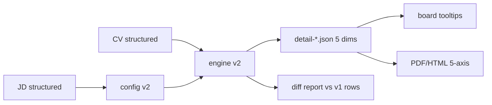

# Product Requirements Document (PRD)

**Feature Name:** Fold Evidence and Impact into Core/Experience (Matching v2)
**Version:** 1.1.0 (MVP)
**Status:** Draft
**Product Manager:** HR Product Team
**Target Users:** HR Recruiters, Hiring Managers, Engineering

> Keep this visible header synchronized with the YAML frontmatter.

---

## Change Log

| Version | Date       | Author          | Change Summary |
| ------- | ---------- | --------------- | -------------- |
| 1.1.0   | 2026-09-03 | HR Product Team | Implementation complete: engine v2, five-dimension consumers, tests green (101), v1-vs-v2 diff report produced for 260901004 (260818001 has no local baseline). |
| 1.0.0   | 2026-09-03 | HR Product Team | Initial draft for Matching v2: remove the `evidence_impact` scored dimension and fold coverage into Core Skill Match and ownership/quantified-impact into Relevant Experience, with explicitly rebalanced dimension weights. |

---

## 1. Executive Summary

The six-dimension radar treats "Evidence and Impact" as a first-class scored dimension, but it is not a JD requirement; it is a cross-cutting measure of CV evidence quality. Matching v2 removes the `evidence_impact` dimension from the scoring contract and folds its content into the dimensions that own it:

- **coverage** (skill claims backed by structured experience/projects/certs/education) becomes a sub-score of **Core Skill Match**;
- **ownership language** and **quantified impact** become a quality sub-score of **Relevant Experience** (undated relevant experiences count for quality, per HR decision);
- the freed **0.15 weight** is split explicitly (+0.08 Core, +0.07 Experience), keeping total active weight at 1.00.

Confirmed HR decisions: purpose is (a) cleaner radar semantics + (c) evidence quality is scored inside its owning dimension; coverage and quality DO affect scores; band thresholds stay high >= 80 / medium >= 60; no v1 compatibility needed (product is in development); DB/Web stack is out of scope for this change.

CRITICAL trust principle: the engine stays deterministic and versioned. The output contract becomes `candidate-matching-v2` with five radar dimensions; every consumer of the offline reports (HTML radar, PDF one-pagers, tooltips) is updated so no stale "Evidence" axis leaks.

### 1.1 Product Vision
Make each radar axis map to a real JD requirement while still scoring CV evidence quality where it belongs, so HR can read a 5-axis radar without losing the "how well is this proven?" signal.

### 1.2 Success Definition (MVP)
Matching v2 is successful when: scores are produced by the five-dimension contract with Core = presence+linkage and Experience = time+quality; all offline reports render exactly five axes; and a v1-vs-v2 diff report over the 260901004 / 260818001 cohorts is reviewed by HR before the version is adopted.

### 1.3 User Personas
1. HR Recruiter: reads ranking board radars; wants axes to mean JD requirements and tooltips to explain sub-scores.
2. Hiring Manager: wants to know why a candidate ranks; needs per-axis reasoning incl. evidence sub-scores.
3. Engineering: wants one versioned deterministic engine and a regression test suite.

### 1.4 Open Questions (Resolve Before Build)
- Internal sub-weights: Core 0.8/0.2 and Experience 0.7/0.3 proposed as defaults; calibrate after the v1-vs-v2 diff report.
- Experience `status` semantics when quality exists on undated experience only (resolved: score can be > 0; status uses score thresholds).
- Excel column handling for the removed Evidence score (resolved: dynamic column, shown only when rows carry the key).

---

## 2. MVP Scope (P0 + P1)

### 2.1 P0 - Core Requirements (Launch Blockers)

| ID   | Feature | Description | Status |
| ---- | ------- | ----------- | ------ |
| B0.1 | Five-dimension contract | `DIMENSION_IDS` / `DEFAULT_WEIGHTS` / labels drop `evidence_impact`; `ALGORITHM_VERSION=candidate-matching-v2`; config validation auto-adapts. | Done |
| B0.2 | Core = presence + linkage | `_score_core` adds linkage sub-score (any structured source counts as linked; fixes first-source bug); facts carry presence/linkage %. | Done |
| B0.3 | Experience = time + quality | `_score_experience` adds ownership/impact quality over all relevant experiences (incl. undated); facts carry ownership/impact %. | Done |
| B0.4 | Interview questions rewired | `_build_questions` looks up dimensions by id; IQ-IMPACT-001 sources from Experience evidence; IQ-SKILL-DEPTH-001 from Core. | Done |
| B0.5 | Offline report consumers | html_board/PDF/tooltips render five axes; Option B preview (F1.2 special case) removed and replaced by per-axis sub-score display. | Done |
| B0.6 | Regression tests | Engine + reporter tests updated to five dimensions; golden parity and PII/escaping tests keep passing. | Done |
| B0.7 | v1-vs-v2 diff report | Run cohorts 260901004 and 260818001 through v1 (stored rows) and v2; produce per-candidate total/band/rank diff for HR review. | Done |

### 2.2 P1 - Important Enhancements

| ID   | Feature | Description | Status |
| ---- | ------- | ----------- | ------ |
| B1.1 | Sub-weight tuning | Make Core/Experience internal sub-weights configurable after diff-report calibration. | Deferred |
| B1.2 | Excel column cleanup | Remove the "Research Quality" column for matching-engine rows when absent (dynamic columns). | Done |

### 2.3 Module Priority Summary

| Module | Name | Priority | Rationale |
| ------ | ---- | -------- | --------- |
| Module 1 | scorer matching (contracts/config/engine) | P0 | Core v2 algorithm |
| Module 2 | report-gen + board_tooltip | P0 | Five-axis rendering |
| Module 3 | pipeline row mapping | P0 | Stop emitting evidence-derived columns |
| Module 4 | unit tests + diff report | P0 | Verification |

### 2.4 Acceptance Criteria by Module

#### Module 1 (engine)

- **AC1.1** Given any JD, When `match_candidate` runs, Then `radar_dimensions` has exactly five items, `match_score` is the weighted sum of five active dimensions, and no `evidence_impact` id exists anywhere in the output.
- **AC1.2** Given a must skill found in the skills list only, When scoring, Then Core linkage counts it as unlinked; when it also appears in experience/projects/certs, Then it counts as linked.
- **AC1.3** Given relevant experiences without dates, When scoring Experience, Then ownership/impact quality still contributes; duration component stays 0 for missing dates.
- **AC1.4** Given the question builder, When dimensions contain no evidence axis, Then IQ-IMPACT-001 / IQ-SKILL-DEPTH-001 / IQ-MISSING-001 / IQ-DURATION-001 / IQ-SENIORITY-001 / IQ-JD-REQUIREMENT-001 still fire from the correct owning dimensions.

#### Module 2 (reports)

- **AC2.1** ranking-overview.html and <appno>.html radars show five axes only; Core tooltip shows linkage; Experience tooltip shows ownership/impact sub-scores.
- **AC2.2** No "Evidence" / "Evidence and Impact" label appears in generated HTML/PDF.
- **AC2.3** Legacy rows without tooltip data still render without tooltip (unchanged).

#### Module 3 (pipeline)

- **AC3.1** `_match_candidate` stops mapping `research_quality` from an evidence dimension; row keys remain internally consistent.

#### Module 4 (verification)

- **AC4.1** Engine/reporter unit tests pass with five dimensions.
- **AC4.2** v1-vs-v2 diff report produced for both cohorts and reviewed.

### 2.5 Related Code / Entry Points

| Req ID | File / Entry | Notes |
| ------ | ------------ | ----- |
| B0.1 | `.codex/skills/scorer/src/scorer/matching/contracts.py` | IDs/weights/labels/version |
| B0.2-B0.4 | `.codex/skills/scorer/src/scorer/matching/engine.py` | core/experience/question functions |
| B0.1 | `.codex/skills/scorer/src/scorer/matching/config_builder.py` | activation map drops evidence |
| B0.5 | `.codex/skills/report-gen/src/report_gen/html_board.py` + `.codex/skills/_shared/src/screening_core/board_tooltip.py` | five-axis tooltips/sub-scores |
| B0.7 | scorer CLI + stored `rows.json` baselines | diff report |

### 2.6 RTM (summary)

| Req | AC | Test | KPI | Module |
| --- | -- | ---- | --- | ------ |
| B0.1 | AC1.1 | T-B0.1-001 | Contract conformance | contracts/config/engine |
| B0.2 | AC1.2 | T-B0.2-001 | linkage counts | engine |
| B0.3 | AC1.3 | T-B0.3-001 | undated quality counts | engine |
| B0.4 | AC1.4 | T-B0.4-001 | question ids present | engine |
| B0.5 | AC2.1-2.3 | T-B0.5-001 | no Evidence label | html_board |
| B0.7 | AC4.2 | T-B0.7-001 | diff report produced | pipeline/diff script |

---

## 3. Out of Scope

- DB/Web stack (`backend/app`, `frontend/`) — HR explicitly out of scope for this change.
- v1 backward compatibility / dual-version product support.
- Changing band thresholds (stays high>=80 / medium>=60).
- Field/radar label renaming beyond removing Evidence.
- zh-Hant localization.

## 4. Technical Workflow

1. `scorer build-config` creates v2 config (five dimensions, new weights).
2. `scorer match` runs deterministic v2 engine (Core presence+linkage, Experience time+quality).
3. Pipeline `_match_candidate` emits five radar axes; no evidence-derived row keys.
4. report-gen renders five-axis radar; tooltips show per-axis sub-scores.
5. Diff script compares stored v1 rows vs v2 rows (per candidate total/band/rank).



## 5. Output Contract / Fixed JSON Schema

### 5.1 Version and dimensions

`schema_version`/`algorithm_version` become `candidate-matching-v2`. `radar_dimensions` has exactly five items in order:

`core_skill_match`, `relevant_experience`, `role_seniority_fit`, `education_certification`, `job_specific_match`.

`evidence_confidence` field is kept (weighted confidence over active dimensions) but no longer includes an evidence dimension.

### 5.2 Weights (v2)

| dimension | weight |
| --------- | ------ |
| core_skill_match | 0.38 |
| relevant_experience | 0.32 |
| role_seniority_fit | 0.15 |
| education_certification | 0.05 |
| job_specific_match | 0.10 |

### 5.3 Internal formulas

```text
core_v2        = 0.8 * presence + 0.2 * linkage
presence       = existing weighted must-skill coverage (0-100)
linkage        = 100 * linked_matches / matched_skills   # any structured source counts
experience_v2  = 0.7 * time_score + 0.3 * quality_score
time_score     = existing dated duration/recency score (0-100)
quality_score  = 100 * (0.5 * ownership_rate + 0.5 * impact_rate)  # all relevant exp incl. undated
```

## 6. Non-Functional Requirements

| Requirement | Target |
| ----------- | ------ |
| Determinism | Same JD+CV -> identical scores (golden test) |
| Traceability | reasoning.facts carry presence/linkage or ownership/impact percentages |
| Versioning | output tagged `candidate-matching-v2` |
| Regression | engine + reporter suites green |

## 7. Risks and Mitigations

| Risk | Impact | Mitigation |
| ---- | ------ | ---------- |
| Scores shift broadly (normalization + new sub-scores) | Medium | v1-vs-v2 diff report to HR before adoption |
| Core linkage first-source bug inflates penalties | High | Fix to "any structured source counts" (B0.2) |
| Undated-quality raises people with no dated experience | Medium | Accept per HR decision; show quality in tooltip |
| Stale "Evidence" labels in reports | Medium | Consumer sweep + no-Evidence-label test |
| Question builder index assumptions | Medium | Look up dimensions by id |

## 8. Boundary / Separation Requirements

- Scorer engine owns v2 contract; report-gen renders it; pipeline maps rows; DB/Web untouched.
- The legacy `scoring` engine (non-matching) is not changed by this PRD.

## 9. Success Metrics (KPIs)

| Metric | Target |
| ------ | ------ |
| Contract conformance | 5 dims, no evidence_impact in any output |
| Test suite | green (engine + reporter) |
| Diff report | produced & reviewed for both cohorts |

## 10. Future Considerations (Post-MVP)

- Config-driven sub-weights.
- Web/DB adoption of v2 in a later cycle.
- HR-approved label wording for blended dimensions.

## 11. PRD Owner Sign-off

**PRD Owner (HR Product Team):** ____________ **Engineering Lead:** ____________ **Data-AI Lead:** ____________

---

## Glossary

| Term | Definition |
| ---- | ---------- |
| linkage | share of matched must-skills that appear in a structured CV section |
| quality | ownership-language and quantified-impact rate over relevant experiences |
| presence | existing must-skill coverage score |
| time_score | existing dated experience duration/recency score |
