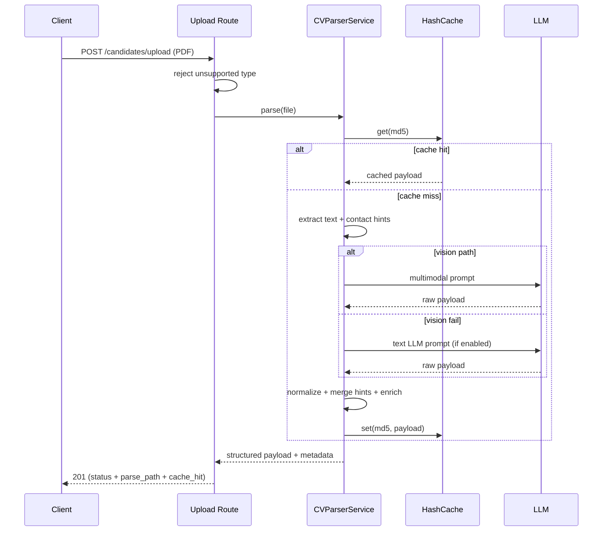

# Product Requirements Document (PRD)

**Feature Name:** CV Insight Parser (Current Production Parser)
**Version:** v1.0 (MVP / Current Baseline)
**Status:** Draft
**Product Manager:** <Name>
**Target Users:** Recruiters, HR Specialists, Hiring Managers, Talent Ops

> Keep the header above in sync with the YAML frontmatter (machine-readable source of truth).

---

## Change Log

| Version | Date       | Author  | Change Summary                                                                 |
| ------- | ---------- | ------- | ------------------------------------------------------------------------------ |
| 1.0.0   | 2026-08-18 | <Name>  | Refined to canonical PRD template; added RTM, API contract, config, Mermaid, DoD, glossary. |

---

## 1. Executive Summary

This document defines the requirements for the **CV parser** currently implemented in `backend/app/services/cv_parser/service.py` (primary module namespace: `app.services.cv_parser`).

The CV parser accepts a candidate PDF resume, performs multimodal and text-based extraction with fallbacks, and returns a normalized structured JSON containing candidate identity, skills, education, experience, and publications.

This PRD also establishes a product boundary:

- `CV parser` = implemented and in active use.
- `JD parser` = separate service; extraction logic lives in `backend/app/services/jd_parser` and is documented in `docs/jd-parser/PRD-JD_Management_v1.0.md`.

CRITICAL trust principle: **deterministic, traceable, and explainable parsing**. The same file and configuration must produce the same structured output, and the response must expose the parse path and cache status for debugging.

### 1.1 Product Vision

Stable, reusable CV extraction that supports the broader evaluation platform: a single normalized candidate profile used by scoring, insight, and future domains.

### 1.2 Success Definition (MVP)

Keep CV parsing stable and measurable while leaving clear extension points for a future dedicated JD parser service; achieve the Section 9 KPI targets on the internal CV sample set.

### 1.3 User Personas

1. **Recruiter / Reviewer** — uploads CVs in bulk and expects reliable normalized profiles; success = low fallback-only rate and high contact completeness.
2. **System Operator** — monitors parse failures and retries; success = per-file error context and retry without full batch restart.

---

## 2. MVP Scope (P0 + P1)

### 2.1 P0 - Core Requirements (Launch Blockers)

| ID   | Feature                     | Description                                                                                             | Status      |
| ---- | --------------------------- | ------------------------------------------------------------------------------------------------------- | ----------- |
| F0.1 | PDF Input                   | Accept CV in PDF format; reject unsupported file types.                                                 | Not Started |
| F0.2 | Cache-First Flow            | Compute file MD5 and return cached structured output when available.                                    | Not Started |
| F0.3 | Vision Parsing Primary Path | Render first N PDF pages to images and parse via multimodal LLM.                                        | Not Started |
| F0.4 | Text Fallback               | If vision parse fails and fallback is enabled, parse compressed text with the text LLM path.            | Not Started |
| F0.5 | Rule-Based Fallback         | If both LLM paths fail, recover minimum structured content from deterministic regex/section heuristics. | Not Started |
| F0.6 | Stable Schema Normalization | Normalize variant model keys into a fixed output schema.                                                | Not Started |
| F0.7 | Contact Hint Merge          | Merge regex-derived email/phone/name hints into structured output when missing.                         | Not Started |
| F0.8 | Content Enrichment Fallback | Fill empty arrays (`skills`, `education`, `experience`, `publications`) from raw text heuristics.       | Not Started |
| F0.9 | Deterministic Metadata      | Return parse metadata (`status`, `parse_path`, `extraction_model`, `cache_hit`, `file_hash`).           | Not Started |

> Status column: Not Started | In Progress | Done | Blocked.

### 2.2 P1 - Important Enhancements

| ID   | Feature                       | Description                                                              | Status      |
| ---- | ----------------------------- | ------------------------------------------------------------------------ | ----------- |
| F1.1 | Focus Pass for Sparse Results | Trigger second vision pass when education/experience are empty.          | Not Started |
| F1.2 | Fragment Merge Logic          | Merge fragmented job lines and education fragments into unified records. | Not Started |
| F1.3 | Prompt Compression Guardrail  | Compress long CV text while preserving high-priority lines.              | Not Started |
| F1.4 | Non-empty Preference Merge    | Prefer non-empty fields from focus pass payload for targeted sections.   | Not Started |

### 2.3 Module Priority Summary

| Module   | Name                  | Priority | Rationale                                  |
| -------- | --------------------- | -------- | ------------------------------------------ |
| Module 0 | CV Parser Service     | P0       | Core extraction pipeline (vision/text/rule).|
| Module 1 | Cache Layer           | P0       | Determinism + latency reduction.           |
| Module 2 | Upload API            | P0       | Ingestion entry point.                     |

### 2.4 Acceptance Criteria by Module

#### Module 0: CV Parser Service

- **AC0.1** Given a valid PDF CV, When parsed, Then a normalized structured profile is returned with `status: success|fallback`.
- **AC0.2** Given the same file hash, When parsed again, Then the cached structured output is returned with `cache_hit: true` and no LLM call.
- **AC0.3** Given a CV where vision parsing fails, When text/rule fallback is enabled, Then parsing recovers minimum structured content without crashing.
- **AC0.4** Given an unsupported file type, When uploaded, Then the request is rejected with an explicit error (4xx).

#### Module 1: Cache Layer

- **AC1.1** Cache key is the file MD5; cache stores the full structured payload and metadata.
- **AC1.2** Given identical input, When parsed twice, Then structured output is byte-identical (determinism).

#### Module 2: Upload API

- **AC2.1** `POST /candidates/upload` returns 201 with per-file status; failures include `error_code`/`error_message`.
- **AC2.2** Response includes parse metadata: `status`, `parse_path`, `extraction_model`, `cache_hit`, `file_hash`.

### 2.5 Related Code / Entry Points

| Req ID | Area          | Existing File(s) / Entry Point                       | Notes                          |
| ------ | ------------- | ---------------------------------------------------- | ------------------------------ |
| F0.1   | API route     | `backend/app/api/routes/candidates.py`               | `POST /candidates/upload`      |
| F0.2   | Cache         | `backend/app/core/hash_cache.py`                     | MD5-keyed cache                |
| F0.3   | Vision parse  | `backend/app/services/cv_parser/service.py`          | Multimodal LLM path            |
| F0.4   | Text fallback | `backend/app/services/cv_parser/prompts.py`          | Text LLM path                  |
| F0.5   | Rule fallback | `backend/app/services/cv_parser/helpers.py`          | Regex/section heuristics       |
| F0.6   | Normalization | `backend/app/services/cv_parser/service.py`          | Alias-based key normalization  |
| F0.7   | Contact hints | `backend/app/services/cv_parser/helpers.py`          | email/phone/name regex         |

### 2.6 Requirements Traceability Matrix (RTM)

| Req ID | Acceptance Criteria | Test Case ID | KPI / Validation                    | Module / File             |
| ------ | ------------------- | ------------ | ----------------------------------- | ------------------------- |
| F0.1   | AC0.4               | T-F0.1-001   | Reject unsupported type test        | `routes/candidates.py`    |
| F0.2   | AC0.2               | T-F0.2-001   | Cache hit latency improvement       | `core/hash_cache.py`      |
| F0.3   | AC0.1               | T-F0.3-001   | Parse success rate                  | `services/cv_parser/`     |
| F0.4   | AC0.3               | T-F0.4-001   | Fallback-only rate <= 8%            | `services/cv_parser/`     |
| F0.5   | AC0.3               | T-F0.5-001   | Fallback recovery test              | `services/cv_parser/`     |
| F0.6   | AC1.2               | T-F0.6-001   | Schema conformance test             | `services/cv_parser/`     |
| F0.7   | AC2.2               | T-F0.7-001   | Contact completeness >= 95%         | `services/cv_parser/`     |
| F0.8   | AC0.1               | T-F0.8-001   | Enrichment unit test                | `services/cv_parser/`     |
| F0.9   | AC2.2               | T-F0.9-001   | Metadata conformance test           | schemas / service         |
---

## 3. Out of Scope

- Parsing standalone Job Descriptions as first-class input objects.
- JD skill taxonomy, must/preferred classification, JD evidence tagging.
- JD-specific missing-field workflows.
- DOC/DOCX parsing in this PRD (handled by upload adapters; parser contract is PDF-focused).

---

## 4. Technical Workflow

### 4.1 Parser Flow (Numbered)

1. Compute file hash and check parser cache.
2. Extract raw PDF text (`pdfplumber`, fallback `pypdf`).
3. Generate contact hints from raw text (`email`, `phone`, `name`).
4. Execute vision parse path:
   - Render pages as data URLs.
   - Run multimodal prompt.
   - Optionally run focus pass for timeline completeness.
5. Normalize LLM payload into stable schema.
6. Merge contact hints.
7. Apply deterministic content fallback for empty arrays.
8. If vision fails:
   - Use text LLM fallback when enabled.
   - Else downgrade to rule-based fallback.
9. Persist parse result into hash cache and return payload.

### 4.2 System Flow (Mermaid)



### 4.3 Config / Environment / External Dependencies

| Config / Env Var          | Required | Default        | Description / Source                     |
| ------------------------- | -------- | -------------- | ---------------------------------------- |
| `ZAI_API_KEY`             | Yes      | -              | LLM provider API key (from `.env`)       |
| `LLM_BASE_URL`            | Yes      | open.bigmodel.cn/api/paas/v4 | LLM endpoint            |
| `LLM_MODEL`               | Yes      | glm-4-flash    | Text LLM model                           |
| `LLM_VISION_MODEL`        | Yes      | glm-4v-flash   | Vision LLM model                         |
| `LLM_VISION_MAX_PAGES`    | No       | 3              | Max PDF pages rendered for vision        |
| `LLM_TEMPERATURE` / `LLM_SEED` | No  | 0 / 42         | Determinism requirements                 |
| `CACHE_DIR`               | Yes      | ./data/cache   | Hash cache storage                       |
| `UPLOAD_DIR`              | Yes      | ./data/uploads | Uploaded CV storage                      |

---

## 5. Output Contract / Fixed JSON Schema

### 5.1 API Contract Summary

| Endpoint                 | Method | Auth   | Success | Error Codes              | Idempotent | Rate Limit |
| ------------------------ | ------ | ------ | ------- | ------------------------ | ---------- | ---------- |
| `/candidates/upload`     | POST   | None (MVP) | 201 | 400/422/500          | No         | N/A (MVP)  |
| `/candidates/{candidate_id}` | GET | None (MVP) | 200 | 404                  | Yes        | N/A (MVP)  |
| `/candidates`            | GET    | None (MVP) | 200 | -                       | Yes        | N/A (MVP)  |

Rules:
- All failures return the shared error envelope (`error_code`, `message`, `module`, `retryable`, `request_id`, `details`, `timestamp`).
- Versioning policy: additive-only within the same major version; breaking changes require a migration plan.

### 5.2 Primary Response Schema (versioned)

```json
{
  "schema_version": "1.0.0",
  "file_hash": "md5_string",
  "cache_hit": false,
  "structured_data": {
    "name": "Candidate Name",
    "email": "candidate@example.com",
    "phone": "+1-555-123-4567",
    "skills": ["Python", "FastAPI", "Docker"],
    "education": [
      {
        "school": "Example University",
        "degree": "Master",
        "major": "Computer Science",
        "period": "2018 - 2020"
      }
    ],
    "experience": [
      {
        "company": "Example Corp",
        "job_title": "Backend Engineer",
        "period": "2020-01 - Present",
        "description": "Built APIs, improved performance, and maintained services."
      }
    ],
    "publications": [
      {
        "title": "Paper Title",
        "journal": "Conference Name",
        "year": "2021"
      }
    ]
  },
  "raw_llm_response": {},
  "extraction_model": "model_name",
  "extraction_seed": 42,
  "status": "success",
  "parse_path": "vision",
  "error_message": null
}
```

Notes:

- `status` may be `success` or `fallback`.
- `parse_path` may be `vision`, `vision_focus`, `text_fallback`, or `rule_fallback`.
- Uncertain fields are explicit `null` (never fabricated).
---

## 6. Non-Functional Requirements

| Category      | Requirement                                                                 |
| ------------- | --------------------------------------------------------------------------- |
| Determinism   | Use fixed seed and temperature settings for reproducibility where possible. |
| Resilience    | Parser must degrade gracefully across vision, text, and rule-based paths.   |
| Traceability  | Return parse path and error context in metadata for debugging.              |
| Performance   | Cache should reduce repeated parse latency for identical files.             |
| Compatibility | Support common CV formats in PDF layouts (single/multi-column).             |
| Security      | Uploaded files and extracted PII handled per retention policy; no PII in logs. |

---

## 7. Risks and Mitigations

| #   | Risk                                | Impact | Mitigation                                                          |
| --- | ----------------------------------- | ------ | ------------------------------------------------------------------- |
| R1  | OCR/layout ambiguity in complex CVs | High   | Vision-first strategy + optional focus pass + text fallback chain.  |
| R2  | Inconsistent LLM key naming         | Medium | Alias-based normalization (`experience`, `work_experience`, etc.).  |
| R3  | Fragmented timeline records         | Medium | Post-processing merge heuristics for education and experience rows. |
| R4  | Missing contact fields              | Medium | Regex contact hints merged into normalized payload.                 |
| R5  | Hallucinated fields                 | Medium | Prompt rules: explicit facts only, unknown -> null.                 |

### 7.1 Failure-Mode Requirements (Non-negotiable)

- A parse failure must never crash the upload pipeline; per-file failure is isolated.
- Failed files expose actionable `error_code`/`error_message` and support retry/delete.
- If all LLM paths fail, rule-based fallback must recover minimum structured content for valid PDFs.

---

## 8. Boundary / Separation Requirements

- **CV parser ownership (CRITICAL):** CV parser concerns remain in `CVParserService` (`backend/app/services/cv_parser`).
- **JD parser ownership (CRITICAL):** JD parser logic must live in a separate service (`backend/app/services/jd_parser`); see `docs/jd-parser/PRD-JD_Management_v1.0.md`.
- Any future JD-specific prompt/schema/versioning must not modify the CV output contract.
- Shared utilities (LLM client, cache, text helpers) can be reused, but parsing pipelines must stay independent.

Current status:

- CV parser logic: implemented.
- JD parser logic: implemented (separate service); documented in the JD PRD.

---

## 9. Success Metrics (KPIs)

| Metric                                          | Target                           | Measured By                                        |
| ----------------------------------------------- | -------------------------------- | -------------------------------------------------- |
| Parse success rate (`status=success`)           | >= 92% on internal CV sample set | CI regression run over golden CV set               |
| Fallback-only rate (`parse_path=rule_fallback`) | <= 8%                            | CI run over golden CV set                          |
| Contact completeness (`email` or `phone`)       | >= 95%                           | DB query on parsed candidate profiles              |
| Cache hit latency improvement                   | >= 70% faster than first parse   | API latency telemetry (cache hit vs miss)          |
| Schema validity                                 | 100% responses conform to §5.2   | CI contract assertion                              |

---

## 10. Future Considerations (Post-MVP)

- Add confidence scoring per extracted CV section.
- Add multilingual CV parsing support.
- Add structured certification/project extraction with evidence spans.
- Add parser benchmarking suite and regression dataset.
- DOC/DOCX first-class parsing quality guarantees.

---

## 11. PRD Owner Sign-off

### 11.1 Definition of Done (DoD)

- [ ] All P0 items implemented and tested (per RTM).
- [ ] Determinism test passes over the fixed CV corpus (same input => same output).
- [ ] Error taxonomy applied to upload failures; retry/delete flow verified.
- [ ] `.env.example` updated for new config if any.
- [ ] CI green; unit + integration coverage for each P0 item.

**PRD Owner Sign-off:** ____________ **Date:** ________
**Engineering Lead Sign-off:** ________ **Date:** ________
**Data/AI Lead Sign-off:** ________ **Date:** ________

---

## 12. Engineering Review Edition (Reference)

- Delivery: parser already implemented; remaining work is hardening (P1 items) and KPI instrumentation.
- Test gates: unit tests for normalization/merge/enrichment; integration tests for upload API; determinism test over golden CV set.
- Error codes: reuse the shared error envelope; per-file failure taxonomy (encrypted PDF, scanned image, timeout, upstream unavailable).
- Observability: log parse path distribution, cache hit rate, per-path latency.

---

## Glossary

| Term               | Definition                                                              |
| ------------------ | ----------------------------------------------------------------------- |
| `parse_path`       | `vision` / `vision_focus` / `text_fallback` / `rule_fallback`.          |
| `cache_hit`        | Parse result served from MD5-keyed cache without an LLM call.           |
| `fallback chain`   | Vision -> text LLM -> rule-based extraction.                            |
| Contact hints      | Regex-derived `email` / `phone` / `name` merged into structured output. |
| Golden CV set      | Fixed internal sample set used for KPI measurement and regression.      |