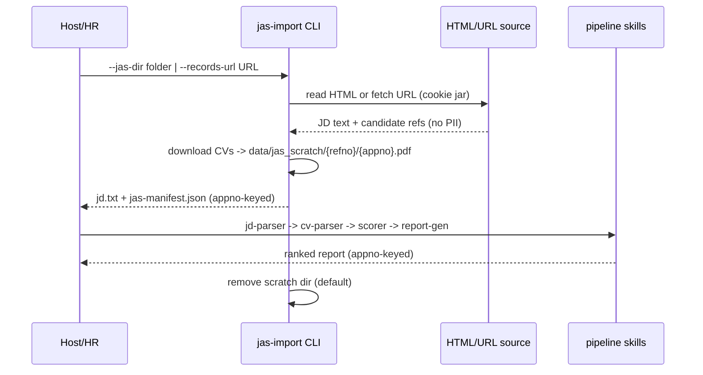
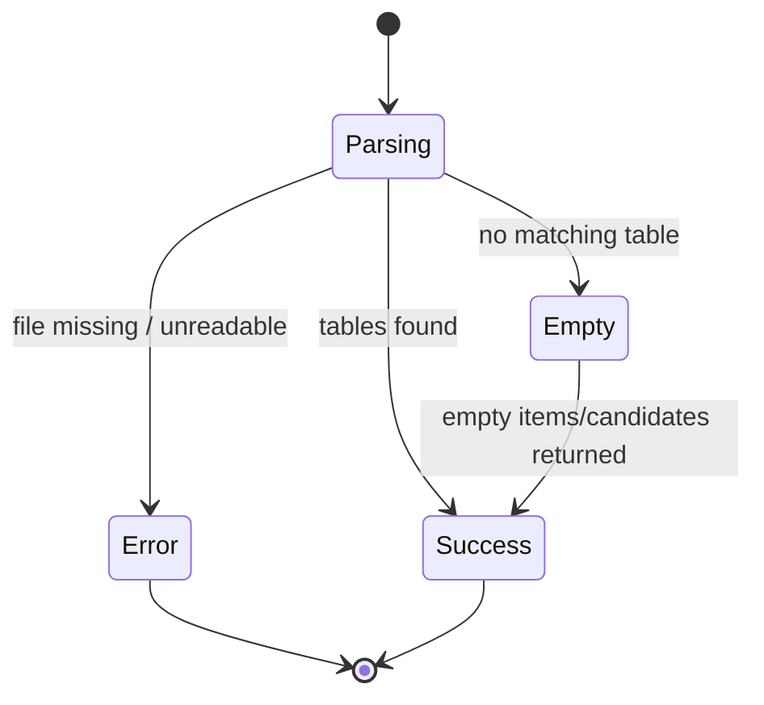

# Product Requirements Document (PRD)

**Feature Name:** JAS Import
**Version:** 1.1.0 (MVP + Phase 1 skeleton)
**Status:** In Review
**Product Manager:** HR Screening Product Owner
**Target Users:** HR recruiters who export internal JAS pages; agent hosts that orchestrate the screening pipeline

> Keep the header above in sync with the YAML frontmatter (machine-readable source of truth).

---

## Change Log

| Version | Date       | Author                     | Change Summary                                                                        |
| ------- | ---------- | -------------------------- | ------------------------------------------------------------------------------------- |
| 1.0.0   | 2026-08-26 | HR Screening Product Owner | Initial draft for JAS Import (Phase 0 parser).                                        |
| 1.1.0   | 2026-08-26 | Engineering Review         | Aligned to implementation: URL mode, input policy, scratch lifecycle, schema_version. |

---

## 1. Executive Summary

The screening product fetches public PolyU postings via `polyu-import`, but HR screens against the internal Job Application System (JAS), which holds the real JD and candidate CVs behind an authenticated area. JAS Import turns JAS data into the structured inputs the existing pipeline already consumes: one JD text plus per-candidate CV references keyed by `Application no.` (`appno`).

Two ingestion modes are implemented:

- **Offline (Phase 0, complete):** HR exports `records.php` HTML + CV PDFs into a folder; `run_jas_screening.py --jas-dir` consumes it.
- **Live (Phase 1 skeleton, complete as code, unvalidated against the real system):** `run_jas_screening.py --records-url` fetches the records page, parses JD + candidate references, downloads every candidate CV to a private scratch dir, runs the pipeline, and removes downloaded CVs after the run.

Product value: remove manual copy-paste and manual CV upload; keep one deterministic parse -> score -> rank -> report chain for internal posts; preserve the existing public-page flow unchanged.

Trust/quality statement: parsing is deterministic (no LLM in JAS Import), traceable by `refno` and `appno`, and PII-minimal - identity columns from the candidate table are dropped at the parser boundary, and every CLI entry point enforces a path-or-allowlisted-URL input contract.

### 1.1 Product Vision

JAS Import is the internal-data adapter in front of the existing deterministic screening engine. Long term, an HR chat host says "screen refno X" and the agent fetches the internal JD + CVs itself, masks PII, scores and ranks, and returns a report - without the host or any LLM ever seeing candidate identity data.

### 1.2 Success Definition (MVP)

MVP success means: given either (a) an HR-exported folder (`records.html` + `cvs/<appno>.pdf`) or (b) a `--records-url`, the CLI produces a contract-conformant job payload (JD text + candidate references keyed by `appno`, zero identity fields), downloads any missing CVs into a private scratch dir, runs the existing pipeline, returns a ranked report, and (URL mode) removes downloaded CVs after the run by default.

### 1.3 User Personas

1. **HR Recruiter (non-technical)**

   - Context: owns the internal JAS account; exports list/detail pages or runs the agent inside an authenticated session.
   - Pain points: manual CV upload, copy-pasting JD text, risk of copying candidate identity data into tools.
   - Success criteria: one command per job produces a ranked report; no personal data leaves the screening artifacts.

2. **Agent Host Integrator (developer)**

   - Context: embeds the screening skills in Codex/Cursor or a chat shell.
   - Pain points: must keep scoring deterministic, must not feed candidate PII into conversation context.
   - Success criteria: JAS Import exposes a stable CLI contract that accepts local HTML files or allowlisted JAS URLs, and rejects inline content (base64 / `data:` URI / pasted text) via the shared input policy.

### 1.4 Open Questions (Resolve Before Live Validation)

- What is the exact authentication/session mechanism for live `/internal/*` fetch (SSO cookie, browser session, or HR export only)?
- **Resolved:** each job has a unique `refno` and each application has a unique `appno`. The product locks a candidate with the composite `(refno, appno)` and **never displays a personal name** (including first-letter masks).
- Does the real `record_detail.php` application form need to be parsed in MVP, or is the CV PDF sufficient for scoring?
- Is `downloadexcel.php?refno=...` a required fast-scan path, and what is its exact column layout?
- Is the current-status label reliably the plain-text token among TBC/P/S/N across real rows?

> These must be resolved before live validation; the offline flow is not blocked by them.

---

## 2. MVP Scope (P0 + P1)

### 2.1 P0 - Core Requirements (Launch Blockers)

| ID   | Feature                                    | Description                                                                                            | Status |
| ---- | ------------------------------------------ | ------------------------------------------------------------------------------------------------------ | ------ |
| F0.1 | Parse JAS records list HTML                | Extract refno, job group, unit, post title, dates, list type, application count, records URL.          | Done   |
| F0.2 | Parse JAS job-detail HTML                  | Extract job metadata + JD text from the advertisement table and candidate CV references.               | Done   |
| F0.3 | Drop candidate identity columns            | Return only appno/status/file URLs; never emit name/email/phone/HKID/salary/declarations.              | Done   |
| F0.4 | CLI with JSON error envelope               | Exit 0 on success (stdout JSON); exit 1 on error (stderr JSON with `error_message`).                   | Done   |
| F0.5 | Register skill in shared bootstrap + tests | Add `jas-import` to `_SKILL_SRC_DIRS`; unit tests against fixtures and real HR samples.                | Done   |
| F0.6 | Input policy guard                         | Entry points accept only existing file paths or allowlisted http(s) URLs; reject base64/data-URI/text. | Done   |

### 2.2 P1 - Important Enhancements

| ID   | Feature                                    | Description                                                                                                        | Status      |
| ---- | ------------------------------------------ | ------------------------------------------------------------------------------------------------------------------ | ----------- |
| F1.1 | Live fetch job                             | `--records-url` / `--jd-url` fetch + parse the records page into JD text (skeleton, mock-tested).                  | In Progress |
| F1.2 | Download CVs keyed by appno                | `--cv-url` / URL mode downloads CVs to `data/jas_scratch/{refno}/{appno}.pdf`; cleanup after run.                  | Done        |
| F1.3 | Parse Excel export                         | `parse-excel --refno` from `downloadexcel.php` for fast candidate metadata without attachments.                    | Not Started |
| F1.4 | Pipeline/agent wiring                      | `pipeline` gains `--jd-url/--cv-url/--cookie-file/--scratch-dir`; `screening-agent` forwards them.                 | Done        |
| F1.5 | Parse `record_detail.php` application form | Pre-fill structured candidate fields (education/experience) from the printable form.                               | Not Started |
| F1.6 | Pseudonymous reports                       | Reports/manifests label candidates by `(refno, appno)` only; names (including first-letter masks) are never shown. | Done        |
| F1.7 | `--trust-extracted` policy                 | `--extracted` profiles outside `--output-dir` require `--trust-extracted`.                                         | Done        |

### 2.3 Module Priority Summary

| Module   | Name                      | Priority | Rationale                                                     |
| -------- | ------------------------- | -------- | ------------------------------------------------------------- |
| Module 0 | JAS parser (`jas-import`) | P0       | Unblocks the whole internal flow; testable without access     |
| Module 1 | Live fetch + downloads    | P1       | Requires internal access/session; skeleton shipped and mocked |
| Module 2 | Pipeline/agent wiring     | P1       | Reuses existing pipeline; adds source flags only              |

### 2.4 Acceptance Criteria by Module

#### Module 0: JAS parser (`jas-import`)

- **AC0.1** Given a saved list HTML with one `<tr>` under `table.job-table`, When `parse_list_html` runs, Then it returns exactly one row with `refno`, `post_title`, `application_count`, and absolute `records_url`.
- **AC0.2** Given a saved job-detail HTML with `table.job-detail-table` and a `Reference number` advertisement table, When `parse_job_html` runs, Then `refno`, `post_title`, `unit`, and `jd_text` are populated and the candidate list contains one item with `appno`, `status`, and absolute `cv_url`/`record_detail_url`.
- **AC0.3** Given candidate-table cells containing email/phone/name/HKID, When `parse_job_skill` serializes the payload, Then the serialized JSON contains none of those identity values and each candidate dict has only keys `appno`, `status`, `cv_url`, `supp_url`, `record_detail_url`.
- **AC0.4** Given a missing HTML file, When the CLI runs, Then it exits 1 and prints a stderr JSON envelope with `status=error` and a non-empty `error_message`.
- **AC0.5** Given a base64 blob / `data:` URI / multiline text passed as `--cv` or `--jd-file`, When the pipeline entry runs, Then it exits 1 with an error message containing "inline content".
- **AC0.6** Given an `--extracted` file outside `--output-dir`, When the pipeline runs without `--trust-extracted`, Then it exits 1 with a message naming `--trust-extracted`.

#### Module 1: Live fetch + downloads

- **AC1.1** Given a JAS records URL and a stubbed network, When `run_url_screening` runs, Then it downloads `data/jas_scratch/{refno}/{appno}.pdf` for each candidate, keeps them for reuse, and skips unchanged downloads via conditional HTTP (ETag); `--cleanup-cvs` deletes them.
- **AC1.2** Given a records URL whose host is not allowlisted, When the URL mode runs, Then it exits 1 before any network call.
- **AC1.3** Given that every CV download fails, When the URL mode runs, Then it exits 1 with an error envelope and still cleans the scratch dir.

### 2.5 Related Code / Entry Points

| Req ID | Area             | Existing File(s) / Entry Point                                                                                                                                                  | Notes                     |
| ------ | ---------------- | ------------------------------------------------------------------------------------------------------------------------------------------------------------------------------- | ------------------------- |
| F0.1   | Parser           | `.codex/skills/jas-import/src/jas_import/records.py` -> `parse_list_html`                                                                                                       | Implemented               |
| F0.2   | Parser           | `.codex/skills/jas-import/src/jas_import/records.py` -> `parse_job_html` / `build_jd_text`                                                                                      | Implemented               |
| F0.3   | Serialization    | `.codex/skills/jas-import/src/jas_import/skill.py` -> `parse_job_skill` / `job_payload_from_html`                                                                               | Implemented               |
| F0.4   | CLI              | `.codex/skills/jas-import/scripts/run_jas_import.py` -> `parse-list` / `parse-job` / `mock`                                                                                     | Implemented               |
| F0.5   | Bootstrap        | `.codex/skills/_shared/src/screening_core/bootstrap.py` -> `_SKILL_SRC_DIRS`                                                                                                    | Implemented               |
| F0.6   | Input policy     | `.codex/skills/_shared/src/screening_core/input_policy.py` -> `validate_reference` / `validate_extracted_reference`                                                             | Implemented               |
| F1.1   | Live fetch       | `.codex/skills/jas-import/src/jas_import/fetch.py` -> `fetch_job_payload` / `fetch_jd_text`; `run_jas_screening.py --records-url`                                               | Implemented (mock-tested) |
| F1.2   | Downloads        | `.codex/skills/jas-import/src/jas_import/fetch.py` -> `download_to` / `cv_filename_for_url`; `run_jas_screening.py`                                                             | Implemented               |
| F1.4   | Orchestration    | `.codex/skills/pipeline/scripts/run_pipeline.py` (`--jd-url`/`--cv-url`/`--cookie-file`/`--scratch-dir`); `.codex/skills/screening-agent/scripts/run_agent.py` (forwards flags) | Implemented               |
| F1.7   | Extracted policy | `.codex/skills/pipeline/scripts/run_pipeline.py` -> `--trust-extracted`; `input_policy.validate_extracted_reference`                                                            | Implemented               |
| Mock   | Test data        | `.codex/skills/jas-import/src/jas_import/mock.py` -> `generate_mock_jas_dir`; `run_jas_import.py mock`                                                                          | Implemented               |

### 2.6 Requirements Traceability Matrix (RTM)

| Req ID | Acceptance Criteria | Test Case ID | KPI / Validation                | Module / File                                          |
| ------ | ------------------- | ------------ | ------------------------------- | ------------------------------------------------------ |
| F0.1   | AC0.1               | T-F0.1-001   | Catalog parse success = 100%    | `jas_import/records.py`, `test_jas_import.py`          |
| F0.2   | AC0.2               | T-F0.2-001   | JD/candidate linkage present    | `jas_import/records.py`, `test_jas_import.py`          |
| F0.3   | AC0.3               | T-F0.3-001   | PII leakage fields = 0          | `jas_import/skill.py`, `test_jas_import.py`            |
| F0.4   | AC0.4               | T-F0.4-001   | Exit-code conformance = 100%    | `run_jas_import.py`, `test_jas_import.py`              |
| F0.5   | AC0.1-AC0.4         | T-F0.5-001   | 100% of P0 tests green          | `bootstrap.py`, `test_jas_import.py`                   |
| F0.6   | AC0.5               | T-F0.6-001   | Inline-content rejection = 100% | `input_policy.py`, `test_input_policy_cli.py`          |
| F1.1   | AC1.1-AC1.3         | T-F1.1-001   | URL mode mock tests green       | `jas_import/fetch.py`, `test_jas_fetch.py`             |
| F1.2   | AC1.1               | T-F1.2-001   | Download + cleanup green        | `run_jas_screening.py`, `test_jas_screening_url.py`    |
| F1.4   | AC1.1               | T-F1.4-001   | URL flags forwarded to pipeline | `run_pipeline.py`, `run_agent.py`, `test_jas_fetch.py` |
| F1.7   | AC0.6               | T-F1.7-001   | Extracted-scratch rule green    | `input_policy.py`, `test_input_policy_cli.py`          |

---

## 3. Out of Scope

- Automating JAS login or storing HR credentials (live auth is a host/HR-provided session or a local cookie jar).
- Sending candidate identity fields to any LLM or report.
- Modifying the deterministic scorer or matching engine.
- Changing the existing `polyu-import` public-page behavior.
- Building a frontend UI for JAS import.
- Parsing candidate identity columns for downstream consumption (they are intentionally discarded).
- Multi-refno batch orchestration (a single `refno` -> one ranked report is the unit).

---

## 4. Technical Workflow

### 4.1 End-to-End User Flow (Text-Based)

1. HR exports `records.php` (list) and `records.php?refno=...` (detail) pages as HTML + CV PDFs into a folder, **or** the host provides a `--records-url` (live mode, requires access).
2. Offline: host runs `run_jas_screening.py --jas-dir <folder>`. Live: host runs `run_jas_screening.py --records-url <URL> [--cookie-file cookies.txt]`.
3. The CLI produces JD text + candidate `appno`/status/CV URLs; live mode downloads each CV to `data/jas_scratch/{refno}/{appno}.pdf`.
4. The CLI delegates to the `pipeline` skill (JD parse -> cv parse -> score/rank -> reports).
5. HR receives a ranked report keyed by `appno` and maps appnos back in JAS if needed.
6. Live mode keeps downloaded CVs for reuse; unchanged CVs are not re-downloaded (conditional HTTP / ETag), and `--cleanup-cvs` deletes them.

### 4.2 Backend/System Workflow

1. Offline: `parse-list` / `parse-job` read HTML -> catalog / job payload JSON (identity columns dropped).
2. Live: `fetch_job_payload(url, cookie_file)` fetches the records page and reuses the same `job_payload_from_html` parsing path.
3. `run_url_screening` fetches each `cv_url` into `data/jas_scratch/{refno}/{appno}.pdf` via `download_to_if_changed` (conditional HTTP / ETag); failures are collected, and a run with zero downloadable CVs errors out.
4. Shared tail `_run_screening` writes `jd.txt` + `jas-manifest.json` (appno-keyed), then invokes the pipeline with `--cv` file paths.
5. Downstream `jd-parser`/`cv-parser`/`scorer`/`report-gen` consume the same contracts as the public flow.
6. URL mode keeps the scratch subdir after the run (success or error) unless `--cleanup-cvs`.



### 4.3 Failure and Fallback Workflow

1. Missing HTML file -> CLI exits 1 (parse) or 2 (need_input for screening) with a JSON envelope.
2. Malformed/empty table -> parser returns an empty list or skips rows; no exception leaks as a traceback.
3. Candidate row without CV link -> `cv_url=null`; the candidate is listed under `candidates_without_cv` rather than failing the batch.
4. Status token undeterminable -> `status=null`; ranking proceeds, status is not fabricated.
5. CV download failure in URL mode -> recorded in `download_failures`; a run with zero downloadable CVs exits 1 with an error envelope, and the scratch dir is still cleaned.
6. Non-allowlisted records/CV URL -> exit 1 before any network call (input policy).
7. Missing recognizable JD table in URL mode -> exit 1; the full records page is never used as a plain-text fallback because it may contain candidate PII.
8. Redirect target outside the URL allowlist -> exit 1 before following the redirect.



### 4.4 Config / Environment / External Dependencies

| Config / Flag         | Required | Default                                         | Description                                                          |
| --------------------- | -------- | ----------------------------------------------- | -------------------------------------------------------------------- |
| `--base-url`          | No       | `https://jobs.polyu.edu.hk`                     | Base URL for resolving relative hrefs                                |
| `--records-url`       | Live     | -                                               | JAS records page URL for live mode                                   |
| `--cookie-file`       | No       | -                                               | Local Netscape `cookies.txt` (0600); cookies are never CLI arguments |
| `--scratch-dir`       | No       | `data/jas_scratch`                              | Root for downloaded CVs (`{refno}/{appno}.pdf`)                      |
| `--cleanup-cvs`      | No       | false                                           | Delete downloaded CVs after the run (default keeps them for reuse)   |
| `--state-dir`         | No       | `data/jas_state`                              | Per-refno run history + CV hashes/metadata (audit + dedup)            |
| `--trust-extracted`   | No       | false                                           | Allow `--extracted` profiles from outside `--output-dir`             |
| External dependencies | Phase 0  | stdlib only                                     | Parsing makes no network calls                                       |
| External dependencies | Phase 1  | `httpx` (already in `backend/requirements.txt`) | Live fetch and downloads                                             |

---

## 5. Output Contract / Fixed JSON Schema

### 5.1 API Contract Summary

| Command                                                  | Method (CLI) | Auth        | Success        | Error Codes                      | Idempotent            | Rate Limit |
| -------------------------------------------------------- | ------------ | ----------- | -------------- | -------------------------------- | --------------------- | ---------- |
| `run_jas_import.py parse-list --html-file F`             | subcommand   | none        | exit 0, stdout | exit 1, stderr JSON              | yes                   | N/A        |
| `run_jas_import.py parse-job --html-file F`              | subcommand   | none        | exit 0, stdout | exit 1, stderr JSON              | yes                   | N/A        |
| `run_jas_import.py mock --output-dir D`                  | subcommand   | none        | exit 0, stdout | exit 1, stderr JSON              | yes                   | N/A        |
| `run_jas_screening.py --jas-dir D`                       | CLI          | none        | exit 0, stdout | exit 1 error / exit 2 need_input | yes (with `--resume`) | N/A        |
| `run_jas_screening.py --records-url U [--cookie-file C]` | CLI          | cookie file | exit 0, stdout | exit 1 error / exit 2 need_input | no (network)          | be polite  |
| `run_pipeline.py --jd-url U --cv-url U ...`              | CLI          | cookie file | exit 0, stdout | exit 1 error / exit 2 need_input | yes (with `--resume`) | N/A        |

- Success JSON carries `"status": "success"`; failure JSON carries `{"status": "error", "error_message": "..."}` on stderr with exit code 1; `need_input` uses exit code 2.

### 5.2 Primary JSON Contract (`schema_version: 1.0.0`)

Catalog (list) contract:

```json
{
  "schema_version": "1.0.0",
  "status": "success",
  "source": "jas",
  "total": 1,
  "items": [
    {
      "refno": "260818001",
      "job_group": "Research / Project Posts",
      "unit": "Institute for Higher Education Research and Development",
      "post_title": "Project Associate",
      "posting_date": "2026-08-01",
      "closing_date": "2026-08-24",
      "off_shelf_date": "2027-02-01",
      "list_type": "Internal Advertisement",
      "application_count": "02",
      "records_url": "https://jobs.polyu.edu.hk/internal/records.php?refno=260818001"
    }
  ]
}
```

Job-detail contract:

```json
{
  "schema_version": "1.0.0",
  "status": "success",
  "source": "jas",
  "refno": "260818001",
  "job": {
    "refno": "260818001",
    "job_group": "Research / Project Posts",
    "unit": "Institute for Higher Education Research and Development",
    "post_title": "Project Associate",
    "appointment_period": "12 months",
    "project_title": "Design and implementation of data governance and data management",
    "posting_date": "2026-08-01",
    "list_type": "Internal Advertisement"
  },
  "jd_text": "Reference number: 260818001\n...\nDescription: ...",
  "candidates": [
    {
      "appno": "123456",
      "status": "S",
      "cv_url": "https://jobs.polyu.edu.hk/internal/file.php?t=cv&id=123456&refno=260818001",
      "supp_url": null,
      "record_detail_url": "https://jobs.polyu.edu.hk/internal/record_detail.php?id=123456&refno=260818001"
    }
  ]
}
```

Screening manifest (`jas-manifest.json`, PII-free):

```json
{
  "source": "jas",
  "refno": "260818001",
  "post_title": "Project Associate",
  "candidates": [
    {
      "appno": "123456",
      "status": "S",
      "cv_path": ".../data/jas_scratch/260818001/123456.pdf"
    }
  ],
  "candidates_without_cv": []
}
```

### 5.3 Backward-Compatibility Policy (Non-negotiable)

- Bump `schema_version` on any breaking change.
- Within the same major version: additive-only changes (new optional fields).
- Breaking changes require a migration plan and must not silently alter shared downstream contracts.

### 5.4 Storage Recommendations (MVP)

Live mode writes only to a private scratch root, never to the output manifest:

```
data/jas_scratch/
  <refno>/<appno>.pdf   # CV keyed by appno
```

Data lifecycle rules:

- Scratch files are kept after the recruitment run by default for reuse; unchanged CVs are not re-downloaded (conditional HTTP / ETag), and `--cleanup-cvs` deletes them (also on error).
- No candidate identity data is persisted in JSON artifacts; only `refno`/`appno` references remain.
- `--cookie-file` contents must never be logged or returned in stdout; the file should be `0600` and never committed.

---

## 6. Non-Functional Requirements

| Category      | Requirement                                                                                                         |
| ------------- | ------------------------------------------------------------------------------------------------------------------- |
| Determinism   | Same HTML input yields identical JSON (no LLM in JAS Import; no random sampling).                                   |
| Resilience    | Malformed tables and missing files degrade to empty results or an error envelope, never a traceback.                |
| Traceability  | Every artifact carries `source=jas`, `refno`, and per-candidate `appno`.                                            |
| Performance   | Local parse of a normal records page completes in < 1s on a developer machine.                                      |
| Compatibility | Parsing is stdlib-only; live fetch uses `httpx` (already a project dependency). Python 3.10+.                       |
| Security/PII  | Identity columns dropped at the parser boundary; inline content rejected at every CLI entry; no PII in stdout/logs. |

---

## 7. Risks and Mitigations

| Risk                                   | Impact | Mitigation                                                                                                                      |
| -------------------------------------- | ------ | ------------------------------------------------------------------------------------------------------------------------------- |
| JAS HTML structure changes             | High   | Select by `job-table`/`job-detail-table` classes + `Reference number` label; regression fixtures + mock generator.              |
| Live `/internal/*` requires auth       | High   | `--cookie-file` reads a local Netscape cookies.txt; cookies never enter CLI arguments or the host conversation.                 |
| Candidate identity leakage             | High   | Parser structurally omits identity columns; unit tests assert absence of email/phone/name; input policy rejects inline content. |
| CV-content PII masking is heuristic    | High   | cv-parser masks locally detected PII before LLM and blocks external calls when no name is detected; residual risk documented.   |
| URL mode unverifiable without access   | Medium | All live paths are mock-tested; first real-access run is a validation milestone.                                                |
| Status inference (TBC/P/S/N) ambiguous | Medium | Emit `null` when not a plain-text token; never fabricate status.                                                                |
| HR sample is masked (`*`)              | Medium | Tests target DOM structure; synthetic mock data provides realistic non-masked fixtures.                                         |
| Duplicate `id="f-list"` on one page    | Medium | Select by class token for candidates and by `Reference number` label for the JD table.                                          |
| Contract drift (PRD vs code)           | Low    | `schema_version` field, RTM, and this alignment pass.                                                                           |

### 7.1 Failure-Mode Requirements (Non-negotiable)

- Never return candidate identity fields in any JSON artifact.
- Always emit a JSON error envelope on failure (no raw tracebacks).
- Always resolve `cv_url`/`record_detail_url` against the configured base URL.
- Always mark candidates with no CV as `cv_url=null` rather than failing the whole job.
- Keep the live-mode scratch dir after the run by default; delete only with `--cleanup-cvs`.

---

## 8. Boundary / Separation Requirements

- `jas-import` owns JAS HTML parsing, PII dropping, and live fetch/downloads; it must not parse JD requirements or score candidates.
- `jd-parser` owns JD requirement extraction from `jd_text`; it must not fetch JAS pages.
- `cv-parser` owns CV PII masking and profile extraction; it must not interpret JAS candidate-table columns.
- `scorer`/`report-gen` own scoring/ranking and reports; they must not reach back into JAS HTML.
- `screening_core.input_policy` owns the path-or-allowlisted-URL input contract; all entry points must call it.
- The existing `polyu-import` public-page flow must remain unchanged.
- Downstream artifacts stay keyed by `refno` + `appno`; no identity enrichment is allowed outside an explicit, default-off HR report path.

---

## 9. Success Metrics (KPIs)

| Metric                              | Target   | Measured By                                                       |
| ----------------------------------- | -------- | ----------------------------------------------------------------- |
| Catalog parse success on HR samples | 100%     | `backend/tests/unit/test_jas_import.py`                           |
| JD + candidate linkage present      | 100%     | Assertions on `jd_text` and `cv_url`                              |
| Candidate identity fields leaked    | 0 fields | Serialized-JSON PII absence assertion                             |
| Inline-content rejection            | 100%     | `test_input_policy_cli.py` base64/data-URI/oversized cases        |
| Extracted-scratch rule              | 100%     | `test_input_policy_cli.py` `--trust-extracted` cases              |
| URL-mode download + cleanup         | 100%     | `test_jas_screening_url.py`                                       |
| CLI exit-code conformance           | 100%     | CLI error-envelope and need_input tests                           |
| End-to-end rank order on mock data  | 100%     | `backend/tests/e2e/test_jas_mock_pipeline.py` (`JAS_MOCK_E2E=1`)  |
| P0 test pass rate                   | 100%     | `pytest backend/tests -q` (223 passed / 1 skipped at review time) |

---

## 10. Future Considerations (Post-MVP)

- `downloadexcel.php` Excel parsing for fast candidate metadata scanning.
- `record_detail.php` application-form parsing to pre-fill candidate profiles.
- Multi-refno orchestration in `screening-agent` (loop refnos, one ranked report each).
- Ranked reports keyed by `(refno, appno)` only. Personal names are never shown (first-letter masking is rejected as insufficient de-identification).
- Live validation against the real JAS once internal access (or an HR-run session) is available.
- Audit logging for every download/cleanup action.

---

## 11. PRD Owner Sign-off

### 11.1 Definition of Done (DoD)

- [ ] All P0 items implemented and tested (per RTM).
- [ ] `schema_version: 1.0.0` emitted by catalog and job payloads and enforced.
- [ ] `jas-import` registered in `screening_core.bootstrap`.
- [ ] Input policy guards every path/URL entry point; inline content and out-of-scratch `--extracted` rejected.
- [ ] URL mode downloads CVs keyed by appno, keeps them for reuse, and skips unchanged downloads via conditional HTTP (ETag); `--cleanup-cvs` deletes them.
- [ ] CLI error-envelope, PII-drop, input-policy, and URL-mode tests green.
- [ ] Mock data generator reproducible (`run_jas_import.py mock`).
- [ ] No changes to existing public `polyu-import` behavior.
- [ ] SKILL.md and this PRD kept in sync.

**PRD Owner Sign-off:** \_\_\_\_\_\_\_\_ **Date:** \_\_\_\_\_
**Engineering Lead Sign-off:** \_\_\_\_\_\_ **Date:** \_\_\_\_\_
**Data/AI Lead Sign-off:** \_\_\_\_\_\_ **Date:** \_\_\_\_\_

---

## 12. Engineering Review Edition (Same-Spec Review Layer)

### 12.1 Implementation Status

| Area                   | Status              | Evidence                                            |
| ---------------------- | ------------------- | --------------------------------------------------- |
| JAS HTML parser (P0)   | Shipped             | `test_jas_import.py` (incl. real HR samples)        |
| Input policy guard     | Shipped             | `test_input_policy.py` + `test_input_policy_cli.py` |
| Offline screening flow | Shipped             | `test_jas_screening.py`; e2e mock pipeline          |
| URL mode skeleton      | Shipped (mock-only) | `test_jas_fetch.py` + `test_jas_screening_url.py`   |
| Pipeline/agent wiring  | Shipped             | `test_jas_fetch.py` forwarding test; compat tests   |
| Mock data generator    | Shipped             | `run_jas_import.py mock`; e2e generate/parse tests  |

### 12.2 Test Gates

- Fast gate (always): `pytest backend/tests -q` - 223 passed / 1 skipped at review time.
- Live gate (opt-in): `JAS_MOCK_E2E=1 pytest backend/tests/e2e/test_jas_mock_pipeline.py::test_real_e2e_ranking -q` - requires LLM API key and network; asserts CHAN Tai Man > LEE Wai Yan.

### 12.3 Open Review Decisions

- Live auth mechanism (cookie jar vs HR-run session vs export-only).
- Whether `schema_version` should also appear in `jas-manifest.json`.
- Whether `--extracted` scratch restriction should additionally block agent host-injected files by location policy.
- Whether `record_detail.php` parsing is required for P1 scoring quality.

### 12.4 Release Readiness

- P0 + input policy + offline flow: release-ready.
- URL mode: code-complete and mock-tested; mark experimental until validated against the real JAS.

---

## Glossary

| Term              | Definition                                                                    |
| ----------------- | ----------------------------------------------------------------------------- |
| JAS               | PolyU Job Application System (internal records area).                         |
| refno             | Job reference number; the internal job identifier used in `records.php`.      |
| appno             | Application number; the internal candidate identifier and CV linkage key.     |
| records_url       | URL to a job-detail page (`internal/records.php?refno=...`).                  |
| record_detail_url | URL to the printable application form (`internal/record_detail.php?id=...`).  |
| cv_url            | URL to a candidate CV download (`internal/file.php?t=cv&id=...`).             |
| supp_url          | URL to a candidate's supplementary document, when present.                    |
| PII               | Personally identifiable information (name, email, phone, HKID, salary, etc.). |
| Pseudonymization  | Replacing identity data with a non-identifying key such as `appno`.           |
| Input policy      | The path-or-allowlisted-URL contract enforced at every CLI entry point.       |
| Scratch dir       | Private local directory (`data/jas_scratch/{refno}/`) for downloaded CVs.     |
| P0 / P1           | MVP launch blockers / delayable enhancements.                                 |
