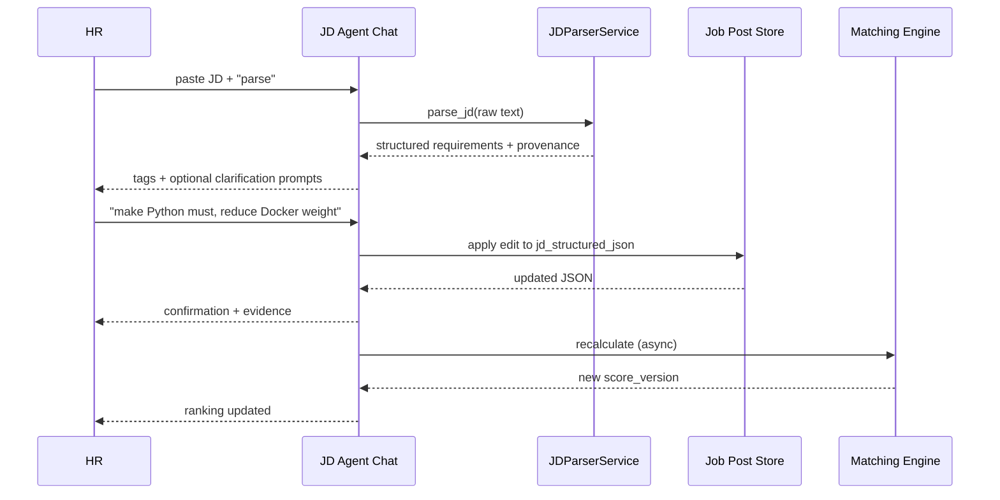

# Product Requirements Document (PRD)

**Feature Name:** JD Management, Parsing, and Candidate Matching MVP (JD Agent)
**Version:** v1.1.0 (MVP)
**Status:** Draft
**Product Manager:** HR Product Team
**Target Users:** Talent Acquisition Specialists, Senior Recruiters, Recruiting Operations Leads

> Keep the header above in sync with the YAML frontmatter (machine-readable source of truth).

---

## Change Log

| Version | Date       | Author        | Change Summary                                                                                  |
| ------- | ---------- | ------------- | ----------------------------------------------------------------------------------------------- |
| 1.1.0   | 2026-08-18 | HR Product Team | Merged `PRD-JD_Parser_v1.0.md` (JD Insight Engine) as the agent-chat interaction model; **removed all drag-and-drop weight reordering** (adjustments are now made through chat); added frontmatter, RTM, API contract, Mermaid, config, KPI Measured By, DoD, glossary. |
| 1.0.0   | -          | HR Product Team | Baseline JD Management, Parsing, and Candidate Matching MVP (formerly `RPD-JD_Management_v1.0.md`). |

---

## 1. Executive Summary

The HR recruiting support system needs to reduce manual screening effort by connecting three operational steps into one workflow: creating and managing Job Posts, parsing JD text into structured criteria, and ranking candidates based on JD-CV fit. Today, CV parsing is already available as a separate agent that stores structured candidate profiles. The missing capability is a unified front-end management experience and the logic layer that transforms JD requirements into explainable and adjustable ranking outcomes.

This MVP delivers four core modules: (1) Job Post Management container, (2) JD Parser module with an **agent chat interaction** for parsing and editing, (3) Candidate Management linked to existing CV parser data, and (4) Matching and Ranking engine with score explainability and fit clustering. The MVP objective is to help HR teams answer two operational questions quickly: "Who should we contact first?" and "Who can we safely reject now?"

**Interaction model (merged from JD Insight Engine):** HR interacts with a **JD agent through a chat conversation**. The agent parses pasted JD text into structured requirements, asks closed-option clarification questions when critical fields are missing, shows provenance evidence for every extracted item, and accepts natural-language instructions to add/edit/remove skills or adjust weights ("make Python a must", "reduce Docker weight"). There is **no drag-and-drop weight editing**; all tuning happens through the chat conversation.

CRITICAL quality principle for this MVP: **Traceable and explainable matching decisions**. Every key output must be inspectable by HR users, including JD parsing provenance, score breakdown components, and candidate fit clusters. This is a non-negotiable trust requirement for production adoption.

### 1.1 Product Vision

Enable HR teams to manage a complete JD-to-shortlist loop in one place, from opening a role to identifying high-fit candidates with transparent, adjustable, and fast decision support.

### 1.2 Success Definition (MVP)

Within one role intake cycle, HR can publish a Job Post, parse and tune JD requirements **by conversing with the JD agent**, import candidates, and obtain an updated ranked list without manual spreadsheet scoring.

### 1.3 User Personas

1. **Persona A: High-Volume Recruiter (Primary)**

   - Handles 10-20 concurrent openings.
   - Needs fast elimination decisions and confidence in automation.
   - Pain points: repetitive triage, inconsistent screening criteria, slow turnaround.
   - Success criteria: can filter Low Fit candidates in one click and prioritize top candidates in under 10 minutes per role.

2. **Persona B: Specialist Recruiter (Secondary)**

   - Handles niche technical roles with strict requirements.
   - Needs fine-grained control over must-have vs preferred skills and weights.
   - Pain points: difficult to calibrate JD strictness; hard to explain candidate ranking to hiring managers.
   - Success criteria: can inspect score provenance, and **adjust weights via chat instructions** with immediate JSON sync and re-ranking.

3. **Persona C: Recruiting Operations Lead (Secondary)**
   - Monitors recruiting funnel quality across sourcing channels.
   - Needs cross-channel comparison data and process consistency.
   - Pain points: limited visibility into source quality and parser failure handling.
   - Success criteria: can compare candidate volume and average fit score by channel for each role.

---

## 2. MVP Scope (P0 + P1)

### 2.1 P0 - Core Requirements (Launch Blockers)

| ID    | Feature                      | Description                                                                                                             | Status      |
| ----- | ---------------------------- | ----------------------------------------------------------------------------------------------------------------------- | ----------- |
| F0.1  | Module 0 Routing & Container | `/` and `/home` resolve to the same Job Post management page and load role list successfully.                           | Not Started |
| F0.2  | Job Post CRUD                | Create, edit, status update (Draft/In Progress/Closed), and archive behavior for Job Posts.                             | Not Started |
| F0.3  | Job Post Copy                | Copy an existing Job Post with full JD text + parsed conditions using deep clone, excluding candidate associations.     | Not Started |
| F0.4  | Job Post List View           | List cards/table show Job Title, JD summary (first 200 chars), start date, headcount, and status.                       | Not Started |
| F0.5  | JD Parse Trigger             | HR can paste JD text in Job Post detail and trigger the JD agent to extract structured requirements.                    | Not Started |
| F0.6  | JD Structured Output         | Must Skill, Preferred Skill, Language, Education, Visa, and Experience requirements are saved in fixed JSON structure.  | Not Started |
| F0.7  | JD Clarification Prompts     | If the agent detects missing critical constraints (visa, salary, location, work mode), the chat asks closed-option follow-up questions. | Not Started |
| F0.8  | JD Explainability            | Each parsed skill has source sentence provenance visible in chat and tag UI.                                            | Not Started |
| F0.9  | JD Agent Chat Session        | Conversational interface: HR chats with the JD agent to parse, clarify, and review requirements; every agent reply is grounded in the JD text. | Not Started |
| F0.10 | JD Chat-Driven Editing       | HR can add/edit/remove skills and adjust weights via chat instructions; edits instantly sync to JSON state (no drag-and-drop). | Not Started |
| F0.11 | JD JSON Export               | HR can copy/export the structured JD JSON for downstream ATS integration.                                               | Not Started |
| F0.12 | Candidate Linking            | Job Post detail shows candidates associated with that role from existing CV parser database.                            | Not Started |
| F0.13 | Batch CV Import              | Upload multiple PDF/Word files, invoke CV parser agent, persist candidates, and auto-link to active Job Post.           | Not Started |
| F0.14 | Import Failure Handling      | Encrypted/scanned/unsupported files are marked as failed with actionable retry/delete options.                          | Not Started |
| F0.15 | Matching Engine              | Compute candidate fit score from Must/Preferred constraints and weights; default ranking is descending by fit score.    | Not Started |
| F0.16 | Score Breakdown UI           | Candidate-level score decomposition is visible (for example skill +30, experience +15).                                 | Not Started |
| F0.17 | Async Recalculation          | JD requirement/weight changes (via chat edits) trigger a background recalculation job and refresh ranking without blocking the user. | Not Started |
| F0.18 | Fit Clustering               | Automatically label candidates as High Fit / Medium Fit / Low Fit with one-click filters.                               | Not Started |
| F0.19 | Channel Tracking             | CV import requires source channel tag (104/LinkedIn/Referral/Other) and stores it for analytics.                        | Not Started |
| F0.20 | Channel Dashboard            | Job Post detail displays per-channel candidate count and average fit score.                                             | Not Started |
| F0.21 | JD Diagnostic Tool           | Show Must skill satisfaction rates and suggest relaxing constraints when any Must item is below 20% satisfaction.       | Not Started |
| F0.22 | Last-Write-Wins Save Rule    | Concurrent edits follow MVP rule: latest save overwrites previous changes, with visible "last updated" metadata.        | Not Started |

> Status column: Not Started | In Progress | Done | Blocked.

### 2.2 P1 - Important Enhancements

| ID   | Feature                   | Description                                                                         | Status      |
| ---- | ------------------------- | ----------------------------------------------------------------------------------- | ----------- |
| F1.1 | JD Quality Hints          | Suggest clearer JD phrasing when parser confidence is low for key requirements.     | Not Started |
| F1.2 | Fit Threshold Tuning      | Admin-adjustable percentile thresholds for High/Medium/Low clusters by role family. | Not Started |
| F1.3 | Candidate Comparison View | Side-by-side comparison of top candidates across selected dimensions.               | Not Started |
| F1.4 | Recalculation Job Monitor | Lightweight status panel for background scoring jobs (queued/running/done/failed).  | Not Started |
| F1.5 | Export Shortlist          | Export filtered candidate list with score components to CSV/XLSX.                   | Not Started |
| F1.6 | Additional Channels       | Configurable source channel taxonomy beyond default preset values.                  | Not Started |
| F1.7 | Chat History Persistence  | Persist and replay JD agent chat sessions per Job Post for auditability.            | Not Started |
| F1.8 | Multi-turn Complex Edits  | Multi-step instructions ("set X must, then reduce Y weight by half") applied atomically with confirmation. | Not Started |
### 2.3 Module Priority Summary

| Module   | Name                                     | Priority | Rationale                                             |
| -------- | ---------------------------------------- | -------- | ----------------------------------------------------- |
| Module 0 | Job Post Management (Container Layer)    | P0       | Entry point for all downstream flows.                 |
| Module 1 | JD Parsing + Agent Chat Module           | P0       | Required to generate and tune structured criteria.    |
| Module 2 | Candidate Management (Association Layer) | P0       | Required candidate ingestion and role linkage.        |
| Module 3 | Matching & Ranking Engine                | P0       | Core product value delivery.                          |

### 2.4 Acceptance Criteria by Module

Write each AC as an assertable statement; use Gherkin for critical paths.

#### Module 0: Job Post Management

- **AC0.1** Accessing `/` and `/home` renders identical page component and data state.
- **AC0.2** Job Post list includes title, 200-char JD summary, start time, headcount, status.
- **AC0.3** "Create from existing" deep-copies JD text and parsed JSON but copies zero candidate links.
- **AC0.4** Status transition to Closed/Archived hides role from default active view and preserves history.
- **AC0.5** Editing base info persists successfully and is visible after reload.

#### Module 1: JD Parsing + Agent Chat

- **AC1.1** JD paste + parse action returns structured fields: Must, Preferred, Language, Education, Visa, Experience.
- **AC1.2** Given a JD missing critical items (visa/salary/location/work mode), When the agent parses it, Then the chat asks closed-option follow-up questions (no free-text chatbot dependency for structured fields).
- **AC1.3** Must skills render as red tags; Preferred skills render as blue tags; provenance is clickable per skill.
- **AC1.4** Given a chat instruction to add/edit/remove a skill or adjust a weight, When the agent confirms, Then the structured JSON updates immediately (no drag-and-drop).
- **AC1.5** Given an ungrounded agent claim, When rendered, Then the claim must include a source sentence from the JD or be flagged as missing evidence.
- **AC1.6** HR can copy/export the structured JD JSON for downstream ATS integration.

#### Module 2: Candidate Management

- **AC2.1** Job Post detail lists linked candidates with name, current company, total years, education.
- **AC2.2** Multi-file upload supports PDF/Word and initiates CV parser job per file.
- **AC2.3** Successful parse records are linked to active Job Post automatically.
- **AC2.4** Failed parse records include explicit error reason and retry/delete action.
- **AC2.5** Import flow requires source channel selection and stores channel for each candidate-role link.

#### Module 3: Matching & Ranking

- **AC3.1** Initial candidate list default sort is descending by total fit score.
- **AC3.2** Score breakdown displays at least skill, experience, education/language components where applicable.
- **AC3.3** Weight changes (via chat edits) enqueue async recalculation; UI remains responsive and list updates on completion.
- **AC3.4** Candidates are grouped as High/Medium/Low Fit and can be filtered in one click.
- **AC3.5** JD diagnostic displays Must skill satisfaction percentages and flags any item below 20%.

### 2.5 Related Code / Entry Points

| Req ID | Area                       | Existing File(s) / Entry Point                          | Notes                                              |
| ------ | -------------------------- | ------------------------------------------------------- | -------------------------------------------------- |
| F0.1   | Routing / container        | `frontend/src/App.tsx`, `frontend/src/pages/JobPostList.tsx` | `/` and `/home` unify                       |
| F0.2   | Job CRUD                   | `backend/app/api/routes/jobs.py`                        | GET/POST/PUT/PATCH/DELETE                           |
| F0.5   | JD parse trigger           | `backend/app/api/routes/jobs.py` -> `POST /jobs/{job_id}/parse-jd` | JDParseResponse                     |
| F0.6   | JD contract                | `backend/app/services/jd_parser/service.py`             | See `JD_PARSING_WEIGHTING_SPEC.md`                  |
| F0.9   | Agent chat                 | `frontend/src/modules/jd-chat/JDChatModule.tsx`         | Wire to backend chat endpoint (P0)                  |
| F0.13  | Batch import               | `backend/app/api/routes/candidates.py` -> `POST /candidates/upload` | CV parser job per file            |
| F0.15  | Matching engine            | `backend/app/services/scorer.py`, `backend/app/services/skill_matcher.py` | Deterministic scoring        |
| F0.17  | Recalculation              | `backend/app/api/routes/scoring.py` -> `POST /jobs/{job_id}/score` | Async job                    |
| F0.21  | JD diagnostic              | `backend/app/api/routes/jobs.py` -> `GET /jobs/{job_id}/diagnosis` | Must-skill satisfaction      |

### 2.6 Requirements Traceability Matrix (RTM)

| Req ID | Acceptance Criteria | Test Case ID | KPI / Validation              | Module / File                   |
| ------ | ------------------- | ------------ | ----------------------------- | ------------------------------- |
| F0.5   | AC1.1               | T-F0.5-001   | Parse success rate >= 98%     | `routes/jobs.py`, `jd_parser/`  |
| F0.7   | AC1.2               | T-F0.7-001   | Clarification resolution rate | `jd_parser/`, chat module       |
| F0.8   | AC1.3               | T-F0.8-001   | Provenance coverage >= 95%    | `jd_parser/`                    |
| F0.9   | AC1.5               | T-F0.9-001   | Chat groundedness (no ungrounded claims) | `jd-chat/`, jd service  |
| F0.10  | AC1.4               | T-F0.10-001  | Chat edit sync latency        | `jd-chat/`, `routes/jobs.py`    |
| F0.11  | AC1.6               | T-F0.11-001  | Export conformance test       | chat / schemas                  |
| F0.13  | AC2.2, AC2.3        | T-F0.13-001  | Import success + auto-link    | `routes/candidates.py`          |
| F0.15  | AC3.1               | T-F0.15-001  | Ranking stability CI test     | `scorer.py`, `skill_matcher.py` |
| F0.17  | AC3.3               | T-F0.17-001  | Recalc completes without blocking | `routes/scoring.py`         |
| F0.18  | AC3.4               | T-F0.18-001  | Fit band assignment test      | `scorer.py`                     |
| F0.21  | AC3.5               | T-F0.21-001  | Diagnostic correctness test   | `routes/jobs.py`                |

---

## 3. Out of Scope

- Full collaborative editing lock model (operational transform / CRDT / real-time merge conflict resolution).
- Drag-and-drop skill reordering and drag-based weight adjustment (removed by decision 2026-08-18; tuning is chat-driven).
- Offer management, interview scheduling, ATS calendar integration, and onboarding workflow.
- ML model retraining pipeline for JD parser or CV parser in MVP timeline.
- Multi-language JD parsing beyond primary launch language set.
- External benchmarking against labor market salary intelligence tools.
- Automatic rejection email dispatch and communication orchestration.
- Cross-job global talent pool recommendations (candidate reuse ranking across roles).
- Explainability at token-level model attention visualization.
- Offline document OCR enhancement services beyond baseline parser behavior.
- Free-text chatbot as the only input mode for structured fields (structured values use closed options; chat is the conversation layer).
---

## 4. Technical Workflow

### 4.1 End-to-End User Flow (Text-Based)

1. HR enters `/` or `/home` and sees Job Post list.
2. HR creates a new Job Post (blank or copied from existing role).
3. HR opens Job Post detail and pastes JD content.
4. JD agent extracts structured constraints and returns normalized JSON + provenance in the chat.
5. If required fields are missing, the agent asks closed-option clarification prompts in the chat.
6. HR reviews tags and tunes constraints/weights **by sending chat instructions**; edits sync immediately.
7. HR uploads candidate files in batch and selects source channels.
8. CV parser agent processes each file; successes are linked to role, failures are flagged.
9. Matching engine computes fit scores using JD constraints + weights + candidate structured CV.
10. UI shows ranked list, score breakdown, fit clusters, and channel dashboard.
11. HR sends weight-adjustment instructions; system triggers async re-score and updates ranking on completion.
12. HR filters Low Fit for elimination and focuses on High/Medium Fit shortlisting.

### 4.2 Backend Processing Workflow

1. Job Post API stores base metadata and version timestamp.
2. JD parsing service stores raw JD, parsed JSON, provenance mapping, and parse confidence.
3. JD agent chat endpoint receives messages, classifies intent (parse/clarify/edit/weight/export), and applies actions to the structured payload.
4. Candidate import service creates ingestion jobs and parser task records.
5. Candidate-role association table persists linkage with source channel and import status.
6. Matching engine reads JD JSON + candidate profiles, normalizes skills via taxonomy, and computes scores.
7. Recalculation jobs run async and increment `score_version` on completion.



### 4.3 Failure and Fallback Workflow

1. **JD parse partial:** HR can complete required fields via chat closed-option prompts and proceed.
2. **Agent edit rejected:** if a chat instruction is ambiguous, the agent asks for confirmation before applying; ungrounded claims are flagged.
3. **Scoring failure:** system keeps last successful ranking with an explicit stale-data indicator.
4. **Import subset failure:** successful files continue downstream independently; failed files expose retry/delete actions.
5. **Recalculation failure/timeout:** preserve old score version; allow manual retry.

### 4.4 Config / Environment / External Dependencies

| Config / Env Var    | Required | Default       | Description / Source              |
| ------------------- | -------- | ------------- | --------------------------------- |
| `ZAI_API_KEY`       | Yes      | -             | LLM provider API key              |
| `LLM_BASE_URL`      | Yes      | open.bigmodel.cn/api/paas/v4 | LLM endpoint          |
| `LLM_MODEL`         | Yes      | glm-4-flash   | Text LLM model for JD agent       |
| `LLM_TEMPERATURE` / `LLM_SEED` | No | 0 / 42      | Determinism requirements          |
| `CACHE_DIR`         | Yes      | ./data/cache  | Hash cache storage                |
| `UPLOAD_DIR`        | Yes      | ./data/uploads| Uploaded CV storage               |
| Taxonomy source     | Yes      | data/taxonomy/skill_taxonomy.yaml | Skill normalization |

---

## 5. Output Contract / Fixed JSON Schema

### 5.1 API Contract Summary

| Endpoint                                   | Method | Auth       | Success | Error Codes                | Idempotent | Rate Limit |
| ------------------------------------------ | ------ | ---------- | ------- | -------------------------- | ---------- | ---------- |
| `/api/job-posts`                           | GET    | None (MVP) | 200     | -                          | Yes        | N/A (MVP)  |
| `/api/job-posts`                           | POST   | None (MVP) | 201     | 400/422                    | No         | N/A (MVP)  |
| `/api/job-posts/{id}`                      | PATCH  | None (MVP) | 200     | 400/404                    | No         | N/A (MVP)  |
| `/api/job-posts/{id}/archive`              | POST   | None (MVP) | 200     | 400/404                    | No         | N/A (MVP)  |
| `/api/job-posts/{id}/jd/parse`             | POST   | None (MVP) | 200     | 400/422/500                | No         | N/A (MVP)  |
| `/api/job-posts/{id}/jd/chat`              | POST   | None (MVP) | 200     | 400/422/500                | No         | N/A (MVP)  |
| `/api/job-posts/{id}/jd`                   | PATCH  | None (MVP) | 200     | 400/404                    | No         | N/A (MVP)  |
| `/api/job-posts/{id}/candidates/import`    | POST   | None (MVP) | 202     | 400/422/500                | No         | N/A (MVP)  |
| `/api/job-posts/{id}/candidates`           | GET    | None (MVP) | 200     | 404                       | Yes        | N/A (MVP)  |
| `/api/job-posts/{id}/matching/recalculate` | POST   | None (MVP) | 202     | 409/500/504                | No         | N/A (MVP)  |
| `/api/job-posts/{id}/matching`             | GET    | None (MVP) | 200     | 404/500                    | Yes        | N/A (MVP)  |
| `/api/job-posts/{id}/diagnostics`          | GET    | None (MVP) | 200     | 404                       | Yes        | N/A (MVP)  |
| `/api/job-posts/{id}/analytics/channels`   | GET    | None (MVP) | 200     | 202/404                    | Yes        | N/A (MVP)  |

Rules:
- All failures use the shared error envelope (Section 12.9).
- `POST /jd/chat` returns the agent reply plus updated JSON (Section 5.4); chat edits are confirmed and atomic.
- Versioning: additive-only within the same major version; breaking changes need a migration plan.

### 5.2 JD Structured Output Contract

```json
{
  "job_post_id": "uuid",
  "jd_raw_text": "string",
  "parse_status": "success|partial|error",
  "schema_version": "1.0",
  "requirements": {
    "must_skills": [
      {
        "skill_id": "string",
        "display_name": "string",
        "canonical_skill": "string",
        "priority_order": 1,
        "weight": 1.0,
        "provenance": {
          "source_sentence": "string",
          "source_char_start": 0,
          "source_char_end": 42,
          "confidence": 0.0
        }
      }
    ],
    "preferred_skills": [
      {
        "skill_id": "string",
        "display_name": "string",
        "canonical_skill": "string",
        "priority_order": 1,
        "weight": 0.6,
        "provenance": {
          "source_sentence": "string",
          "source_char_start": 0,
          "source_char_end": 42,
          "confidence": 0.0
        }
      }
    ],
    "language_requirements": [
      {
        "language": "English",
        "level": "basic|business|fluent|native",
        "is_mandatory": true,
        "provenance": "string"
      }
    ],
    "education_requirement": {
      "minimum_degree": "none|bachelor|master|phd",
      "field_of_study": "string|null",
      "is_mandatory": false,
      "provenance": "string|null"
    },
    "visa_requirement": {
      "requirement_type": "none|required|preferred|unknown",
      "target_region": "string|null",
      "provenance": "string|null"
    },
    "experience_requirement": {
      "minimum_years": 3,
      "condition_groups": [
        { "type": "or", "criteria": "Master's degree + 2 years" }
      ],
      "provenance": "string|null"
    }
  },
  "clarification_prompts": [
    {
      "prompt_id": "uuid",
      "question_type": "visa|salary|location|work_mode",
      "question_text": "string",
      "options": [
        {
          "value": "string",
          "label": "string"
        }
      ],
      "selected_value": "string|null"
    }
  ],
  "metadata": {
    "parser_agent_version": "string",
    "taxonomy_version": "string",
    "updated_by_user_id": "uuid",
    "last_updated_at": "ISO-8601",
    "save_strategy": "last_write_wins",
    "error_message": "string|null"
  }
}
```

### 5.3 Candidate-Job Match Result Contract

```json
{
  "job_post_id": "uuid",
  "candidate_id": "uuid",
  "score_version": 3,
  "total_score": 78.5,
  "fit_band": "high|medium|low",
  "score_breakdown": {
    "must_skill_score": 35.0,
    "preferred_skill_score": 18.0,
    "experience_score": 15.0,
    "education_score": 5.0,
    "language_score": 5.5
  },
  "diagnostic_flags": ["missing_must_skill:Kubernetes"],
  "computed_at": "ISO-8601",
  "compute_status": "success|fallback|error",
  "metadata": {
    "recalc_job_id": "uuid|null",
    "taxonomy_version": "string",
    "error_message": "string|null"
  }
}
```

### 5.4 Agent Chat Message Contract (MVP)

```json
{
  "session_id": "uuid",
  "job_post_id": "uuid",
  "messages": [
    {
      "message_id": "uuid",
      "role": "user|assistant|system",
      "content": "string",
      "intent": "parse|clarify|edit|weight|export|null",
      "payload": {},
      "evidence_sentences": ["string"],
      "created_at": "ISO-8601"
    }
  ],
  "parse_status": "success|partial|error"
}
```

### 5.5 Database Schema Recommendations (MVP)

#### Table A: `job_posts`

| Column                  | Type         | Constraints          | Notes                               |
| ----------------------- | ------------ | -------------------- | ----------------------------------- |
| id                      | UUID         | PK                   | Job Post identifier                 |
| title                   | VARCHAR(255) | NOT NULL             | Job title                           |
| jd_raw_text             | TEXT         | NULL                 | Source JD text                      |
| jd_summary_200          | VARCHAR(220) | NULL                 | Cached list summary                 |
| head_count              | INT          | NOT NULL DEFAULT 1   | Open positions                      |
| recruiting_start_at     | TIMESTAMP    | NOT NULL             | Hiring start                        |
| status                  | ENUM         | NOT NULL             | draft/in_progress/closed/archived   |
| cloned_from_job_post_id | UUID         | NULL FK job_posts.id | Copy traceability                   |
| jd_structured_json      | JSONB        | NULL                 | Parsed + agent-edited payload       |
| jd_schema_version       | VARCHAR(32)  | NOT NULL             | Contract version                    |
| created_by              | UUID         | NOT NULL             | Audit                               |
| created_at              | TIMESTAMP    | NOT NULL             | Audit                               |
| updated_at              | TIMESTAMP    | NOT NULL             | Audit                               |

#### Table B: `candidate_job_links`

| Column                            | Type         | Constraints               | Notes                       |
| --------------------------------- | ------------ | ------------------------- | --------------------------- |
| id                                | UUID         | PK                        | Link record identifier      |
| job_post_id                       | UUID         | NOT NULL FK job_posts.id  | Role association            |
| candidate_id                      | UUID         | NOT NULL FK candidates.id | Candidate association       |
| source_channel                    | ENUM         | NOT NULL                  | 104/linkedin/referral/other |
| import_status                     | ENUM         | NOT NULL                  | pending/success/failed      |
| import_error_code                 | VARCHAR(64)  | NULL                      | Machine-readable error      |
| import_error_message              | TEXT         | NULL                      | User-facing error           |
| cv_file_name                      | VARCHAR(255) | NULL                      | Uploaded document           |
| cv_file_type                      | ENUM         | NULL                      | pdf/doc/docx                |
| retry_count                       | INT          | NOT NULL DEFAULT 0        | Retry tracking              |
| linked_at                         | TIMESTAMP    | NOT NULL                  | Association timestamp       |
| UNIQUE(job_post_id, candidate_id) | -            | Unique                    | Prevent duplicate links     |

#### Table C: `candidate_match_scores`

| Column                               | Type         | Constraints               | Notes                       |
| ------------------------------------ | ------------ | ------------------------- | --------------------------- |
| id                                   | UUID         | PK                        | Score record identifier     |
| job_post_id                          | UUID         | NOT NULL FK job_posts.id  | Role context                |
| candidate_id                         | UUID         | NOT NULL FK candidates.id | Candidate context           |
| score_version                        | INT          | NOT NULL                  | Increment per recalculation |
| total_score                          | DECIMAL(5,2) | NOT NULL                  | 0-100 score                 |
| fit_band                             | ENUM         | NOT NULL                  | high/medium/low             |
| breakdown_json                       | JSONB        | NOT NULL                  | Component scores            |
| diagnostic_json                      | JSONB        | NULL                      | Missing skills / notes      |
| compute_status                       | ENUM         | NOT NULL                  | success/fallback/error      |
| computed_at                          | TIMESTAMP    | NOT NULL                  | Computation time            |
| recalc_job_id                        | UUID         | NULL                      | Async job trace             |
| INDEX(job_post_id, total_score DESC) | -            | Index                     | Fast rank query             |
---

## 6. Non-Functional Requirements

| Category       | Requirement                                                                                                       |
| -------------- | ----------------------------------------------------------------------------------------------------------------- |
| Performance    | P95 Job Post list API < 800 ms for up to 500 roles; ranked candidate query P95 < 1.2 s for 500 candidates.        |
| Scalability    | Recalculation jobs support at least 1,000 candidate-score computations per role via async workers.                |
| Responsiveness | UI interaction remains non-blocking during background recalculation; status updates shown within 3 seconds.       |
| Reliability    | CV import and scoring jobs are retryable for transient failures; at-least-once processing with idempotent writes. |
| Determinism    | Same JD JSON + same candidate snapshot + same taxonomy version must yield reproducible score output.              |
| Traceability   | Every parsed requirement and score result must store provenance, version metadata, and timestamps.                |
| Explainability | HR can inspect source sentence for parsed skills and score breakdown for each candidate.                          |
| Security       | Role-based access for HR users; uploaded files and PII encrypted at rest and in transit (TLS 1.2+).               |
| Privacy        | Retain candidate files per retention policy; support deletion workflow for compliance requests.                   |
| Compatibility  | Support latest two major versions of Chrome and Edge in MVP.                                                      |
| Availability   | Core APIs and ranking view target 99.5% monthly availability in MVP environment.                                  |
| Observability  | Structured logs and metrics for parser success rate, chat intent distribution, import failures, recalculation latency, and API errors. |

---

## 7. Risks and Mitigations

| Risk                                                                                          | Impact | Mitigation                                                                                                                                                                                                                 |
| --------------------------------------------------------------------------------------------- | ------ | -------------------------------------------------------------------------------------------------------------------------------------------------------------------------------------------------------------------------- |
| R1 Skill naming mismatch between CV parser and JD parser (for example "Python" vs "python3"). | High   | Build and version a canonical Skill Taxonomy service with alias mapping; normalize both parser outputs pre-scoring; log unknown skills for weekly taxonomy updates; fallback to fuzzy alias matching with confidence flag. |
| R2 Large candidate volume causes slow recalculation after weight changes.                     | High   | Use async queue + worker pool; incremental recomputation per affected role only; cache candidate normalized vectors; optimistic UI refresh with "last computed" timestamp; enforce job timeout + retry policy.             |
| R3 Job Post copy incorrectly duplicates candidate associations.                               | Medium | Implement deep clone at Job Post + JD JSON level only; explicit exclusion list for association tables; add integration test verifying zero copied candidate links.                                                         |
| R4 Concurrent edits from multiple HR users overwrite each other unexpectedly.                 | Medium | MVP policy is last-write-wins with visible "last updated by/time"; maintain full edit history snapshot for rollback support by admin; include conflict warning toast on stale data detection.                              |
| R5 CV parse failures reduce trust and throughput.                                             | High   | Standardize import error taxonomy (encrypted PDF, scanned image, unsupported format, parser timeout); show per-file recovery actions (retry/delete/re-upload guideline); batch retry endpoint with capped retry count.     |
| R6 JD agent misinterprets a chat edit instruction.                                            | High   | Intent classification + confirmation before applying edits; every edit response echoes the resulting JSON diff and provenance; ungrounded claims flagged.                                                                   |
| R7 Parser vendor/model drift impacts output consistency.                                      | Medium | Pin parser agent version per production release; include schema contract validation gate; alert when parse confidence distribution shifts beyond threshold.                                                                |
| R8 Data quality issues in historical candidate profiles skew scores.                          | Medium | Track candidate profile completeness score; apply missing-data penalty logic transparently; surface low-confidence badge in UI.                                                                                            |
| R9 Async job backlog under peak upload periods.                                               | Medium | Autoscale worker replicas by queue depth; priority queue for active Job Posts; circuit breaker for non-critical recalculations.                                                                                            |

### 7.1 Failure-Mode Requirements (Non-negotiable)

- If scoring fails, system must continue showing last successful ranking with explicit stale-data indicator.
- If JD parse is partial, HR must still be able to complete required fields via chat closed-option prompts and proceed.
- If a chat edit instruction is ambiguous, the agent must ask for confirmation; it must never silently apply an ungrounded change.
- If import fails for a subset of files, successful files must continue downstream processing independently.

---

## 8. Boundary / Separation Requirements

- **CV Parser Ownership Boundary (CRITICAL):** Existing CV parser extraction logic and output schema ownership remains in CV Parser service; this PRD does not redefine CV extraction fields.
- **JD Parser Ownership Boundary (CRITICAL):** JD parser service owns JD requirement extraction, provenance, and chat-driven editing; it must not modify CV parser internals.
- **Route Layer:** Job routes orchestrate persistence; they do not own parsing or chat reasoning rules.
- **Scoring Engine:** stays generic (normalized JSON in, scores out); no CV-specific coupling.
- **Contract Rule:** `jd_parsed_json` / `weight_config_json` must not be overwritten by other modules; the weighting contract is maintained in `docs/jd-parser/JD_PARSING_WEIGHTING_SPEC.md`.

---

## 9. Success Metrics (KPIs)

| Metric                                   | Target                                       | Measured By                                              |
| ---------------------------------------- | -------------------------------------------- | -------------------------------------------------------- |
| JD parse success rate (`/parse-jd`)      | >= 98% for valid non-empty JD                | API logs / DB query over parse responses                 |
| Schema validity rate                     | 100% responses conform to Section 5          | CI contract assertion                                    |
| Provenance coverage                      | >= 95% of parsed skills include evidence     | DB query on `jd_structured_json`                         |
| Clarification prompt resolution rate     | >= 85% via closed-option chat prompts        | Chat analytics (prompt -> answered)                      |
| Chat edit sync correctness               | 100% of confirmed edits reflected in JSON    | Integration tests + edit audit log                       |
| Chat groundedness                        | 0 ungrounded claims in MVP (UAT gate)        | UAT checklist + spot checks                              |
| Ranking stability                        | 100% identical repeated runs (same input)    | CI determinism test                                      |
| Recalculation non-blocking               | UI interactive during recalc (P95 < 3s status update) | Frontend perf telemetry                        |
| Frontend parse-render failures           | 0 critical runtime errors from payload mismatch | Error monitoring                                    |
| Median parse response time               | <= 1.5s in local/staging baseline            | API latency telemetry                                    |

---

## 10. Future Considerations (Post-MVP)

- Full collaborative editing and conflict merge (operational transform / CRDT).
- Offer management, interview scheduling, and ATS calendar integration.
- ML model retraining pipeline for JD parser or CV parser.
- Multi-language JD parsing quality guarantees.
- Cross-job global talent pool recommendations.
- Token-level explainability visualizations.
- Chat session replay and audit export.
- Boolean search string generator and LinkedIn sourcing integrations.

---

## 11. PRD Owner Sign-off

### 11.1 Definition of Done (DoD)

- [ ] All P0 items implemented and tested (per RTM).
- [ ] Agent chat parse/clarify/edit/weight/export flows verified end-to-end.
- [ ] No drag-and-drop weight UI remains in the product.
- [ ] Provenance available for every parsed skill; ungrounded claims gated.
- [ ] DB migrations applied and reversible; `.env.example` updated for new config.
- [ ] Error taxonomy complete; retry policy implemented.
- [ ] CI green; unit + integration coverage for each P0 item.

**PRD Owner Sign-off:** ____________ **Date:** ________
**Engineering Lead Sign-off:** ________ **Date:** ________
**Data/AI Lead Sign-off:** ________ **Date:** ________

---

## 12. Engineering Review Edition (Same-Spec Review Layer)

This section is an implementation review layer. Keep Sections 1-11 as the canonical PRD.

### 12.1 Delivery Phases and Milestones

| Phase   | Scope                                                                                     | Exit Criteria                                                                                                               |
| ------- | ----------------------------------------------------------------------------------------- | --------------------------------------------------------------------------------------------------------------------------- |
| Phase 1: Foundation | Module 0 shell + Job Post CRUD + route unification (`/` and `/home`) + copy behavior      | Demo proves create/edit/close/archive/copy; copy excludes candidate links via integration test.                             |
| Phase 2: JD Intelligence | Module 1 parser integration, agent chat (parse/clarify/edit/weight/export), provenance, JSON sync | JD parse + chat edit cycle complete; provenance available per skill; clarification prompts resolve missing required fields. |
| Phase 3: Candidate Ingestion | Module 2 batch import, parser orchestration, failure handling, source channel persistence | Mixed success/failure upload batch handled correctly; failed rows can retry/delete; channel tagging coverage >= 95% in QA dataset. |
| Phase 4: Matching Core | Module 3 scoring, ranking, breakdown visualization, fit clustering, async recalculation   | Ranking stable and reproducible; async jobs update UI without blocking; stale-state handling verified.                       |
| Phase 5: Diagnostics and Hardening | JD diagnostic widget, channel dashboard, observability, security checks, UAT fixes        | KPI instrumentation active, error taxonomy complete, UAT sign-off for top 5 recruitment scenarios.                           |

### 12.2 API Surface (MVP Proposed)

| Endpoint                                   | Method | Purpose                                            | Notes                                            |
| ------------------------------------------ | ------ | -------------------------------------------------- | ------------------------------------------------ |
| `/api/job-posts`                           | GET    | List job posts with summary fields                 | Supports status filter and pagination.           |
| `/api/job-posts`                           | POST   | Create new job post                                | Supports `clone_from_job_post_id` for deep copy. |
| `/api/job-posts/{id}`                      | PATCH  | Update base job post fields                        | Last-write-wins with `updated_at` check.         |
| `/api/job-posts/{id}/archive`              | POST   | Close/archive role                                 | Soft state transition only.                      |
| `/api/job-posts/{id}/jd/parse`             | POST   | Trigger JD parsing from raw text                   | Returns schema in Section 5.2.                   |
| `/api/job-posts/{id}/jd/chat`              | POST   | Send agent chat message (parse/clarify/edit/weight/export) | Returns reply + updated JSON; Section 5.3. |
| `/api/job-posts/{id}/jd`                   | PATCH  | Save edits applied via agent chat to JD JSON       | Atomic replace of structured payload.            |
| `/api/job-posts/{id}/candidates/import`    | POST   | Batch upload CV files with source channel          | Async ingestion job creation.                    |
| `/api/job-posts/{id}/candidates`           | GET    | Get linked candidates with profile basics          | Supports fit-band and channel filters.           |
| `/api/job-posts/{id}/matching/recalculate` | POST   | Trigger asynchronous re-scoring                    | Returns `recalc_job_id`.                         |
| `/api/job-posts/{id}/matching`             | GET    | Fetch ranked candidates + breakdown + fit band     | Optional `score_version=latest`.                 |
| `/api/job-posts/{id}/diagnostics`          | GET    | Must-skill satisfaction and relaxation suggestions | Threshold alert default is <20%.                 |
| `/api/job-posts/{id}/analytics/channels`   | GET    | Source channel dashboard data                      | Count + average score by channel.                |

### 12.3 Data and Consistency Rules (Review-Critical)

1. **Deep Clone Rule (Non-negotiable):** copy flow clones role metadata + JD JSON only; candidate links and score history are excluded.
2. **Versioned Scoring Rule:** each recalculation increments `score_version`; UI always reads latest successful version.
3. **Taxonomy Normalization Rule:** both JD and CV skill tokens must resolve to canonical taxonomy IDs before scoring.
4. **Save Semantics Rule:** last-write-wins in MVP; server records `updated_by` and `updated_at` on every mutation.
5. **Failure Isolation Rule:** per-file CV parse failure does not block successful files in the same batch.
6. **Chat Edit Rule (Non-negotiable):** every chat edit must be confirmed, applied atomically to `jd_structured_json`, and echoed back with the resulting diff; no drag-and-drop editing path exists.

### 12.4 Test Plan and Quality Gates

| Test Layer        | Coverage Focus                            | Mandatory Cases                                                                                            |
| ----------------- | ----------------------------------------- | ---------------------------------------------------------------------------------------------------------- |
| Unit Tests        | JD parser buckets, provenance, intent classification, weight math | Must/preferred split, condition groups, chat intent mapping, score determinism        |
| Integration Tests | Routes + DB + async recalc + chat endpoint | Parse -> edit -> recalc round trip; deep clone excludes links; import failure isolation                   |
| E2E Tests         | Recruiter journey                         | Create role -> chat parse -> clarify -> tune -> import -> rank -> export                                   |
| Contract Tests    | Section 5 schemas                         | 100% response conformance; versioned schema additive-only gate                                              |

### 12.5 Release Readiness Checklist

- [ ] Chat parse/clarify/edit/weight/export flows pass UAT.
- [ ] No drag-and-drop weight UI remains.
- [ ] Error taxonomy + retry policy implemented and tested.
- [ ] Observability metrics instrumented (parse, chat, recalc, import).
- [ ] Stale-data indicator verified for scoring failures.

### 12.6 Observability and Ops Runbook (MVP Minimum)

| Signal                       | Threshold               | On-Call Action                                       |
| ---------------------------- | ----------------------- | ---------------------------------------------------- |
| JD parse error rate          | > 5% over 10 min        | Check LLM upstream + parser version pin              |
| Chat edit failure rate       | > 2%                    | Inspect intent classification + schema validation   |
| Recalculation queue depth    | > 100 pending           | Scale workers; check circuit breaker                |
| API 5xx rate                 | > 1% over 5 min         | Check DB + LLM upstream; rollback last deploy       |

### 12.7 Open Review Decisions (To Resolve Before Build Lock)

1. Chat session persistence scope for MVP (in-memory vs `jd_chat_sessions` table) - default: persist to table for audit.
2. Whether chat edit confirmation requires explicit user confirm click or natural-language acknowledgment - default: explicit confirm for weight changes.
3. Export target format for JD JSON (copy-to-clipboard vs downloadable file) - default: both in MVP.

### 12.8 Engineering Sign-off Criteria

MVP build is review-approved only when:

1. All P0 ACs pass (Sections 2.4 + RTM).
2. Chat edits are confirmed + atomic + echoed; no drag-and-drop UI remains.
3. Determinism test passes (same input + same config => same ranking).
4. Error taxonomy complete and retry policy exercised.

### 12.9 API Error Code Catalog (Frontend-Backend Contract)

| Error Code                    | HTTP Status | Module   | Retryable | User Message (UI)                                    | Client Action                                            |
| ----------------------------- | ----------- | -------- | --------- | ---------------------------------------------------- | -------------------------------------------------------- |
| `JD_PARSE_EMPTY_JD`           | 422         | Module 1 | No        | JD text is empty.                                    | Block submit until text entered.                         |
| `JD_PARSE_FAILED`             | 500         | Module 1 | Yes       | JD parsing failed. Please retry.                     | Show retry action.                                       |
| `JD_CHAT_AMBIGUOUS_INSTRUCTION` | 422      | Module 1 | No        | Your instruction was ambiguous.                      | Ask for confirmation / clarification in chat.            |
| `JD_CHAT_UNGROUNDED_CLAIM`    | 422         | Module 1 | No        | The agent could not ground this change in the JD.    | Flag missing evidence; request confirmation.             |
| `CV_PARSE_ENCRYPTED_PDF`      | 422         | Module 2 | No        | Encrypted PDF cannot be parsed.                      | Mark failed with re-upload guidance.                     |
| `CV_PARSE_TIMEOUT`            | 504         | Module 2 | Yes       | CV parsing timed out.                                | Keep row failed with retry action.                       |
| `CV_PARSE_UPSTREAM_UNAVAILABLE` | 503       | Module 2 | Yes       | CV parsing service temporarily unavailable.          | Batch-level retry with cooldown.                         |
| `CANDIDATE_LINK_DUPLICATE`    | 409         | Module 2 | No        | Candidate already linked.                            | Skip duplicate and continue.                             |
| `MATCH_SCORE_COMPUTE_FAILED`  | 500         | Module 3 | Yes       | Failed to compute scores.                            | Keep stale ranking + stale-data indicator.               |
| `RECALC_JOB_TIMEOUT`          | 504         | Module 3 | Yes       | Recalculation exceeded time limit.                   | Preserve old score version; allow retry.                 |
| `AUTH_FORBIDDEN`              | 403         | Cross    | No        | No permission for this action.                      | Hide privileged actions.                                 |
| `RATE_LIMIT_EXCEEDED`         | 429         | Cross    | Yes       | Too many requests.                                   | Retry with backoff.                                      |
| `INTERNAL_UNEXPECTED_ERROR`   | 500         | Cross    | Yes       | Unexpected error.                                    | Show support ID + safe retry.                            |

#### Error Payload Contract (MVP)

```json
{
  "error_code": "string_enum",
  "message": "human_readable_message",
  "module": "module_0|module_1|module_2|module_3|cross",
  "retryable": true,
  "request_id": "uuid",
  "details": {
    "job_post_id": "uuid|null",
    "candidate_id": "uuid|null",
    "file_name": "string|null",
    "upstream_service": "jd_parser|cv_parser|matching_engine|null"
  },
  "timestamp": "ISO-8601"
}
```

#### Retry Policy (MVP)

1. **Immediate retry (once):** network transient, 502/503/504 class errors.
2. **Exponential backoff:** start 2s, then 5s, then 10s; max 3 attempts for background-safe endpoints.
3. **No auto-retry:** validation and business-rule errors (4xx non-transient).
4. **User-visible fallback:** when retries exhausted, keep last successful state and show actionable next step.

---

## Glossary

| Term                     | Definition                                                            |
| ------------------------ | --------------------------------------------------------------------- |
| JD agent                 | Conversational layer that parses, clarifies, edits, and exports JD requirements. |
| Provenance               | Source sentence/span evidence for an extracted or edited item.        |
| Clarification prompt     | Closed-option question asked by the agent when a critical field is missing. |
| Chat-driven editing      | Adjusting JD requirements/weights via chat instructions (no drag-and-drop). |
| `jd_structured_json`     | Parsed + agent-edited requirement payload (see `JD_PARSING_WEIGHTING_SPEC.md`). |
| `weight_config_json`     | Per-skill weight configuration derived from parsed skills.            |
| Fit band                 | high / medium / low cluster label for ranking.                        |
| `score_version`          | Version incremented per recalculation; UI reads latest successful.    |
| Last-write-wins          | MVP concurrency rule: latest save overwrites, with audit metadata.    |