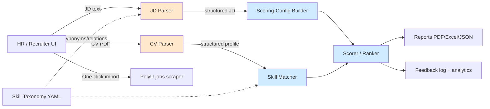
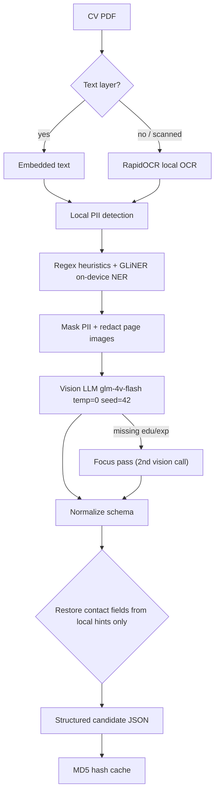
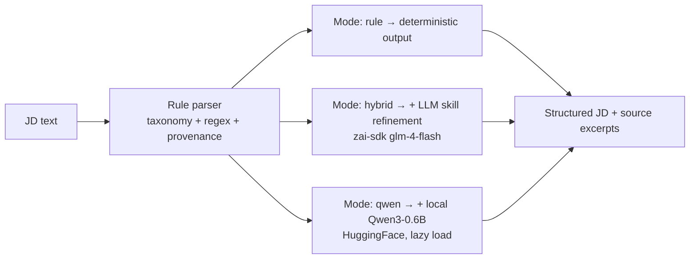
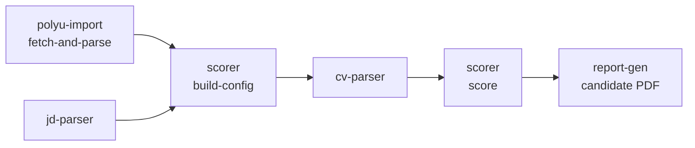
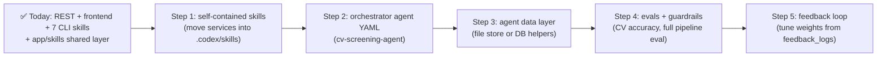

# Agent CV Screening — Summary

## 0. One-line pitch

An **AI-powered CV screening system**: parse a Job Description + candidate CVs (PDF) into structured data, score & rank candidates with **fully deterministic logic**, and export PDF/Excel reports — with a privacy-first, cacheable LLM pipeline. The same logic runs via **REST (frontend)** or **offline agent CLI skills** (Codex / future orchestrator).

---

## 1. End-to-end architecture



**Dual entry points (same services, two paths):**

| Path                 | Entry                                                              | Use case                                       |
| -------------------- | ------------------------------------------------------------------ | ---------------------------------------------- |
| **REST API**         | `backend/app/api/routes/*` → `backend/app/services/*`              | Traditional frontend, DB persistence           |
| **Agent CLI skills** | `.codex/skills/*/scripts/*.py` → `backend/app/skills/*` → services | Offline agent pipeline, no HTTP / no DB writes |

- **FastAPI backend** (`backend/app/main.py`) exposes `/api/v1` routes: candidates, jobs, scoring, reports, feedback.
- **PostgreSQL 15 + async SQLAlchemy** store jobs, candidates, resumes, extracted data, scoring configs/results, feedback, skill taxonomy (JSONB columns).
- **Key design rule:** the LLM is used **only** for parsing (CV/JD); matching, scoring and ranking are **100% deterministic** (no LLM) and reproducible (`temperature=0`, `seed=42`, MD5-based caching).

---

## 2. Modules & tech stack

| #   | Module                       | What it does                                                                 | Tech                                                                                                                     |
| --- | ---------------------------- | ---------------------------------------------------------------------------- | ------------------------------------------------------------------------------------------------------------------------ |
| 1   | **API / Web layer**          | REST endpoints, DI, startup migrations, CORS, error handling                 | FastAPI, uvicorn, Pydantic v2, SQLAlchemy 2 (async) + asyncpg, Alembic, Docker Compose                                   |
| 2   | **CV Parser**                | PDF → structured candidate data (multimodal, privacy-first)                  | PyMuPDF, pypdf, pdfplumber, RapidOCR (ONNX), OpenCV, GLiNER, zai-sdk (Zhipu AI `glm-4v-flash` / `glm-4-flash`), tenacity |
| 3   | **JD Parser**                | JD → must/preferred skills, languages, education, visa, experience (3 modes) | PyYAML, regex, zai-sdk; optional torch/transformers (Qwen3-0.6B)                                                         |
| 4   | **Skill Taxonomy + Matcher** | Canonicalize skills, synonym & parent/child matching                         | PyYAML (`data/taxonomy/skill_taxonomy.yaml`), SQLAlchemy sync                                                            |
| 5   | **Scorer / Ranker**          | 8-dimension score, weighted total, tiers, hard filters, ranking              | Pure Python + `Decimal` (no LLM)                                                                                         |
| 6   | **Reports & Integrations**   | PDF one-pager, Excel comparison, PolyU job import, feedback analytics        | reportlab, openpyxl, httpx/requests, regex                                                                               |

---

## 3. CV Parser pipeline (most complex module)



**Fallback chain:** `vision → vision_focus → text LLM (masked text) → rule-based`, each tagged as a `parse_path` (`vision`, `text_fallback`, `rule_fallback`, `privacy_rule_fallback`).

**Privacy design:** contact info (name/email/phone) is detected **locally** and re-attached locally; anything the LLM returns in those fields is **stripped**. If no local name is detected, the external LLM call is **blocked** (privacy guard).

---

## 4. JD Parser — 3 pluggable modes



- `rule` (default): taxonomy token matching, Chinese numerals, language levels, education/visa/experience + **provenance** (source sentence + char offsets + confidence).
- `hybrid` / `qwen`: enrichment providers implement an **ABC (`JDEnrichmentProvider`)**; on failure it **falls back to rule output** and records `enrichment_notes`.
- The structured JD is bridged into a **scoring config** (`build_scoring_config_from_jd`: required skills, weights, hard filters, tiers).

---

## 5. Codex skills (agent CLI layer)

### Skill inventory

| Skill folder      | CLI script            | Wraps (`backend/app/skills/`)                                                          | AI?                                              |
| ----------------- | --------------------- | -------------------------------------------------------------------------------------- | ------------------------------------------------ |
| `cv-parser`       | `run_cv_parse.py`     | `parse_cv_skill`                                                                       | ✅ LLM (vision + text fallback)                  |
| `jd-parser`       | `run_jd_parse.py`     | `parse_jd_skill`                                                                       | ✅ optional (hybrid/qwen); default rule = no LLM |
| `scorer`          | `run_score.py`        | `score_candidate_skill`, `rank_candidates_skill`, `build_scoring_config_from_jd`       | ❌ deterministic                                 |
| `report-gen`      | `run_report.py`       | `generate_candidate_report_skill`, `generate_comparison_report_skill`                  | ❌ reportlab / openpyxl                          |
| `polyu-import`    | `run_polyu_import.py` | `list_polyu_catalog_skill`, `fetch_polyu_job_skill`, `fetch_and_parse_polyu_job_skill` | ❌ httpx scrape; parse step uses jd-parser       |
| `pipeline`        | `run_pipeline.py`     | chains polyu-import, jd-parser, cv-parser, scorer, report-gen skill CLIs               | ✅ cv-parser step uses LLM when parsing PDFs     |
| `screening-agent` | `run_agent.py`        | orchestrates pipeline rounds (`need_input`/partial retry/`resume`)                     | ⚙️ rule-based loop (no extra LLM decisions)      |
| `write-prd`       | (docs)                | —                                                                                      | ✅ LLM-assisted PRD                              |

> Each skill has `SKILL.md`, `agents/openai.yaml`, `scripts/_bootstrap.py` (repo-root cwd + `backend/` on `sys.path`), and examples. CLI scripts call the **same** functions as the REST API where applicable; PolyU skill does **not** write to DB (REST `/sync-polyu/*` still persists jobs).

### Shared skill orchestration (`backend/app/skills/`)

| Module            | Purpose                                          |
| ----------------- | ------------------------------------------------ |
| `cv_parse.py`     | CV PDF → structured profile                      |
| `jd_parse.py`     | JD text → structured requirements                |
| `score.py`        | Score, rank, `build_scoring_config_from_jd`      |
| `report.py`       | PDF one-pager + Excel comparison                 |
| `polyu_import.py` | PolyU catalog / detail fetch + optional JD parse |

### Offline agent pipeline (file-based, no DB)



```bash
# One command (pipeline skill) — legacy or matching engine
python .codex/skills/pipeline/scripts/run_pipeline.py \
  --jd-file jd.txt --cv cv1.pdf --cv cv2.pdf \
  --position "Backend Engineer" --output-dir data/pipeline_out

# Manual chain (same steps as pipeline skill)
# Option A: JD from PolyU
python .codex/skills/polyu-import/scripts/run_polyu_import.py fetch-and-parse --external-ref <REF> --output polyu.json
python .codex/skills/scorer/scripts/run_score.py build-config --jd-structured polyu.json --output config.json

# Option B: JD from text file
python .codex/skills/jd-parser/scripts/run_jd_parse.py --jd-file jd.txt --output jd.json
python .codex/skills/scorer/scripts/run_score.py build-config --jd-structured jd.json --output config.json

# Score + report (requires ZAI_API_KEY for cv-parser)
python .codex/skills/cv-parser/scripts/run_cv_parse.py --file cv.pdf --output extracted.json
python .codex/skills/scorer/scripts/run_score.py score --extracted extracted.json --config config.json --output score.json
python .codex/skills/report-gen/scripts/run_report.py candidate --extracted extracted.json --score score.json --position "Job Title" --rank 1 --output report.pdf
```

**CLI envelope unwrapping (fail-fast on invalid JSON):**

| Step                           | Accepts                                                                  | Unwrap behavior                                     |
| ------------------------------ | ------------------------------------------------------------------------ | --------------------------------------------------- |
| `build-config --jd-structured` | jd-parser output, polyu `fetch-and-parse` output, pure `structured_data` | `jd_parse` → `structured_data` → requirement fields |
| `score --config`               | raw config or `{status, config}` envelope                                | inner `config` dict                                 |
| `score --extracted`            | cv-parser output or pure `structured_data`                               | inner `structured_data`                             |
| `report-gen --score`           | score output or `{score, ranking}` envelope                              | inner `score` dict                                  |
| `report-gen --extracted`       | cv-parser output or pure `structured_data`                               | inner `structured_data`                             |

Regression coverage: `backend/tests/unit/test_skill_cli_compat.py` (CLI ↔ `app.skills.*` parity + pipeline stubs).

### Still optional to extract as standalone skills

| Part                            | Skill?                                                          |
| ------------------------------- | --------------------------------------------------------------- |
| Local OCR (scanned CVs)         | 🔧 could extract `cv-ocr` (bundled in cv-parser today)          |
| Local PII / name detection      | 🔧 could extract `cv-pii-redact`                                |
| Local Qwen JD extractor         | 🔧 could extract `jd-qwen` (mode on jd-parser / polyu `--mode`) |
| Skill taxonomy + matching alone | 🔧 could extract `skill-matcher` (bundled in scorer today)      |
| Feedback analytics              | 🔧 future skill / agent step                                    |

---

## 6. Turning the whole project into one agent — roadmap



### Done (since initial roadmap)

- **Eight Codex skills** under `.codex/skills/` with CLI entry points and `SKILL.md` contracts (including **`pipeline`** end-to-end orchestration and **`screening-agent`** L1 retry loop).
- **`backend/app/skills/`** as single source of truth for REST + CLI (`cv_parse`, `jd_parse`, `score`, `report`, `polyu_import`).
- **Chainable offline pipeline**: manual step chain or **`pipeline` skill** one-shot (`polyu/jd → build-config → cv-parse → score → report-gen`), with L1 phase 1 **partial success**, per-candidate retries, `--resume`, and `need_input` when JD/CVs/position are missing.
- **Envelope unwrapping + fail-fast** on scorer, report-gen, and build-config inputs.
- **CLI compat tests** in `test_skill_cli_compat.py` (including stubbed PolyU network).

### Still needed

1. **Self-contained skills** — merge `backend/app/skills/*` and wrapped services into each `.codex/skills/*` folder (`TODO(agent-migration)` in code and skill docs).
2. **Orchestrator agent evolution (post-L1)** — extend `screening-agent` from rule-loop retries to richer planning (`ask_user` UX, smarter retry classification, batch continuation policies). L2 feedback weight tuning remains later.
3. **Agent data access** — optional DB helpers or file-based job/candidate storage for multi-CV batch runs.
4. **Runtime config** — document / centralize env (ZAI_API_KEY, LLM_BASE_URL, JD_PARSER_MODE) for agent runs.
5. **Evaluation & guardrails** — extend `backend/scripts/eval_jd_parsers.py`; add CV parser accuracy and full pipeline regression tests.
6. **Feedback loop** — agent consumes `feedback_logs` analytics to suggest scoring weight / config adjustments.
7. **Deprecate legacy REST/frontend path** (optional) — thin API or remove routes marked `TODO(agent-migration)` when agent is primary.

### Known limits (agent path)

- **PolyU fetch** requires HTTPS to `jobs.polyu.edu.hk`; TLS/CA issues must be fixed at OS level (do not disable cert verification in code).
- **PolyU HTML** parsing depends on current page structure (`ITS_clickableTableRow`, `<main>`); site redesign may break listing/detail parsers.
- **PDF report fields** — `ReporterService` expects experience `title` / `start_date`; some CV extractions use `job_title` / `period` (same limitation as REST).
- **polyu-import** does not persist jobs; REST `/api/v1/jobs/sync-polyu/*` remains the path for DB import + frontend job board.
