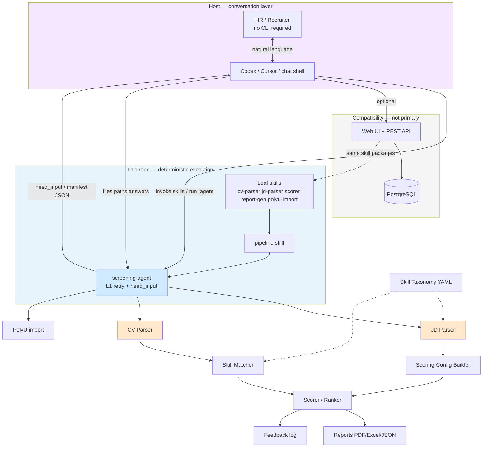
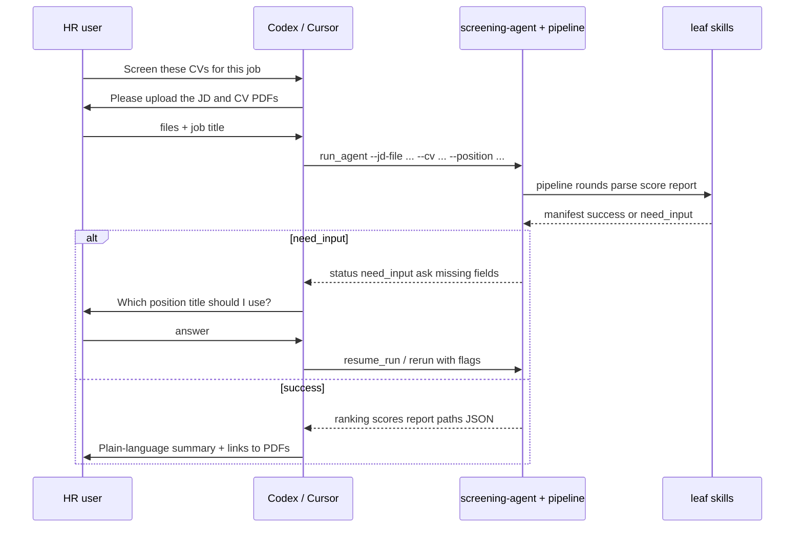
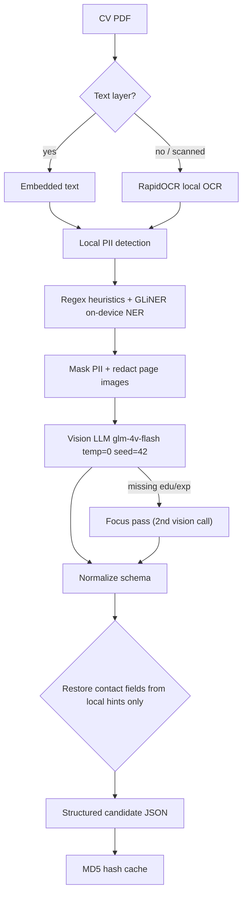
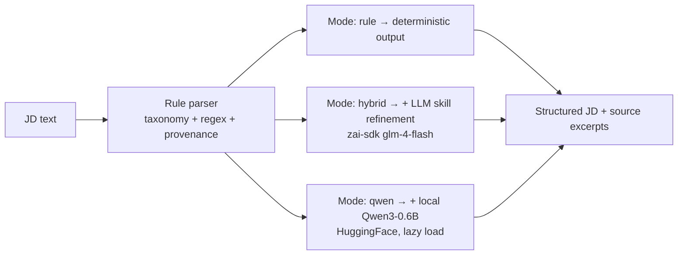
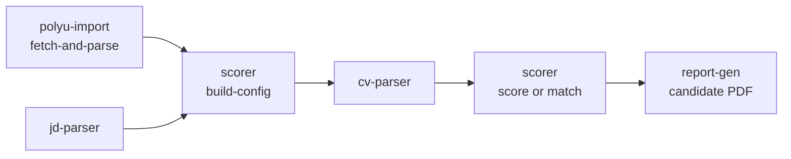
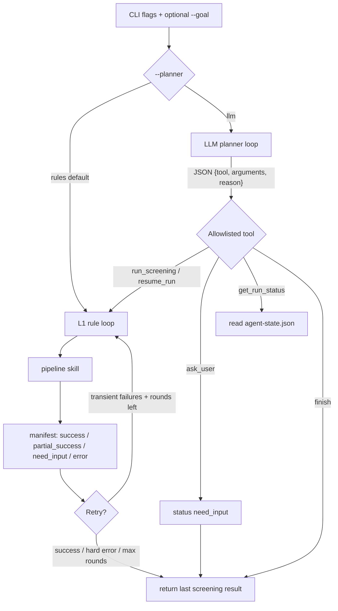
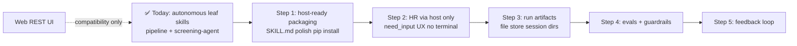

# Agent CV Screening — Summary

## 0. Product vision

**Primary goal:** an **embeddable CV screening execution layer** for agent hosts (Codex, Cursor, and similar). The **host** runs the conversation; **this repo** runs deterministic screening.

| Layer                                            | Owner           | Responsibility                                                                                                             |
| ------------------------------------------------ | --------------- | -------------------------------------------------------------------------------------------------------------------------- |
| **Host** (Codex / Cursor / future HR chat shell) | Platform        | Natural-language dialogue, file pickers, clarifying questions, explaining results to the user                              |
| **This repo**                                    | Screening agent | Parse JD + CVs, score & rank with **reproducible logic**, generate PDF/Excel, surface `need_input` when inputs are missing |

**Target user:** HR and recruiters **without a technical background**. They should not run terminals, read JSON, or configure pipelines. They talk to the host; the host invokes skills / `screening-agent` / `pipeline` on their behalf.

**Web application (FastAPI + frontend):** **not the primary product.** It remains a **compatibility path** for stepwise UI, DB persistence, PolyU job-board sync, and demos. New product work should favor **host-embeddable skills** first; extend the web stack only when it does not block that path.

**One-line pitch:** Host-guided CV screening for non-technical HR — chat in the host, **deterministic parse → score → rank → report** in this repo via Codex skills and `screening-agent`.

---

## 1. End-to-end architecture



**Division of intelligence:**

| Concern                                     | Host (conversation) | This repo (execution)                          |
| ------------------------------------------- | ------------------- | ---------------------------------------------- |
| Ask for missing JD, CVs, job title          | ✅ primary          | surfaces `need_input` + `ask` hints            |
| Explain scores and tiers to HR              | ✅ primary          | returns structured JSON + report paths         |
| Choose when to retry after transient errors | ✅ in production    | L1 rules + optional dev planner                |
| Parse PDF / extract profile                 | ❌                  | ✅ cv-parser (LLM inside bounded extract step) |
| Score, rank, tier                           | ❌ never LLM        | ✅ pure Python                                 |
| Generate PDF / Excel                        | ❌                  | ✅ report-gen                                  |

### Entry points (priority order)

| Priority | Path              | Entry                                                                           | Role                                           |
| -------- | ----------------- | ------------------------------------------------------------------------------- | ---------------------------------------------- |
| **P0**   | **Host + skills** | Host reads `SKILL.md`, runs `.codex/skills/*/scripts/*.py` or `screening-agent` | **Primary** — HR-facing product                |
| **P1**   | **Pipeline CLI**  | `run_pipeline.py` → leaf skill CLIs                                             | Dev, CI, host subprocess chain                 |
| **P2**   | **REST + web UI** | `backend/app/api/routes/*` → skill shims → DB                                   | Compatibility, persistence, legacy stepwise UI |

- **FastAPI backend** (`backend/app/main.py`): `/api/v1` for candidates, jobs, scoring, matching, reports, feedback — **secondary** to host embedding.
- **PostgreSQL 15 + async SQLAlchemy**: optional persistence for the web path; host/file-based runs do not require DB writes.
- **Shared runtime** (`.codex/skills/_shared/src/screening_core/`): bootstrap, config, LLM client, taxonomy, hash cache. `backend/app/core/*` and `backend/app/config.py` re-export `screening_core`.
- **Shared LLM client** (`screening_core.llm_client`): Zhipu `zai-sdk`, OS certificate store for TLS, `temperature=0` / `seed=42`, JSON repair pass.

**Where the LLM is allowed (and where it is not):**

| Layer                           | LLM?                          | What it may do                                            | Who typically triggers it |
| ------------------------------- | ----------------------------- | --------------------------------------------------------- | ------------------------- |
| **Host conversation**           | ✅ (host model)               | Dialogue, clarification, summarization for HR             | Codex / Cursor            |
| CV parse                        | ✅ required for vision/text   | Extract structured profile (privacy-redacted)             | cv-parser skill           |
| JD parse                        | ⚙️ optional (`hybrid`/`qwen`) | Refine skills on top of rule parser                       | REST or future skill move |
| screening-agent `--planner llm` | ⚙️ optional                   | Dev / fallback tool picker when host does not orchestrate | CLI only today            |
| Matching / scoring / ranking    | ❌ never                      | Pure Python; reproducible                                 | scorer skill              |
| Reports                         | ❌ never                      | reportlab / openpyxl                                      | report-gen skill          |

In the **target HR product**, the host’s model handles conversation; this repo’s optional `--planner llm` is **not** a second chat agent for end users — it is a bounded orchestration helper. Scores and tiers are never rewritten by any planner.

The in-repo planner **cannot** invent file paths, change weights, or rewrite scores. Paths come from host-supplied CLI flags or prior host actions; `run_screening` / `resume_run` ignore extra tool arguments.

### HR journey (host-mediated)



---

## 2. Modules & tech stack

Modules are listed in **product priority** (embeddable execution first, web compatibility last).

| #   | Module                             | Product role                                                                 | Tech                                                                                                            |
| --- | ---------------------------------- | ---------------------------------------------------------------------------- | --------------------------------------------------------------------------------------------------------------- |
| 1   | **Codex skills + screening-agent** | **Primary embed surface** — `SKILL.md` contracts + CLIs for hosts            | `.codex/skills/*`, `screening_core`, subprocess pipeline                                                        |
| 2   | **CV Parser**                      | PDF → structured candidate data (multimodal, privacy-first)                  | PyMuPDF, pypdf, pdfplumber, RapidOCR (ONNX), OpenCV, GLiNER, zai-sdk (`glm-4v-flash` / `glm-4-flash`), tenacity |
| 3   | **JD Parser**                      | JD → must/preferred skills, languages, education, visa, experience (3 modes) | PyYAML, regex, zai-sdk; optional torch/transformers (Qwen3-0.6B)                                                |
| 4   | **Skill Taxonomy + Matcher**       | Canonicalize skills, synonym & parent/child matching                         | PyYAML (`data/taxonomy/skill_taxonomy.yaml`), SQLAlchemy sync                                                   |
| 5   | **Scorer / Ranker**                | Two engines: **legacy** 8-dimension score, or **matching** 6-dimension radar | Pure Python + `Decimal` (no LLM)                                                                                |
| 6   | **Reports & Integrations**         | PDF one-pager, Excel comparison, PolyU job import                            | reportlab, openpyxl, httpx/requests, regex                                                                      |
| 7   | **API / Web layer**                | **Compatibility** — REST, DB, frontend stepwise UI                           | FastAPI, uvicorn, Pydantic v2, SQLAlchemy 2 (async) + asyncpg, Alembic, Docker Compose                          |

**Scoring engines** (both deterministic; chosen with `--engine` on pipeline / screening-agent):

| Engine     | Dimensions                                                                                   | Typical output                                              |
| ---------- | -------------------------------------------------------------------------------------------- | ----------------------------------------------------------- |
| `legacy`   | 8: skill, experience, education, research, experience quality, language, work auth, location | `dimension_scores`, `total_score`, `tier`, interview hints  |
| `matching` | 6: core skill, relevant experience, seniority, evidence impact, education/cert, job-specific | `match_score`, `fit_band`, radar, eligibility, interview Qs |

---

## 3. CV Parser pipeline (most complex module)



**Fallback chain:** `vision → vision_focus → text LLM (masked text) → rule-based`, each tagged as a `parse_path` (`vision`, `text_fallback`, `rule_fallback`, `privacy_rule_fallback`).

**Privacy design:** contact info (name/email/phone) is detected **locally** and re-attached locally; anything the LLM returns in those fields is **stripped**. If no local name is detected, the external LLM call is **blocked** (privacy guard).

---

## 4. JD Parser — 3 pluggable modes



- `rule` (default): taxonomy token matching, Chinese numerals, language levels, education/visa/experience + **provenance** (source sentence + char offsets + confidence).
- `hybrid` / `qwen`: enrichment providers implement an **ABC (`JDEnrichmentProvider`)**; on failure it **falls back to rule output** and records `enrichment_notes`.
- The structured JD is bridged into a **scoring config** (`build_scoring_config_from_jd`: required skills, weights, hard filters, tiers).

---

## 5. Codex skills — embed contract for hosts

`.codex/skills/` is the **primary integration surface** for Codex, Cursor, and similar hosts. Each skill ships:

- **`SKILL.md`** — when to invoke, inputs/outputs, example commands (what the host agent reads).
- **`scripts/*.py`** — deterministic CLI entry points the host runs via shell / tool use.
- **`src/<pkg>/`** (leaf skills) — implementation; no dependency on `backend/` imports.

Hosts should **not** expose raw JSON envelopes to HR; they translate manifests, scores, and `need_input` into natural language. This repo returns **structured, auditable artifacts** (`output_dir/`, PDF paths, exit codes).

### Skill autonomy — current status

**Yes for the five leaf execution skills.** Domain logic now lives in `.codex/skills/*/src/`; each CLI bootstraps via `_bootstrap.py` → `screening_core.bootstrap.ensure_skill_imports()` (repo root + `sys.path`, no `backend/` import in skill code). `backend/app/services/*` and `backend/app/skills/*` are **compatibility shims** that re-export the same packages for REST.

| Category              | Skills                                                           | `src/` package?          | Notes                                                                         |
| --------------------- | ---------------------------------------------------------------- | ------------------------ | ----------------------------------------------------------------------------- |
| **Leaf (autonomous)** | `cv-parser`, `jd-parser`, `scorer`, `report-gen`, `polyu-import` | ✅ each has `src/<pkg>/` | Source of truth for parse / score / report / PolyU fetch                      |
| **Shared runtime**    | `_shared`                                                        | ✅ `screening_core/`     | bootstrap, config, LLM client, taxonomy, hash cache — not a user-facing skill |
| **Orchestrator**      | `pipeline`, `screening-agent`                                    | ❌ scripts only          | Chain sibling CLIs (`subprocess` or L1 loop); no duplicate domain logic       |
| **Docs**              | `write-prd`                                                      | ❌                       | PRD template + skill contract; no Python package                              |

**Not yet moved into skill packages (REST / DB layer only):**

| Piece                                     | Location                                    | CLI / agent impact                                                                  |
| ----------------------------------------- | ------------------------------------------- | ----------------------------------------------------------------------------------- |
| JD **hybrid / qwen** enrichment providers | `backend/app/services/jd_parser/providers/` | Skill CLI + pipeline use **rule** JD parse; REST `parse_jd_skill` injects providers |
| Matching **persistence / recalc**         | `backend/app/services/matching_service.py`  | REST + DB; offline pipeline uses `scorer.matching` in-process                       |
| Taxonomy **DB sync**                      | `backend/app/services/taxonomy_sync.py`     | REST startup; skills read `data/taxonomy/skill_taxonomy.yaml` directly              |

**Packaging gap (optional follow-up):** skills are autonomous in _code ownership_, but still expect repo layout + bootstrap rather than installable `pyproject.toml` wheels.

### Skill inventory

| Skill folder      | CLI script            | Package (`src/`)                                                  | AI?                                                     |
| ----------------- | --------------------- | ----------------------------------------------------------------- | ------------------------------------------------------- |
| `cv-parser`       | `run_cv_parse.py`     | `cv_parser/`                                                      | ✅ LLM (vision + text fallback)                         |
| `jd-parser`       | `run_jd_parse.py`     | `jd_parser/` (rule parser; hybrid/qwen providers REST-only)       | ❌ CLI rule; REST ⚙️ hybrid/qwen                        |
| `scorer`          | `run_score.py`        | `scorer/` including `matching/` engine + `skill_matcher`          | ❌ deterministic                                        |
| `report-gen`      | `run_report.py`       | `report_gen/`                                                     | ❌ reportlab / openpyxl                                 |
| `polyu-import`    | `run_polyu_import.py` | `polyu_import/` (CLI JD parse = rule)                             | ❌ httpx scrape                                         |
| `pipeline`        | `run_pipeline.py`     | orchestrator — chains leaf skill CLIs                             | ✅ when CV PDFs are parsed                              |
| `screening-agent` | `run_agent.py`        | orchestrator — pipeline rounds + `planner.py` for `--planner llm` | ⚙️ rules / ✅ planner LLM (scoring still deterministic) |
| `write-prd`       | (docs)                | —                                                                 | ✅ LLM-assisted PRD (authoring, not runtime)            |

### REST shim layer (`backend/app/skills/`) — compatibility only

Thin adapters for FastAPI routes; implementations import from skill packages (not vice versa).

| Module            | Purpose                                        |
| ----------------- | ---------------------------------------------- |
| `cv_parse.py`     | Re-export `cv_parser.skill`                    |
| `jd_parse.py`     | Rule skill + inject hybrid/qwen providers      |
| `score.py`        | Re-export `scorer.skill` / `ScorerService`     |
| `report.py`       | Re-export `report_gen.skill`                   |
| `polyu_import.py` | Fetch via skill; parse may use REST `jd_parse` |

### Offline agent pipeline (file-based, no DB)



```bash
# One command (pipeline skill) — legacy or matching engine
python .codex/skills/pipeline/scripts/run_pipeline.py \
  --jd-file jd.txt --cv cv1.pdf --cv cv2.pdf \
  --position "Backend Engineer" --output-dir data/pipeline_out

# Manual chain (same steps as pipeline skill)
# Option A: JD from PolyU
python .codex/skills/polyu-import/scripts/run_polyu_import.py fetch-and-parse --external-ref <REF> --output polyu.json
python .codex/skills/scorer/scripts/run_score.py build-config --jd-structured polyu.json --output config.json

# Option B: JD from text file
python .codex/skills/jd-parser/scripts/run_jd_parse.py --jd-file jd.txt --output jd.json
python .codex/skills/scorer/scripts/run_score.py build-config --jd-structured jd.json --output config.json

# Score + report (requires ZAI_API_KEY for cv-parser)
python .codex/skills/cv-parser/scripts/run_cv_parse.py --file cv.pdf --output extracted.json
python .codex/skills/scorer/scripts/run_score.py score --extracted extracted.json --config config.json --output score.json
python .codex/skills/report-gen/scripts/run_report.py candidate --extracted extracted.json --score score.json --position "Job Title" --rank 1 --output report.pdf
```

**CLI envelope unwrapping (fail-fast on invalid JSON):**

| Step                           | Accepts                                                                  | Unwrap behavior                                     |
| ------------------------------ | ------------------------------------------------------------------------ | --------------------------------------------------- |
| `build-config --jd-structured` | jd-parser output, polyu `fetch-and-parse` output, pure `structured_data` | `jd_parse` → `structured_data` → requirement fields |
| `score --config`               | raw config or `{status, config}` envelope                                | inner `config` dict                                 |
| `score --extracted`            | cv-parser output or pure `structured_data`                               | inner `structured_data`                             |
| `report-gen --score`           | score output or `{score, ranking}` envelope                              | inner `score` dict                                  |
| `report-gen --extracted`       | cv-parser output or pure `structured_data`                               | inner `structured_data`                             |

Regression coverage: `backend/tests/unit/test_skill_cli_compat.py` (CLI ↔ `app.skills.*` parity + pipeline stubs).

### Optional future splits (already bundled in leaf skills today)

| Part                       | Today                                             | Optional split                       |
| -------------------------- | ------------------------------------------------- | ------------------------------------ |
| Local OCR (scanned CVs)    | `cv_parser/ocr.py`                                | `cv-ocr` skill                       |
| Local PII / name detection | `cv_parser/pii.py`, `local_ner.py`                | `cv-pii-redact` skill                |
| Local Qwen JD extractor    | backend `providers/qwen.py`                       | move into `jd-parser` for CLI parity |
| Skill taxonomy + matcher   | `scorer/skill_matcher.py` + `_shared/taxonomy.py` | `skill-matcher` skill                |
| Feedback analytics         | REST `feedback` routes                            | future skill / agent step            |

---

## 6. Screening agent — execution orchestrator (host complements conversation)

`screening-agent` is the **recommended host entry** for full runs. It sits on `pipeline` and returns envelopes HR hosts can interpret (`success`, `partial_success`, `need_input`, `error`). It does **not** replace the host’s chat model.

**Production pattern:** host = conversation + file handling; `screening-agent --planner rules` = deterministic retries and `need_input` signaling.

**Dev / no-host pattern:** `--planner llm` uses an in-repo tool picker when no external host orchestrates turns.



### 6.1 `--planner rules` (default, no extra LLM)

Deterministic L1 loop in `run_agent.py`:

1. Build the pipeline command from CLI flags (JD source, CVs / extracted JSON, engine, output dir).
2. Run pipeline; persist `output_dir/agent-state.json` (`round`, `retry_decision`, `runs[]`).
3. Classify the envelope:
   - `need_input` → stop, exit `2`, `ask` lists missing JD / candidates / position.
   - `success` → stop, exit `0`.
   - `partial_success` → retry with `--resume` if failures look transient and `--max-rounds` is not exhausted.
   - hard `error` → stop, exit `1`.
4. Retry policy is `stage + error-message` based (`cv-parse` / `score` / `match` / `report-gen` / `comparison`). Transient hints (timeout, 429, 5xx) retry; SSL, missing files, auth, invalid input do not.

### 6.2 `--planner llm` (in-repo tool picker — not the HR chat agent)

Implemented in `.codex/skills/screening-agent/scripts/planner.py`. **Target product:** host model orchestrates; this mode is for **development, testing, or hosts without tool routing**. Each turn the model must return one JSON object:

```json
{ "tool": "run_screening", "arguments": {}, "reason": "inputs look complete" }
```

| Tool             | Effect                                                                     |
| ---------------- | -------------------------------------------------------------------------- |
| `run_screening`  | Call the L1 loop with the original CLI paths (`resume` always false)       |
| `resume_run`     | Same L1 loop with pipeline `--resume` (reuse artifacts in `output_dir`)    |
| `ask_user`       | Stop with `need_input`; `missing` allowlisted to jd / candidates / position |
| `get_run_status` | Read compact `agent-state.json`; envelope status is `status_read`          |
| `finish`         | Last in-memory result, or rebuild from `agent-state.json`                  |

**Planner runtime:**

- Shared `LLMClient` (`glm-4-flash`, `response_format=json_object`, `temperature=0`, `seed=42`); one client reused across turns.
- Context per turn: boolean/count CLI snapshot (no secrets or full paths) + compact redacted history.
- `--max-rounds` defaults to `1` in llm mode so planner `resume_run` does not stack on a second L1 round.
- Unknown tools are recorded as `invalid` and the loop continues (budget `--planner-max-steps`, default 8).
- Terminal statuses `success` / `need_input` / `error` after `run_screening` / `resume_run` / `ask_user` stop the loop immediately. `partial_success` is **not** terminal so the model can choose `resume_run`.
- Envelope adds `planner: "llm"` and `planner_steps`. Audit file: `output_dir/planner-state.json`.

```bash
# L1 rules (default)
python .codex/skills/screening-agent/scripts/run_agent.py \
  --jd-file jd.txt --cv cv1.pdf --cv cv2.pdf \
  --position "Backend Engineer" --output-dir data/pipeline_out

# LLM planner (needs ZAI_API_KEY + LLM_BASE_URL)
python .codex/skills/screening-agent/scripts/run_agent.py \
  --planner llm \
  --goal "Screen these candidates and retry transient parse failures." \
  --jd-json .codex/skills/scorer/examples/sample-jd-structured.json \
  --extracted .codex/skills/report-gen/examples/sample-extracted.json \
  --position "Backend Engineer" \
  --skip-reports \
  --output-dir data/agent_planner_out
```

Offline sample path (no PDF parse): `--jd-json` + `--extracted` + `--skip-reports` still exercises planner + L1 + scorer. Use `--planner rules` if the planner LLM call cannot reach Zhipu (TLS/network).

Tests: `backend/tests/unit/test_screening_agent_cli.py` (L1) and `test_screening_agent_planner.py` (tool allowlist, ask/resume/finish, mocked LLM).

---

## 7. Roadmap — embeddable agent for non-technical HR



### Done (foundation for host embedding)

- **Eight Codex skills** under `.codex/skills/` with CLI entry points and `SKILL.md` contracts — **primary embed surface**.
- **Autonomous leaf skills:** `cv-parser`, `jd-parser`, `scorer`, `report-gen`, `polyu-import` own `src/` packages; `screening_core` owns shared config / LLM / taxonomy / cache. `backend/app/services/*`, `backend/app/skills/*`, and `backend/app/core/*` are shims for REST compatibility.
- **JD hybrid/qwen** enrichment providers remain backend-only (`backend/app/services/jd_parser/providers/`); skill CLI and pipeline use rule JD parse.
- **`pipeline` skill**: one-shot `polyu/jd → build-config → cv-parse → score|match → report-gen`, with **partial success**, per-candidate retries, `--resume`, and `need_input`.
- **`screening-agent` L1**: multi-round retry over pipeline, `agent-state.json`, retry classification, **`need_input` bridge for hosts**.
- **`--planner llm`**: allowlisted tool picker for dev / fallback orchestration; scores remain deterministic.
- **Matching engine** (`--engine matching`) as a second deterministic scorer (radar + interview questions).
- **Envelope unwrapping + fail-fast** on scorer, report-gen, and build-config inputs.
- **CLI / agent tests**: `test_skill_cli_compat.py`, `test_screening_agent_cli.py`, `test_screening_agent_planner.py`.
- **Web + REST**: functional compatibility layer (DB, PolyU sync UI, stepwise demo) — **not the primary HR product**.

### Still needed (host-first)

1. **Host-ready packaging** — `pyproject.toml` / install docs so Codex/Cursor can depend on skills without manual `PYTHONPATH`; keep `SKILL.md` examples copy-paste safe for agents.
2. **HR `need_input` contract** — stable `ask` / `missing` fields and plain-language templates hosts can surface; no CLI flags exposed to HR users.
3. **Session artifacts** — predictable `output_dir` layout (ranking JSON, report paths, `agent-state.json`) for hosts to attach or open files in the chat UI.
4. **JD enrichment parity** — move hybrid/qwen providers into `jd-parser` skill if CLI should match REST modes.
5. **Runtime config for hosts** — single doc for env (`ZAI_API_KEY`, `LLM_BASE_URL`, `JD_PARSER_MODE`) via `screening_core.config`; host setup wizard, not `.env` editing by HR.
6. **Evaluation & guardrails** — CV parser accuracy and full pipeline regression; hosts should not ship silent quality regressions.
7. **Feedback loop** — skill or host step to consume `feedback_logs` and suggest weight adjustments (deterministic apply still in scorer).
8. **Web path maintenance** — thin REST shim over skills; avoid new HR-only features **only** in frontend when the host path should get them first.

### Known limits (host + execution split)

- **Host must own conversation** — this repo does not ship a production HR chat UI; `need_input` is structured hints, not rendered forms.
- **In-repo planner is not the product chat agent** — it cannot add CVs, invent paths, or edit scores; `--goal` is hint text only.
- **`--planner llm` needs network to Zhipu** when used; TLS/CA issues must be fixed at OS level. Prefer host orchestration + `--planner rules` for HR flows.
- **PolyU fetch** requires HTTPS to `jobs.polyu.edu.hk`; same TLS rule as above (do not disable cert verification in code).
- **PolyU HTML** parsing depends on current page structure (`ITS_clickableTableRow`, `<main>`); site redesign may break listing/detail parsers.
- **PDF report fields** — `ReporterService` expects experience `title` / `start_date`; some CV extractions use `job_title` / `period` (same limitation as REST).
- **polyu-import** does not persist jobs; REST `/api/v1/jobs/sync-polyu/*` remains the compatibility path for DB import + job board UI.
- **REST + frontend** do not call `screening-agent` today; converging them behind the same host-oriented envelopes is optional compatibility work, not the main roadmap.
