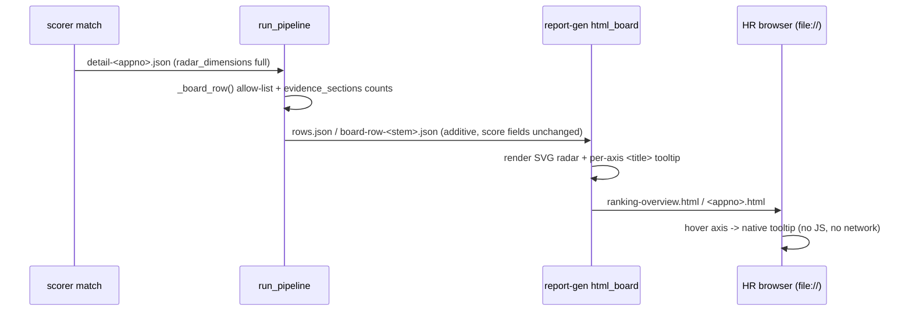

# Product Requirements Document (PRD)

**Feature Name:** Ranking HTML Radar Axis Trace-back (Option A)
**Version:** 1.3.0 (MVP)
**Status:** Draft
**Product Manager:** HR Product Team
**Target Users:** HR Recruiters, Hiring Managers, Recruiting Operations Leads

> Keep this visible header synchronized with the YAML frontmatter (machine-readable source of truth).

---

## Change Log

| Version | Date       | Author          | Change Summary |
| ------- | ---------- | --------------- | -------------- |
| 1.3.0   | 2026-09-03 | HR Product Team | Radar readability pass: F1.3 (full axis names + on-chart numeric scores) delivered, plus new F1.5 (tooltip cards auto-size, no inner scrollbar) and F1.6 (always-visible dimension breakdown beside the radar on `<appno>.html`). `REPORT_FINGERPRINT_VERSION` bumped `hr-report-v3` → `hr-report-v4`. F1.4 (zh-Hant) stays Deferred. |
| 1.2.0   | 2026-09-03 | HR Product Team | Documentation status sync: P0 F0.1-F0.7 and P1 F1.1-F1.2 marked Done; F1.3/F1.4 and the release-gating DoD items (manual board smoke, HR acceptance, Approved flip) recorded as not planned this cycle. |
| 1.1.0   | 2026-09-03 | HR Product Team | P1 implemented: styled pure-CSS tooltip cards (F1.1) and Option B evidence sub-metrics preview on Core/Experience tooltips (F1.2); per-axis native `<title>` replaced by CSS-revealed overlay panels; tests updated. |
| 1.0.0   | 2026-09-03 | HR Product Team | Initial draft: Option A (presentation-only radar trace-back). Option B (removing the `evidence_impact` scored dimension) is deferred and explicitly out of scope. |

---

## 1. Executive Summary

HR screening runs the offline pipeline and opens `ranking-overview.html`, which shows one radar chart per candidate. Today the radar shows only a polygon shape: there is no per-dimension numeric score on the page and no reason for the shape, so HR cannot explain to a hiring manager *why* a candidate scored a given dimension, and cannot see the trace-back behind a score. The matching detail JSON already contains per-dimension `reasoning`, `gaps`, and `evidence` provenance, but the pipeline strips it before the board is rendered.

Option A adds **per-axis hover/focus trace-back** to `ranking-overview.html` and each `<appno>.html` match page: hovering an axis reveals the full dimension label, score, status, a one-paragraph templated reasoning summary, the key gaps, and evidence provenance counts by CV section. It is a **presentation-layer change only**:

- The deterministic six-dimension scoring engine (`scorer match`) is untouched.
- `match_score`, `fit_band`, radar geometry, ranking order, per-candidate PDFs, and the Excel comparison are unchanged.
- No backend/API/database/frontend web module changes; no contract version bump for the matching engine.
- Option B (deleting `evidence_impact` as a scored dimension and folding it into other dimensions) is deliberately deferred until HR can evaluate real boards produced by Option A.

CRITICAL trust principle: the numbers shown on the radar and in tooltips must be exactly the deterministic engine scores. Tooltips must never contain raw CV text or personal data (`evidence[].text` is forbidden); only templated, allow-listed content may be rendered. The HTML must keep working when opened from `file://` with no network and no JavaScript.

### 1.1 Product Vision

Make every score visible on the report HR actually opens, not only in the per-candidate PDF, so an HR user can explain and audit a shortlist directly from the ranking page — with zero change to the scoring model they already trust.

### 1.2 Success Definition (MVP)

Option A is successful when, for any candidate scored by the `matching` engine, hovering (or keyboard-focusing) each active radar axis on `ranking-overview.html` and `<appno>.html` shows the score, status, reasoning summary, key gaps, and evidence provenance counts — while every visible score, band, rank, and radar geometry on the page is byte-identical (same inputs, same `report_date`) to the pre-change output.

### 1.3 User Personas

1. **HR Recruiter (primary)**

   - Context: screens CVs against a JD refno, reviews the ranking board, shortlists candidates.
   - Pain points: cannot explain a radar shape or a dimension score; has to open PDFs or guess from the shape.
   - Success criteria: hovers an axis and immediately reads the reason and the numeric score; no training needed.

2. **Hiring Manager / Auditor**

   - Context: wants justification for a shortlist decision.
   - Pain points: "why is this candidate #1" cannot be answered from the board alone.
   - Success criteria: per-dimension trace-back is readable on the same page and cites only JD requirements and CV-section provenance (never raw CV prose).

3. **Engineering (secondary)**

   - Context: owns the report-gen skill and the scoring engine contract.
   - Pain points: scoring-model changes alter rankings and invalidate saved reports.
   - Success criteria: Option A merges with no engine/contract change and full regression coverage.

### 1.4 Open Questions (Resolve Before Build)

- Tooltip rendering approach: native SVG `<title>` (P0 default, zero JS) vs styled pure-CSS tooltip cards (P1). Resolved: P0 ships native `<title>`; P1 adds CSS cards without JavaScript.
- Tooltip language: engine reasoning/gap templates are English. Resolved: v1 renders English templates verbatim; zh-Hant localization is P1/out of scope.
- Evidence provenance depth: show only section counts (`experience 2 · projects 1`) rather than individual source lines. Resolved: counts only in P0.
- Whether to preview Option B inside tooltips (surface `evidence_impact` sub-metrics on Core/Experience axes). Resolved: P1 decision aid, not P0.

> Open questions must be resolved before build lock; cross-check with Section 12.7 review decisions.

---

## 2. MVP Scope (P0 + P1)

### 2.1 P0 - Core Requirements (Launch Blockers)

| ID   | Feature | Description | Status |
| ---- | ------- | ----------- | ------ |
| F0.1 | Additive tooltip payload in board rows | Pipeline `_board_row()` attaches allow-listed per-dimension fields (`status`, `confidence`, `summary`, `gaps`, `requirements`, `evidence_sections`) to each existing `radar_dimensions` item, keeping `id`/`label`/`score` and all other row fields byte-compatible. | Done |
| F0.2 | Hover/focus tooltip on ranking board radar | `ranking-overview.html` renders, for every active radar axis, a hover/focus styled tooltip card containing: full label, `Score: X/100`, `Status`, reasoning summary (<=240 chars), up to 3 gap texts (+N overflow), and evidence-section counts. | Done |
| F0.3 | Tooltip on candidate match pages | `<appno>.html` match pages (shared card renderer) expose the same per-axis tooltip. | Done |
| F0.4 | Zero-JS / offline-safe rendering | The board remains a standalone HTML file with no inline JavaScript and no external `http(s)` assets; it must work from `file://`. | Done |
| F0.5 | Privacy allow-list and escaping | Tooltip text is restricted to templated fields; `evidence[].text` (raw CV text) is never rendered; all rendered text is HTML-escaped. | Done |
| F0.6 | Scoring-invariance guard | Regression test proves `total_score`, `tier`, rank order, and radar geometry (score list) are unchanged by this feature for the same inputs. | Done |
| F0.7 | Fingerprint regeneration | `REPORT_FINGERPRINT_VERSION` is bumped so existing worktrees regenerate HTML instead of reusing stale boards. | Done |

### 2.2 P1 - Important Enhancements

| ID   | Feature | Description | Status |
| ---- | ------- | ----------- | ------ |
| F1.1 | Styled tooltip cards | Replace native `<title>` with pure-CSS tooltip cards (status color, readable wrapping) while keeping zero-JS. | Done |
| F1.2 | Option B preview aid | Surface `evidence_impact` sub-metrics (coverage/ownership/impact) inside Core Skill / Experience tooltips as a non-scoring preview of Option B. | Done |
| F1.3 | Full axis names + on-chart scores | Drop abbreviated axis names: render the full dimension label, wrapped over up to three lines, and print each axis score to one decimal place on the chart for at-a-glance reading. | Done |
| F1.4 | zh-Hant localization | Localize templated reasoning/gap copy and board chrome to Traditional Chinese. | Deferred |
| F1.5 | Auto-height tooltip cards | Hover tooltip cards grow to fit their content instead of scrolling internally (`max-height: none; overflow: visible`). | Done |
| F1.6 | Always-visible match-page breakdown | On `<appno>.html`, render the per-dimension explanation beside the radar in a two-column layout with no hover required; hovering an axis cross-highlights its card. | Done |

> F1.4 (zh-Hant) remains explicitly deferred (confirmed 2026-09-03). F1.3 / F1.5 / F1.6 shipped 2026-09-03.

### 2.3 Module Priority Summary

| Module   | Name | Priority | Rationale |
| -------- | ---- | -------- | --------- |
| Module 1 | `html_board.py` renderer | P0 | Owns radar DOM and tooltips (F0.2-F0.5). |
| Module 2 | `run_pipeline.py` row assembly | P0 | Owns the additive board-row payload (F0.1). |
| Module 3 | `report_fingerprint.py` | P0 | Regeneration gate (F0.7). |
| Module 4 | `test_reporter.py` | P0 | Regression + privacy + invariance gates (F0.5-F0.7). |

### 2.4 Acceptance Criteria by Module

Write each AC as an assertable statement; Gherkin is used for the critical path.

#### Module 1: `html_board.py` renderer

- **AC1.1** Given a board row whose `radar_dimensions` items carry allow-listed fields, When the board HTML is rendered, Then every active axis (`score` is not null) has a hover/focus target wired to a styled tooltip card whose content includes the full label, score `/100`, the status, and the reasoning summary (when present), and the page contains no `evidence[].text` value.
- **AC1.2** Given a tooltip field containing HTML metacharacters (`<`, `>`, `&`, `"`), When rendered, Then the characters appear escaped (`&lt;`, `&gt;`, `&amp;`, `&quot;`) and no raw tag is injected.
- **AC1.3** Given a radar axis with no extra tooltip fields (legacy row), When rendered, Then the radar renders exactly as today with no tooltip and no error.
- **AC1.4** Given a candidate card, When the HTML is inspected, Then it contains no `<script>` element and no external `http://`/`https://` asset reference introduced by this feature.
- **AC1.5** Given a candidate card in a browser with `:has()` support, When hovering or focusing an axis, Then its styled tooltip card becomes visible (functional check in an evergreen browser; DOM check in CI).

#### Module 2: `run_pipeline.py` row assembly

- **AC2.1** Given a matching-engine row with a `_detail` JSON, When `_board_row()` runs, Then each `radar_dimensions` item gains exactly the allow-listed additive keys and keeps `id`/`label`/`score`; no other row field changes value.
- **AC2.2** Given a matching detail item, When its `evidence` list contains N records across sections, Then `evidence_sections` is `{"experience": a, "projects": b, ...}` counting by `section` only.
- **AC2.3** Given a row without `_detail` (legacy scoring engine), When `_board_row()` runs, Then output is unchanged from today (no `radar_dimensions` enrichment, no crash).
- **AC2.4** Given a `_detail` file that is missing or malformed, When `_board_row()` runs, Then it degrades to today's public row without raising.

#### Module 3: `report_fingerprint.py`

- **AC3.1** Given a previously fingerprinted worktree with unchanged inputs, When the new report-gen code runs, Then `REPORT_FINGERPRINT_VERSION` differs from the previous value so `ranking-overview.html` and `<appno>.html` regenerate.

#### Module 4: `test_reporter.py` (and friends)

- **AC4.1** Given the fixture row set, When the board is generated before and after this feature with the same `report_date`, Then every visible score/band/rank string and the radar score list are identical (score-invariance golden).
- **AC4.2** Given the fixture row set with raw `evidence[].text` and name-like strings injected, When the board is generated, Then the raw text and name-like strings do not appear in the output (PII gate).
- **AC4.3** Given a row with `gaps` longer than 3 and `summary` longer than 240 characters, When rendered, Then at most 3 gaps appear with a `+N more` overflow marker and the summary is truncated to 240 characters.
- **AC4.4** Given the existing html-board tests, When the suite runs, Then all legacy cases (no names, all-low advisory, resume links, explicit labels) still pass unchanged.

### 2.5 Related Code / Entry Points

| Req ID | Area | Existing File(s) / Entry Point | Notes |
| ------ | ---- | ------------------------------ | ----- |
| F0.1 | Pipeline row assembly | `.codex/skills/pipeline/scripts/run_pipeline.py` → `_board_row()` | Enrich `radar_dimensions` items (allow-list). |
| F0.1 | Board-row schema source | `detail-<appno>.json` written by `.codex/skills/scorer/scripts/run_score.py match` | Read-only source of `radar_dimensions`. |
| F0.2, F0.3, F0.4, F0.5 | HTML renderer | `.codex/skills/report-gen/src/report_gen/html_board.py` → `_axes()`, `_radar_svg()`, `_card()` | Render per-axis hover/focus tooltip cards; keep zero-JS. |
| F1.3 | Radar geometry / labels | `.codex/skills/report-gen/src/report_gen/html_board.py` → `_wrap_label()`, `_radar_svg()` | Full axis names wrapped over `_LABEL_MAX_LINES` tspans; per-axis `.axis-score` text; viewBox padded on all four sides (`_RADAR_PAD_X` / `_RADAR_PAD_Y`). |
| F1.5 | Tooltip card sizing | `.codex/skills/report-gen/src/report_gen/html_board.py` → `_PAGE_CSS_BASE` | `.radar-tip` uses `height: auto; max-height: none; overflow: visible`; `.card:hover, .card:focus-within { z-index: 5 }` keeps the card above its grid siblings. |
| F1.6 | Match-page layout | `.codex/skills/report-gen/src/report_gen/html_board.py` → `_dimension_card()`, `_dimension_panel()`, `_card(layout="detail")`, `write_candidate_match_html()`, `_DIM_HIGHLIGHT_RULES` | Two-column `.match-layout` (radar + `.dim-list`); always-visible `.dim-card` per active axis; axis hover cross-highlights its card. |
| F0.2 | Board service seam | `.codex/skills/report-gen/src/report_gen/reporter.py` → `ReporterService.generate_screening_board_html()` / `generate_candidate_match_html()` | Delegates to `html_board`; unchanged unless needed. |
| F0.2 | Skill entry | `.codex/skills/report-gen/src/report_gen/skill.py` → `generate_screening_board_skill()`, `generate_candidate_match_html_skill()` | Unchanged. |
| F0.7 | Fingerprint | `.codex/skills/_shared/src/screening_core/report_fingerprint.py` → `REPORT_FINGERPRINT_VERSION` | Bump to `hr-report-v3`. |
| F0.5-F0.7, AC4.x | Tests | `backend/tests/unit/test_reporter.py` | Add tooltip/privacy/invariance cases; keep legacy cases. |

### 2.6 Requirements Traceability Matrix (RTM)

| Req ID | Acceptance Criteria | Test Case ID | KPI / Validation | Module / File |
| ------ | ------------------- | ------------ | ---------------- | ------------- |
| F0.1 | AC2.1-AC2.4 | T-F0.1-001 | Payload conformance (schema) | `run_pipeline.py::_board_row` |
| F0.2 | AC1.1, AC1.5 | T-F0.2-001 | Tooltip coverage >=95% of active axes | `html_board.py::_card` |
| F0.3 | AC1.1 (match page) | T-F0.3-001 | Tooltip present on `<appno>.html` | `html_board.py::write_candidate_match_html` |
| F0.4 | AC1.4 | T-F0.4-001 | Zero external `http(s)`/`<script>` in HTML | `html_board.py` output |
| F0.5 | AC1.2, AC4.2 | T-F0.5-001 | 0 PII / 0 raw-evidence hits in HTML | `html_board.py` output |
| F0.6 | AC4.1 | T-F0.6-001 | Score/rank/geometry parity 100% | `test_reporter.py` golden |
| F0.7 | AC3.1 | T-F0.7-001 | Version changed; HTML regenerated | `report_fingerprint.py` |

---

## 3. Out of Scope

- **Option B** — removing `evidence_impact` as a scored dimension, folding it into other dimensions, re-weighting, or any scoring-model change. Deliberately deferred until HR evaluates boards produced by Option A.
- Any change to `scorer match`, `config_builder`, `contracts.py`, matching schema/algorithm versions, backend API, or database.
- Any change to per-candidate PDFs or the Excel comparison report (PDFs already render dimension details).
- Any change to the web candidate-match modal (`frontend/`, `backend/app/services/matching_service.py`).
- Adding, renaming, reordering, or recoloring radar axes.
- Displaying raw CV text (`evidence[].text`), names, emails, phones, schools, companies, or salaries anywhere in HTML.
- Localization (zh-Hant) of engine templates or board chrome (P1 candidate).
- Touch/pen-pinning or custom tooltip chrome beyond a native tooltip (P1 candidate).

---

## 4. Technical Workflow

### 4.1 System / Data Flow

1. `scorer match` writes `detail-<appno>.json` per candidate with `radar_dimensions` (six dimensions; each item carries `label`, `score`, `status`, `confidence`, `reasoning.summary`, `gaps[]`, `requirements[]`, `evidence[]`).
2. `run_pipeline.py::_match_candidate()` builds the internal row; `_board_row()` converts it to the public row and, when `_detail` exists, enriches each `radar_dimensions` item with the F0.1 allow-listed fields.
3. Pipeline writes `rows.json` (board) and `board-row-<stem>.json` (per candidate) to the work directory.
4. `run_report.py board` / `match-html` call `html_board.write_screening_board()` / `write_candidate_match_html()`. The board renders the radar plus hidden per-axis tooltip cards (`layout="board"`); the match page renders the radar beside an always-visible dimension breakdown (`layout="detail"`).
5. HR opens `Desktop/workbuddy-cv-screen/<refno>/ranking-overview.html` (or `<appno>.html`) from `file://`; on the board, hovering an axis reveals its styled tooltip card; on a match page the same explanation is already on screen next to the radar.



### 4.2 User Flow

1. HR opens `ranking-overview.html`.
2. HR hovers (or keyboard-focuses) a radar axis of any candidate card.
3. A native tooltip shows: full dimension label, `Score: X/100`, status, one-paragraph reasoning summary, up to 3 key gaps (+N), and evidence provenance counts (`experience 2 · projects 1`).
4. HR repeats for any axis/candidate; nothing else on the page changes.

### 4.3 Failure and Fallback Flow

- Legacy rows without `radar_dimensions` or without additive fields: radar renders as today, no tooltip, no error (`AC1.3`, `AC2.3`).
- Missing/malformed `_detail` JSON: `_board_row()` returns today's public row without raising (`AC2.4`).
- Tooltip field longer than limits: truncate summary to 240 chars; cap gaps at 3 with `+N more`; drop empty sections (`AC4.3`).
- Unsupported browser/touch with no hover: scores remain visible in the PDF/Excel; native tooltips degrade to nothing, never a broken page.

### 4.4 Config / Environment / External Dependencies

| Item | Value / Rule |
| ---- | ------------ |
| Env vars | None new. |
| Feature flags | None; P1 items gated by their own PRD decision. |
| Network | None; HTML must load from `file://` with no external `http(s)` assets. |
| JS | None allowed in the HTML (repo red line for HR reports). |
| Fingerprint | `REPORT_FINGERPRINT_VERSION` in `report_fingerprint.py` bumps `hr-report-v2` → `hr-report-v3` (F0.7). |
| External services | None. |
| Data source | `detail-<appno>.json` (read-only), produced by `scorer match`. |

---

## 5. Output Contract / Fixed JSON Schema

### 5.1 API Contract Summary

This feature has no network API. The contract is the **local board-row JSON** consumed by report-gen subcommands (`board`, `match-html`).

| Endpoint / CLI | Method | Auth | Success | Error Codes | Idempotent | Rate Limit |
| -------------- | ------ | ---- | ------- | ----------- | ---------- | ---------- |
| `run_report.py board --rows rows.json` | local CLI | none | `status: success` | non-zero exit + JSON error on stderr | yes (same inputs -> same file) | n/a |
| `run_report.py match-html --row board-row-*.json` | local CLI | none | `status: success` | non-zero exit + JSON error on stderr | yes | n/a |
| `run_pipeline.py` `_board_row()` | in-process | none | public row dict | no raise; degrade to legacy row | yes | n/a |

### 5.2 Board-Row JSON Schema (additive to `radar_dimensions`)

`radar_dimensions` items gain optional fields. All pre-existing keys and values are unchanged (additive-only within this contract). `schema_version` marks the enrichment generation.

```json
{
  "schema_version": "board-row/tooltip-v1",
  "radar_dimensions": [
    {
      "id": "evidence_impact",
      "label": "Evidence and Impact",
      "score": 72.5,
      "status": "partial",
      "confidence": 90.0,
      "summary": "Evidence and Impact: 72.5/100. Evidence-linked skill coverage is 67%; ownership evidence is 100%; quantified impact evidence is 50%.",
      "gaps": [
        "Some skill claims are not tied to structured experience, project, or certification evidence.",
        "No quantified impact was found in relevant experience."
      ],
      "requirements": ["Structured evidence quality"],
      "evidence_sections": { "experience": 2, "projects": 1 }
    }
  ]
}
```

Field rules (allow-list; see `engine.py` `_dimension()` for source semantics):

| Field | Type | Source | Nullability / Limits |
| ----- | ---- | ------ | -------------------- |
| `id` / `label` / `score` | string / string / number|null | existing | `score: null` for inactive dimensions (axis not drawn). |
| `status` | string | existing | `met` / `partial` / `not_met` / `unknown` / `not_applicable`. |
| `confidence` | number | existing | omit when null. |
| `summary` | string | `reasoning.summary` (templated) | <=240 chars; omit when empty. |
| `gaps` | string[] | `gaps[].text` (templated) | max 3 + `+N more` overflow; omit when empty. |
| `requirements` | string[] | `requirements[].text` (JD-side) | max 3; omit when empty. |
| `evidence_sections` | object | counts of `evidence[].section` | omit when no evidence. Raw `evidence[].text` NEVER included. |

**Backward-compatibility policy:** additive-only within this board-row contract; older readers that ignore unknown keys keep working, and older rows without the new keys render without tooltips. Breaking changes require a new `schema_version` and a migration note.

### 5.3 HTML DOM Contract

- Each active radar axis must be wrapped in a hoverable/focusable group (`data-axis`) wired through pure CSS (`:has`) to a hidden styled tooltip card (`data-tip`) whose content follows Section 5.2 (allow-list, escaped, truncated). Tooltip content stays in the DOM for deterministic tests; each axis group carries an `aria-label`.
- Axis labels must be the **full** dimension name, split into `<tspan>` lines rather than abbreviated or truncated (F1.3). Abbreviations such as "Core skills" or "Job-specific" must not appear in the output.
- Each axis renders its score to one decimal place in a `.axis-score` text node, and the viewBox must be padded on all four sides so no wrapped label clips outside the canvas (F1.3). The same one-decimal precision applies to `.tip-score` and `.dim-score`, so a dimension never shows two different numbers on one page.
- Tooltip cards must not constrain their own height: no `max-height` clipping and no `overflow: auto` scrollbar (F1.5).
- `<appno>.html` must render a `.match-layout` grid containing the radar and a `.dim-list` of always-visible `.dim-card[data-dim]` entries — one per active axis — instead of a `.radar-tips` hover overlay (F1.6).
- The page must not contain `<script>` or new external `http(s)` references introduced by this feature.
- No raw CV text (anything under `evidence[].text`) may appear anywhere in the HTML.

---

## 6. Non-Functional Requirements

| Requirement | Target | Measured By |
| ----------- | ------ | ----------- |
| Determinism / reproducibility | Same inputs + same `report_date` -> identical visible scores/ranks and radar geometry | T-F0.6-001 golden |
| Traceability | Each tooltip cites label, score, status, templated reason, gaps, section counts | T-F0.2-001 |
| Privacy / security | 0 raw-CV-text or PII strings in generated HTML; all text escaped | T-F0.5-001 + CI scan |
| Compatibility | Renders on evergreen browsers from `file://`; no JS, no network | T-F0.4-001 |
| Performance | Tooltip payload adds < 2 KB per candidate to `rows.json`; generation time increase < 5% | CI assertion on fixture |
| Accessibility | Tooltips reachable by mouse hover and keyboard focus (`:has` + `:focus-visible` wiring); every axis group carries an `aria-label` | Manual check + DOM assertion |
| Testability | Legacy html-board tests unchanged and passing | pytest suite |

---

## 7. Risks and Mitigations

| Risk | Impact | Mitigation |
| ---- | ------ | ---------- |
| PII/raw CV leak through new tooltip fields | High (compliance red line) | Strict allow-list in `_board_row()`; `evidence[].text` excluded by construction; T-F0.5-001 scans output for injected raw text and name-like strings. |
| Stale HTML reused after deploy (fingerprint) | Medium (HR sees old board) | Bump `REPORT_FINGERPRINT_VERSION` (F0.7, AC3.1); board and match pages regenerate in existing worktrees. |
| Score/ranking drift from a "visual only" change | High (trust) | `html_board` never recomputes scores; T-F0.6-001 golden asserts parity; tooltip values come from the detail JSON, not the DOM. |
| Tooltip content too long / clips or bloats HTML | Low | Truncation limits (240-char summary, 3 gaps, section counts only) enforced by AC4.3. |
| Styled cards depend on CSS `:has()` (evergreen browsers) | Medium | F1.1 shipped pure-CSS cards; each axis keeps an `aria-label`; PDF/Excel remain the fallback for full detail; touch pin stays future work. |
| Malformed/missing `_detail` breaks board generation | Medium | `_board_row()` degrades to today's public row without raising (AC2.4, AC1.3). |
| Legacy golden tests drift | Low | Keep legacy test assertions; add new tests without rewriting legacy expectations (AC4.4). |

---

## 8. Boundary / Separation Requirements

| Boundary | Owner | Must Not |
| -------- | ----- | -------- |
| Scoring engine (`scorer`, `contracts.py`, `config_builder.py`) | Candidate-matching module | Change scores, weights, dimensions, or contracts in this PRD. |
| Pipeline row assembly (`run_pipeline.py`) | Pipeline module | Emit non-allow-listed fields; alter existing row values. |
| HTML rendering (`html_board.py`, `reporter.py`) | Report-gen module | Add JS, external assets, raw CV text, or recompute scores. |
| Fingerprints (`report_fingerprint.py`) | Shared module | Skip the version bump or change input fingerprints. |
| Web candidate-match UI / backend API / DB | Existing owners | Be touched by this PRD. |
| Per-candidate PDF/Excel | Report-gen module | Be modified by this PRD (already carry dimension details). |

---

## 9. Success Metrics (KPIs)

| Metric | Target | Measured By |
| ------ | ------ | ----------- |
| Tooltip coverage on active axes | >=95% of active-axis instances across fixture set contain summary + score | T-F0.2-001 DOM assertion |
| Score/rank/geometry parity | 100% identical vs pre-change golden (same inputs) | T-F0.6-001 |
| PII/raw-text hits in generated HTML | 0 | T-F0.5-001 CI scan |
| External assets / JS in HTML | 0 new references | T-F0.4-001 |
| Legacy html-board tests | 100% pass unchanged | pytest |
| HR sample acceptance | 1 HR user confirms tooltips explain scores on a real refno board (manual, within 2 weeks of release) | Manual review checklist |

---

## 10. Future Considerations (Post-MVP)

- Option B evaluation: use real Option A boards (including F1.2 preview) to decide whether `evidence_impact` should become a non-scored reasoning layer.
- Styled CSS tooltip cards with status colors and tap-to-pin for touch devices.
- zh-Hant localization of tooltip copy and board chrome.
- On-axis numeric labels for at-a-glance reading.
- Optional JSON export of per-dimension reasoning for audit trails outside HTML.

---

## 11. PRD Owner Sign-off

### 11.1 Definition of Done (DoD)

- [x] PRD sections 1-11 complete; Section 12 present; frontmatter/header in sync.
- [x] F0.1-F0.7 implemented and merged.
- [x] All ACs (Module 1-4) pass as automated tests; legacy html-board tests unchanged.
- [x] T-F0.5-001 PII/raw-text scan passes; T-F0.6-001 score-parity golden passes.
- [ ] Manual smoke: generate a real refno board and confirm hover tooltips work from `file://` — waived (not planned this cycle).
- [ ] PRD change log updated to mark 1.0.0 status `Approved` at release — deferred; status stays Draft.
- [x] P1 F1.1 (styled pure-CSS tooltip cards) and F1.2 (Option B evidence preview) delivered and covered by tests.
- [x] P1 F1.3 (full axis names + on-chart scores), F1.5 (auto-height tooltip cards) and F1.6 (always-visible match-page breakdown) delivered and covered by tests.
- [x] `REPORT_FINGERPRINT_VERSION` bumped to `hr-report-v4` so existing worktrees regenerate instead of reusing stale boards.
- [ ] Manual smoke of the regenerated 260901004 preview board and one match page from `file://` — pending HR review.

### 11.2 Sign-off Lines

**PRD Owner (HR Product Team):** __________________________________  Date: __________

**Engineering Lead:** ______________________________________________  Date: __________

**Data-AI Lead:** __________________________________________________  Date: __________

---

## 12. Engineering Review Edition (Same-Spec Review Layer)

### 12.1 Implementation Phases

| Phase | Scope | Deliverable |
| ----- | ----- | ----------- |
| P0-1 | `_board_row()` allow-list enrichment + `evidence_sections` counting | `run_pipeline.py` change + unit test |
| P0-2 | `html_board.py` per-axis tooltip rendering (native `<title>`, escaped, truncated, legacy fallback) | `html_board.py` change + unit tests |
| P0-3 | `REPORT_FINGERPRINT_VERSION` bump to `hr-report-v3` | `report_fingerprint.py` change + assertion |
| P0-4 | Score-parity golden + PII scan + full regression run | `test_reporter.py` additions |

### 12.2 Public / Internal API Surface

- Internal only: `run_pipeline.py::_board_row()` return shape (additive `radar_dimensions`), `html_board.py::_card()` DOM.
- No public HTTP API, no schema/algorithm version change for matching.

### 12.3 Test Gates

| Gate | Command | Requirement |
| ---- | ------- | ----------- |
| Unit | `pytest backend/tests/unit/test_reporter.py` | All pass |
| Privacy | `pytest` T-F0.5-001 | 0 raw/PII hits |
| Parity | `pytest` T-F0.6-001 | 100% parity |

### 12.4 Release Readiness

- Manual smoke on one real refno board from `Desktop/workbuddy-cv-screen/<refno>/`.
- Confirm `ranking-overview.html` and `<appno>.html` regenerate (fingerprint bump) in an existing worktree.

### 12.5 Observability Runbook

- No new runtime services. Debugging aid: inspect `rows.json`/`board-row-*.json` in the work directory; tooltip absence = row has no `_detail` or radar item has no allow-listed fields.

### 12.6 Open Review Decisions

- (From Section 1.4) P0 shipped native `<title>`; P1 (F1.1) replaced it with pure-CSS (`:has`) styled cards. Browsers without `:has()` see no card but `aria-label` keeps axis info accessible.
- Board-row `schema_version` value: `board-row/tooltip-v1`.
- Gap cap 3 and summary cap 240 characters confirmed for v1.

---

## Glossary

| Term | Definition |
| ---- | ---------- |
| `evidence_impact` | Scored dimension "Evidence and Impact"; radar short label "Evidence". P0 keeps it; Option B would remove it as a scored dimension. |
| radar axis / dimension | One of the six engine dimensions; drawn as a spoke of the radar polygon. |
| active dimension | Dimension with a non-null `score`; drawn on the radar. Inactive dimensions are skipped. |
| allow-listed fields | Fields safe to render in HTML: label, score, status, confidence, `reasoning.summary`, `gaps[].text`, `requirements[].text`, `evidence[].section` counts. |
| raw CV text | `evidence[].text` / free-form CV descriptions; forbidden in HTML. |
| trace-back | Per-score explanation: score + status + templated reason + gaps + CV-section provenance. |
| `REPORT_FINGERPRINT_VERSION` | Version string in `report_fingerprint.py` that invalidates cached HTML/PDF reuse. |
| Option B | Deferred design to remove the `evidence_impact` scored dimension and fold its sub-metrics into other dimensions' reasoning. |
| full axis name | The complete dimension label (e.g. "Education and Certification"); wrapped over up to three `<tspan>` lines rather than abbreviated. |
| `.match-layout` | Two-column grid used on `<appno>.html`: radar on the left, per-dimension breakdown on the right. |
| `.dim-card` | One always-visible explanation card per active axis on a match page; its left border is colour-coded by status. |
| `layout="detail"` | `_card()` rendering mode that replaces the hover tooltip overlay with the always-visible breakdown. |
