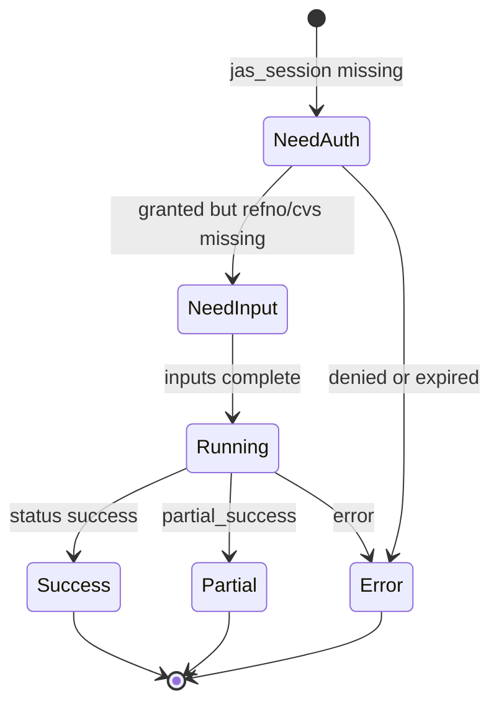

# Product Requirements Document (PRD)

**Feature Name:** WorkBuddy Host Tool Return JSON Whitelist
**Version:** 1.1.0 (MVP)
**Status:** Draft
**Product Manager:** HR Screening Product Owner
**Target Users:** WorkBuddy host integrators; non-technical HR using chat to screen a JAS `refno`

> Keep the header above in sync with the YAML frontmatter (machine-readable source of truth).

---

## Change Log

| Version | Date       | Author                     | Change Summary                                                                 |
| ------- | ---------- | -------------------------- | ------------------------------------------------------------------------------ |
| 1.0.0   | 2026-08-27 | HR Screening Product Owner | Initial host-visible tool envelope: field whitelist, denylist, ask/auth codes. |
| 1.1.0   | 2026-08-27 | Engineering                | `host-envelope` projector CLI; pipeline identity is `refno`/`appno`/`display_label`. |

---

## 1. Executive Summary

WorkBuddy is the HR conversation host. This repository is the deterministic screening engine. HR says “screen refno XXX”; the host may ask follow-up questions and request JAS session access. **CV text, JD text, candidate identity, cookies, and report file contents must never enter the host LLM context.**

This PRD defines the **only JSON** a WorkBuddy tool may return into the model context (`host_visible`). Everything else stays on disk (`disk_only`). Skill CLI stdout today is **not** host-safe (pipeline manifests still include `name` and file paths that may contain usernames). The host (or a thin projection layer) must map skill output onto this whitelist before any model turn.

Trust statement: same inputs yield the same scores in this repo; the host LLM may only **explain** whitelist fields and **open** report paths in the UI. It must not re-score, re-rank, or ingest artifacts.

### 1.1 Product Vision

One host-safe envelope for every screening tool, so PIPL/GDPR minimization is enforceable in code: allowlisted keys only, `additionalProperties: false`, string fields length-capped and pattern-checked.

### 1.2 Success Definition (MVP)

Given a tool call (`request_jas_access`, `screen_refno`, `get_run_status`), the object merged into the host LLM context validates against `docs/workbuddy/host-tool-return.schema.json`, contains no denylisted keys or payload kinds, and is sufficient for the host to (a) ask an allowlisted follow-up, (b) tell HR the run finished, and (c) point the UI at PDF/Excel paths without reading those files into the model.

### 1.3 User Personas

1. **HR Recruiter (non-technical)**

   - Context: already logged into JAS in the browser; talks to WorkBuddy.
   - Pain points: must not paste CVs or cookies into chat.
   - Success criteria: “筛 refno X” plus a system permission prompt is enough.

2. **WorkBuddy Host Integrator**
   - Context: wires tools to skill CLIs / local runtime.
   - Pain points: skill stdout is richer than what the model may see.
   - Success criteria: one projector; failed validation drops the tool result and returns `error_code` only.

### 1.4 Open Questions (Resolve Before Build)

- **Resolved:** WorkBuddy UI opens reports by `run_id` (`open_in_panel`); the host LLM receives booleans, not filesystem paths.
- **Resolved:** `post_title` stays on the whitelist (job metadata, not candidate identity).
- **Resolved:** this repository owns the projector (`host-envelope` CLI). WorkBuddy must not attach raw skill stdout to the model.

---

## 2. MVP Scope (P0 + P1)

### 2.1 P0 - Core Requirements (Launch Blockers)

| ID   | Feature                       | Description                                                                                             | Status      |
| ---- | ----------------------------- | ------------------------------------------------------------------------------------------------------- | ----------- |
| F0.1 | Single host-visible envelope  | Every tool returns the schema in Section 5; unknown keys stripped; `additionalProperties` false.        | Done        |
| F0.2 | Field whitelist               | Only keys in Section 5.2 may reach the host LLM.                                                        | Done        |
| F0.3 | Payload denylist              | Section 5.4 kinds never appear in model context (HTML, PDF bytes, JD/CV text, cookies, extracted JSON). | Done        |
| F0.4 | Ask / auth enums              | Follow-ups limited to `ask.missing` codes; JAS access is `auth.jas_session`, never cookie values.       | Done        |
| F0.5 | Candidate identity projection | Host rows keyed by `(refno, appno)` only; never `name` / first-letter masks / email / phone / HKID.     | Done        |
| F0.6 | Do not ingest artifacts       | Host UI may open `reports.*` paths; the model must not `Read` those files.                              | Done        |
| F0.7 | Error sanitization            | `error_code` enum + short `error_message` (no paths, emails, HTML, stack traces).                       | Done        |

### 2.2 P1 - Important Enhancements

| ID   | Feature               | Description                                                                   | Status      |
| ---- | --------------------- | ----------------------------------------------------------------------------- | ----------- |
| F1.1 | `host-envelope` CLI   | This repo prints the whitelist JSON so WorkBuddy never sees raw skill stdout. | Done        |
| F1.2 | Strength token labels | Optional canonical skill tokens (taxonomy IDs), no free-text CV excerpts.     | Not Started |
| F1.3 | Schema unit tests     | Reject fixtures that include `name`, `jd_text`, `Set-Cookie`, base64.         | Done        |

### 2.3 Acceptance Criteria

- **AC0.1** Given pipeline stdout containing `"name": "Alice"`, When projected, Then the host envelope has no `name` key and the candidate id is `appno`.
- **AC0.2** Given a JAS HTML body or CV bytes in a tool result, When validated, Then the result is rejected and the model receives `{ "status": "error", "error_code": "envelope_rejected" }` only.
- **AC0.3** Given `ask.missing` containing a value outside the enum, When normalized, Then that value is dropped; if none remain, `missing` is `["input"]`.
- **AC0.4** Given HR grants JAS access, When `request_jas_access` returns, Then `auth.jas_session` is `granted` and no cookie name/value/`cookie_file` path is present.
- **AC0.5** Given a successful screen, When the host explains results, Then it uses only `ranking[]` numeric/enum fields plus report **paths as opaque handles**, not file contents.

### 2.4 Related Code / Entry Points

| Concern             | Current code                                         | Host rule                                      |
| ------------------- | ---------------------------------------------------- | ---------------------------------------------- |
| Input path/URL only | `screening_core/input_policy.py`                     | Host tools pass `refno` / paths, never inline. |
| Live JAS fetch      | `jas_import/fetch.py`, `run_jas_screening.py`        | Cookies stay in a local jar; not in JSON.      |
| Pipeline stdout     | `run_pipeline.py` manifest (`refno`, `appno`, `display_label`, `source`, paths) | **Project through `host-envelope`** before LLM. |
| Host projection     | `.codex/skills/host-envelope`                                                   | Only `HostToolReturn` may enter the host model. |
| Agent envelope      | `run_agent.py` `_final_payload` (nested `result`)    | Nested skill JSON is `disk_only`.              |
| Planner ask keys    | `planner.py` `ALLOWED_MISSING`                       | Align with Section 5.2 `ask.missing`.          |

### 2.5 Requirements Traceability Matrix (RTM)

| Req  | AC    | Validation                      | Module                         |
| ---- | ----- | ------------------------------- | ------------------------------ |
| F0.1 | AC0.2 | JSON Schema draft 2020-12       | `host-tool-return.schema.json` |
| F0.5 | AC0.1 | No identity keys in envelope    | Projector                      |
| F0.4 | AC0.3 | Enum for `ask.missing`          | Projector + host               |
| F0.6 | AC0.5 | Host policy: no Read of reports | WorkBuddy runtime              |

---

## 3. Out of Scope

- Changing the JAS website.
- Feeding CV/JD to the host LLM with “temporary” redaction in the prompt.
- Letting the host LLM call `cv-parser` / `jd-parser` stdout directly.
- Legal sign-off that the product is PIPL/GDPR compliant (engineering contract only).
- Skill-internal extraction LLM (glm-4v) policy — that is a separate processor boundary.

---

## 4. Technical Workflow

1. HR: “筛 refno 260818001”.
2. Host LLM may call `request_jas_access` if `auth.jas_session != granted`.
3. Runtime shows a **system** permission UI; cookie jar is written locally; tool returns whitelist JSON only.
4. Host calls `screen_refno` with `{ "refno": "260818001" }` (optional `scope`).
5. Runtime runs `run_jas_screening.py --records-url ... --cookie-file <local>` (cookie path never copied into model args history if the host logs tool arguments — log `cookie_file_present: true` instead).
6. Runtime writes full artifacts under `output_dir`; **projects** stdout to `HostToolReturn`.
7. Host LLM sees `HostToolReturn` only; UI opens `reports.comparison_xlsx` / `reports.directory`.
8. On `need_input`, host asks HR using `ask.questions` (already sanitized, enum-backed `missing`).

```mermaid
sequenceDiagram
    participant HR as HR
    participant LLM as Host LLM
    participant RT as WorkBuddy runtime
    participant SK as Skills this repo

    HR->>LLM: Screen refno X
    LLM->>RT: request_jas_access
    RT->>HR: OS/browser permission prompt
    RT-->>LLM: HostToolReturn auth only
    LLM->>RT: screen_refno
    RT->>SK: live fetch plus pipeline
    SK-->>RT: full stdout plus files on disk
    RT-->>LLM: HostToolReturn whitelist
    LLM->>HR: Explain ranking by appno; open reports in UI
```



### 4.1 Config / Environment / External Dependencies

- JAS allowlisted host: `jobs.polyu.edu.hk` (input policy).
- Local Netscape cookie jar; mode `0600`; never committed.
- WorkBuddy must not send tool **arguments** that contain cookie values; arguments whitelist: `refno`, `scope`, `run_id`, `engine`.

---

## 5. Output Contract / Fixed JSON Schema

Canonical machine schema: [`docs/workbuddy/host-tool-return.schema.json`](host-tool-return.schema.json).

`schema_version` for this envelope: `1.0.0`.

### 5.1 Tools and what they may return

| Tool                 | Purpose                                                       | Typical `status`                                       |
| -------------------- | ------------------------------------------------------------- | ------------------------------------------------------ |
| `request_jas_access` | Ask runtime for JAS session; never scrape HTML into the model | `need_input` or `success` (auth only)                  |
| `screen_refno`       | Fetch + parse + score + reports                               | `success` / `partial_success` / `need_input` / `error` |
| `get_run_status`     | Poll `run_id`                                                 | same                                                   |

The host LLM **must not** be given a tool that returns raw HTML, PDF, or skill stdout.

### 5.2 Field whitelist (host LLM)

Top-level keys only. Nested objects may only use keys listed under them.

| Key                | Type            | Allowed values / notes                                                                      |
| ------------------ | --------------- | ------------------------------------------------------------------------------------------- |
| `schema_version`   | string          | `"1.0.0"`                                                                                   |
| `tool`             | string          | `request_jas_access` \| `screen_refno` \| `get_run_status`                                  |
| `status`           | string          | `success` \| `partial_success` \| `need_input` \| `error`                                   |
| `error_code`       | string or null  | See 5.2.1; required when `status=error`                                                     |
| `error_message`    | string or null  | Max 160 chars; sanitizer in 5.5; no paths/PII                                               |
| `run_id`           | string or null  | Opaque id (`[a-zA-Z0-9_-]{1,64}`)                                                           |
| `refno`            | string or null  | JAS reference; `[0-9]{6,12}` recommended                                                    |
| `post_title`       | string or null  | Job title from JAS advertisement table only; max 120 chars                                  |
| `engine`           | string or null  | `legacy` \| `matching`                                                                      |
| `candidate_count`  | integer or null | Count of ranked rows                                                                        |
| `failed_count`     | integer or null | Count of failed candidates (no identities)                                                  |
| `auth`             | object or null  | See 5.2.2                                                                                   |
| `ask`              | object or null  | See 5.2.3; set when `status=need_input`                                                     |
| `ranking`          | array           | Max 200 items; see 5.2.4                                                                    |
| `reports`          | object or null  | **Opaque paths for the UI**, see 5.2.5. Model may show “report ready”, must not read files. |
| `scratch_retained` | boolean or null | Whether downloaded CVs were retained (kept by default); never list files                                      |

#### 5.2.1 `error_code` enum

`envelope_rejected` | `unauthorized` | `session_expired` | `host_not_allowlisted` | `refno_invalid` | `fetch_failed` | `need_input` | `pipeline_error` | `partial_failures` | `internal`

Do not put HTTP bodies, HTML, or exception strings into `error_code`.

#### 5.2.2 `auth`

| Key                   | Type    | Allowed                                         |
| --------------------- | ------- | ----------------------------------------------- |
| `jas_session`         | string  | `missing` \| `granted` \| `denied` \| `expired` |
| `cookie_file_present` | boolean | Whether a local jar exists; **not** the path    |

Forbidden in `auth`: `cookie`, `cookies`, `set_cookie`, `token`, `cookie_file`, `sso`.

#### 5.2.3 `ask`

| Key         | Type     | Allowed                                                                                         |
| ----------- | -------- | ----------------------------------------------------------------------------------------------- |
| `missing`   | string[] | Subset of: `jas_session` \| `refno` \| `candidates` \| `jd` \| `position` \| `scope` \| `input` |
| `questions` | string[] | Max 6 items, each max 120 chars, already written for HR; sanitizer 5.5                          |

Host must not invent extra missing keys (align with screening-agent planner allowlist, plus `jas_session` / `scope` / `refno`).

#### 5.2.4 `ranking[]` item

| Key             | Type            | Allowed                                                        |
| --------------- | --------------- | -------------------------------------------------------------- |
| `rank`          | integer         | 1-based                                                        |
| `appno`         | string          | Application no. only                                           |
| `hr_status`     | string or null  | JAS label `TBC` \| `P` \| `S` \| `N` only                      |
| `total_score`   | number or null  | Legacy engine                                                  |
| `tier`          | string or null  | Legacy tier label (no name)                                    |
| `match_score`   | number or null  | Matching engine                                                |
| `fit_band`      | string or null  | Matching band                                                  |
| `eligible`      | boolean or null | Hard-filter pass/fail                                          |
| `parse_failed`  | boolean         | True if this appno did not produce a score                     |
| `failure_stage` | string or null  | `cv-parse` \| `score` \| `match` \| `report-gen` \| `download` |

Forbidden on ranking rows: `name`, `email`, `phone`, `source` (raw filename), `extracted_json`, `score_json`, `detail_json`, `report_pdf`, `reasoning`, `evidence`, `interview_questions`, `radar_dimensions` (free text).

#### 5.2.5 `reports` (UI handles, not model content)

| Key               | Type           | Notes                                                                                                                                                                                 |
| ----------------- | -------------- | ------------------------------------------------------------------------------------------------------------------------------------------------------------------------------------- |
| `directory`       | string or null | Output dir path for the **UI file opener**, max 512 chars. Host policy: do not concatenate this into prompts if the path contains a username; prefer `run_id` and let the UI resolve. |
| `comparison_xlsx` | boolean        | File exists (UI uses `run_id` to open). Prefer boolean over path.                                                                                                                     |
| `pdf_count`       | integer        | Number of one-pagers                                                                                                                                                                  |
| `html_ready`      | boolean        | `screening-board.html` exists (ranking + SVG radar). HR opens it in a browser; the HTML body is never attached to the host LLM.                                                       |
| `open_hint`       | string or null | Fixed enum-like hint: `open_in_panel` \| `open_in_folder` \| null                                                                                                                     |

**Preferred MVP:** booleans + counts + `run_id`, not filesystem paths, so Windows `C:\Users\...` never reaches the model. If a path must be returned for a dumb host, it is still on the whitelist **only** under `reports.directory` and must not appear in `error_message` or `ask.questions`.

### 5.3 Example (success)

```json
{
  "schema_version": "1.0.0",
  "tool": "screen_refno",
  "status": "success",
  "error_code": null,
  "error_message": null,
  "run_id": "run_260818001_01",
  "refno": "260818001",
  "post_title": "Project Associate",
  "engine": "matching",
  "candidate_count": 2,
  "failed_count": 0,
  "auth": {
    "jas_session": "granted",
    "cookie_file_present": true
  },
  "ask": null,
  "ranking": [
    {
      "rank": 1,
      "appno": "123456",
      "hr_status": "TBC",
      "total_score": null,
      "tier": null,
      "match_score": 78.5,
      "fit_band": "strong_fit",
      "eligible": true,
      "parse_failed": false,
      "failure_stage": null
    }
  ],
  "reports": {
    "directory": null,
    "comparison_xlsx": true,
    "pdf_count": 2,
    "html_ready": true,
    "open_hint": "open_in_panel"
  },
  "scratch_retained": false
}
```

### 5.4 Denylist (never in host LLM context)

These may exist on disk or in skill stdout; the projector **drops** them. Presence after projection is a contract failure.

**Keys / fields**

- Identity: `name`, `email`, `phone`, `hkid`, `salary`, `address`, `linkedin`, `photo`
- Bodies: `jd_text`, `raw_text`, `html`, `text`, `markdown`, `content`, `page_images`, `data_url`
- Auth secrets: `cookie`, `cookies`, `cookie_file`, `authorization`, `set-cookie`, `token`, `session_id` values
- Skill dumps: `extracted`, `extracted_json`, `score_json`, `detail_json`, `candidates` (full pipeline objects), `result` (nested screening-agent payload), `runs`, `pipeline_command`, `planner_steps`
- Evidence: `radar_dimensions`, `reasoning`, `gaps`, `interview_questions`, `interview_suggestions`, `strengths`, `risks`, `rationale` (free text)
- Inline payloads: `base64`, `data:` URIs, multiline file contents

**Payload kinds** (detect and reject the whole envelope)

- HTML / XML documents
- PDF / Office magic bytes or base64 blobs longer than 64 chars without path separators
- Newlines inside any string except none — all whitelist strings are single-line
- Email-like or HKID-like substrings in any string field

### 5.5 String sanitizer (host-visible strings)

Apply before JSON is attached to the model:

1. Collapse whitespace to a single line; max length per field as in 5.2.
2. Redact `\b[\w.+-]+@[\w.-]+\.[A-Za-z]{2,}\b` → `[redacted]`.
3. Redact filesystem paths (`[A-Za-z]:\\` or `/home/` or `/Users/`) → `[path]`.
4. Reject if the value contains `<html`, `Set-Cookie`, or `;base64,`.

`error_message` after sanitizing still over 160 chars → truncate.

### 5.6 Disk-only (runtime may keep, model must not load)

| Artifact                       | Typical path                                                         |
| ------------------------------ | -------------------------------------------------------------------- |
| Cookie jar                     | local `cookies.txt`                                                  |
| Downloaded CVs                 | `data/jas_scratch/<refno>/<appno>.pdf`                               |
| JD text                        | `output_dir/jd.txt`                                                  |
| Parsed JD / extracted / scores | `jd-parse.json`, `extracted-*.json`, `score-*.json`, `detail-*.json` |
| Full manifests                 | `manifest.json`, `jas-manifest.json`, `agent-state.json`             |
| PDF / Excel reports            | `report-gen` outputs                                                 |
| JAS HTML                       | never persist identity tables; if cached, disk_only                  |

### 5.7 Backward-Compatibility Policy

- Bump `schema_version` on breaking whitelist changes.
- Same major: additive optional keys only, still listed in this PRD before use.
- Skill CLI contracts may stay richer; only the **host projection** is bound to this schema.

---

## 6. Non-Functional Requirements

| Category    | Requirement                                                           |
| ----------- | --------------------------------------------------------------------- |
| Privacy     | Host LLM context ⊆ whitelist; denylist empty.                         |
| Determinism | Envelope projection is pure (no LLM).                                 |
| Security    | Cookie values never in tool args, logs shipped to the model, or JSON. |
| UX          | HR sees permission UI + ranking by appno; maps back in JAS.           |
| Size        | Entire `HostToolReturn` JSON ≤ 32 KiB.                                |

---

## 7. Risks and Mitigations

| Risk                                                   | Impact | Mitigation                                                                             |
| ------------------------------------------------------ | ------ | -------------------------------------------------------------------------------------- |
| Host `Read`s PDF to “summarize”                        | High   | Runtime tool policy: no file-read tool on `output_dir` / scratch.                      |
| Pipeline `name` leaked via copy-paste of stdout        | High   | Projector is mandatory; do not bind skill stdout to the model.                         |
| `post_title` + unique `appno` still identifying        | Medium | Product/legal: screening is university HR processing; still no extra identity in chat. |
| `reports.directory` contains Windows username          | Medium | Prefer booleans + `run_id`; paths only in UI channel.                                  |
| Unique career data in reports if model OCR/screenshots | Medium | Do not attach screenshots of reports to chat.                                          |

---

## 8. Boundary / Separation Requirements

| Layer                    | May see CV/JD bodies            | May see identity                                         | May see scores       |
| ------------------------ | ------------------------------- | -------------------------------------------------------- | -------------------- |
| WorkBuddy host LLM       | No                              | No                                                       | Yes, by `appno` only |
| WorkBuddy UI / file pane | No in chat; HR may open reports | Only if HR opens a PII report (default off)              | Yes                  |
| This repo skills         | Yes, locally                    | cv-parser local restore; JAS import drops table identity | Yes                  |
| Skill extraction LLM     | Masked CV only                  | Must not; heuristic residual risk                        | No                   |
| JAS website              | Yes (system of record)          | Yes                                                      | N/A                  |

WorkBuddy must not implement a second scorer. It must not pass `jd_text` into `chat.completions`.

---

## 9. Success Metrics (KPIs)

| KPI                                                                | Target            |
| ------------------------------------------------------------------ | ----------------- |
| Host envelopes failing schema validation in staging                | 0                 |
| Identity keys (`name`, `email`, `phone`) in model-bound JSON       | 0                 |
| Cookie substrings in model-bound JSON                              | 0                 |
| HR can complete “screen refno” with only permission + confirmation | Yes (qualitative) |

---

## 10. Future Considerations (Post-MVP)

- `host-envelope` CLI in this repository as the only subprocess WorkBuddy invokes.
- Default-off `--include-pii` HR view is **out of product**: names (including first-letter masks) are never shown. HR looks the person up in JAS by `refno` + `appno`.
- Optional `strength_tokens[]` from taxonomy IDs only.

---

## 11. PRD Owner Sign-off

- [ ] Whitelist reviewed against PIPL minimization (legal, not engineering).
- [x] Projector implemented (`host-envelope` CLI + unit tests).
- [ ] WorkBuddy runtime: no artifact `Read` tool for screening output dirs.

**PRD Owner Sign-off:** ****\_\_\_\_**** **Date:** **\_\_\_\_**

---

## 12. Engineering Review Edition (Same-Spec Review Layer)

### 12.1 Implementation note vs current CLIs

`run_pipeline.py` now prints `candidates[].refno`, `appno`, and `display_label` (never a personal `name`). It still includes `source` file paths and `extracted_json` / `score_json` / `report_pdf` paths that must not reach the host LLM. `run_agent.py` nests the full pipeline payload in `result` and `runs`. **WorkBuddy must call `host-envelope`**, not skill stdout. Skill stdout remains an internal contract.

### 12.2 Projector mapping (`host-envelope`)

| Skill stdout | Host envelope |
| --- | --- |
| `status` | `status` (unknown → `error`) |
| JAS `refno` / `post_title` | `refno` / `post_title` |
| `candidates[].name` | **dropped**; never copied into `appno` |
| `candidates[].appno` or CV filename stem | `ranking[].appno` |
| `candidates[].total_score` / `tier` (legacy) | `ranking[].total_score` / `tier` |
| matching `match_score` / `fit_band` (or matching rows that reuse `total_score`/`tier`) | `ranking[].match_score` / `fit_band` |
| `failures[]` | `failed_count` + `ranking[].parse_failed` / `failure_stage` |
| `reports.comparison_xlsx` path | `reports.comparison_xlsx: true`; `directory` is always `null` |
| `reports.screening_board_html` path | `reports.html_ready: true` |
| `ask.missing` | intersect with enum (`jas_session` / `refno` / `candidates` / `jd` / `position` / `scope` / `input`) |
| `error_message` | sanitize; HTML / `Set-Cookie` / base64 → `envelope_rejected` |

### 12.3 Test gates

- Schema validate positive fixture (`test_project_strips_name_and_uses_appno`).
- Negative: pipeline-like JSON with `name` → strip-and-pass (`test_name_is_not_used_as_appno`).
- Negative: HTML / `Set-Cookie` string in skill stdout → `envelope_rejected`.

### 12.7 Open review decisions

- Projector ownership: **this repo** (`host-envelope`). Closed.
- `post_title` stays on the whitelist. Closed.
- WorkBuddy must still forbid a file-`Read` tool on screening output dirs.

---

## Glossary

| Term                     | Meaning                                                     |
| ------------------------ | ----------------------------------------------------------- |
| Host LLM                 | WorkBuddy conversation model.                               |
| Host-visible / whitelist | JSON attached to that model.                                |
| Disk-only                | Files the runtime and skills may use; not model input.      |
| `appno`                  | JAS Application no.; pseudonymous id in this product.       |
| `refno`                  | JAS job reference number.                                   |
| Projector                | Pure function: skill stdout + manifests → `HostToolReturn`. |
